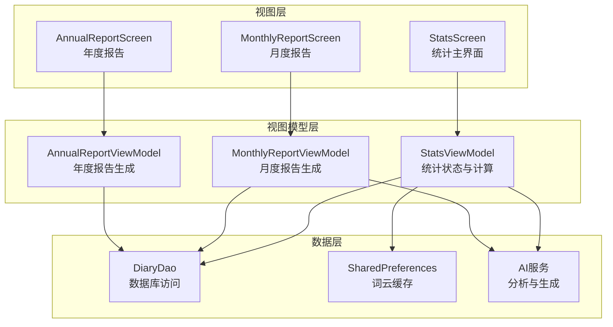
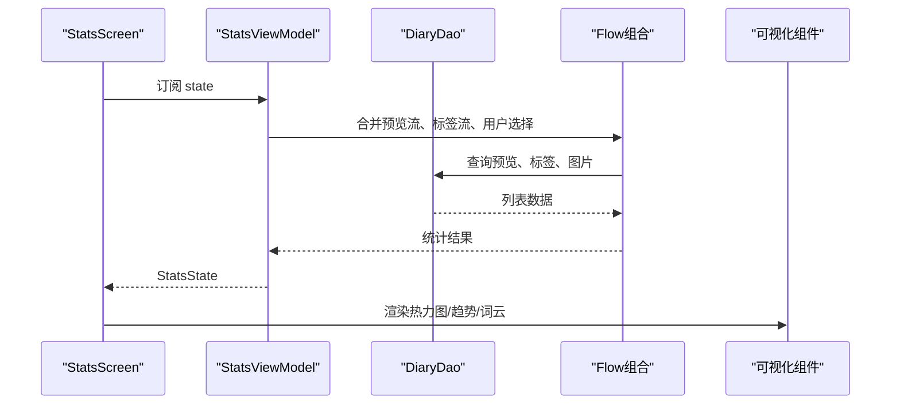
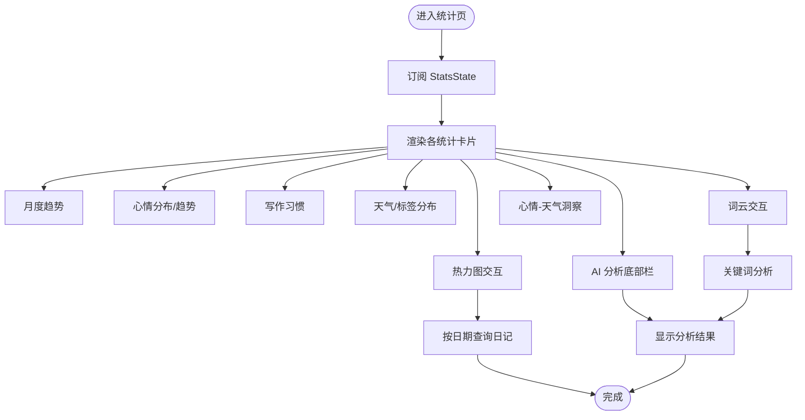
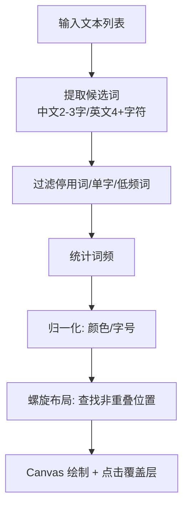
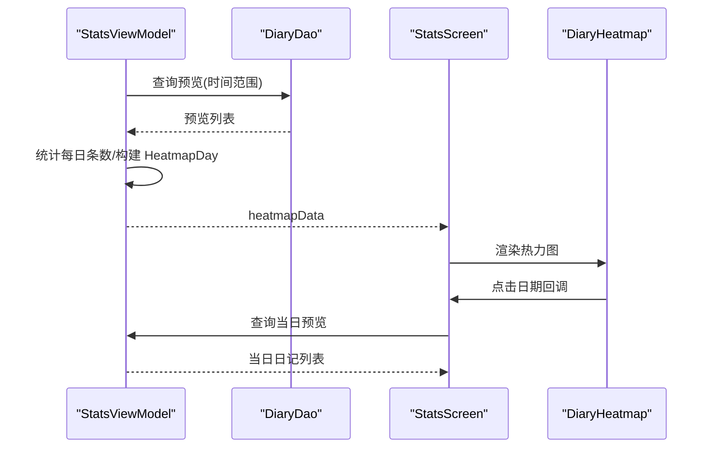
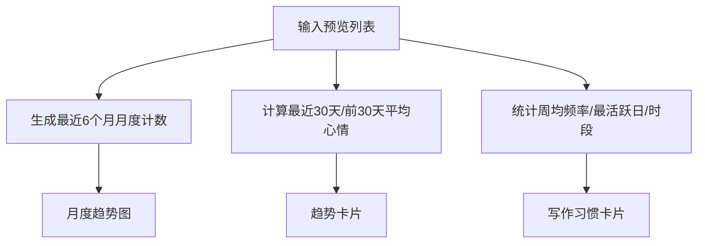
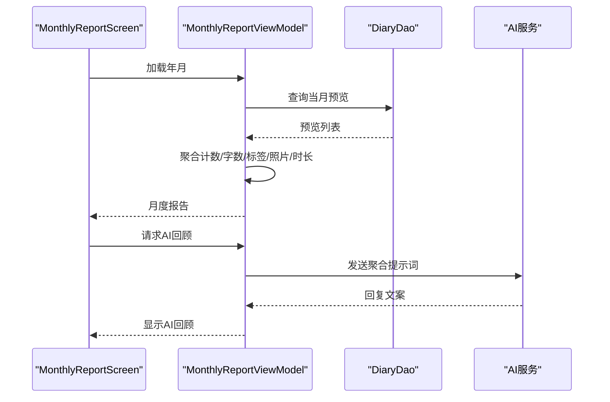
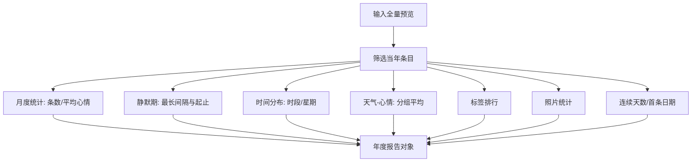
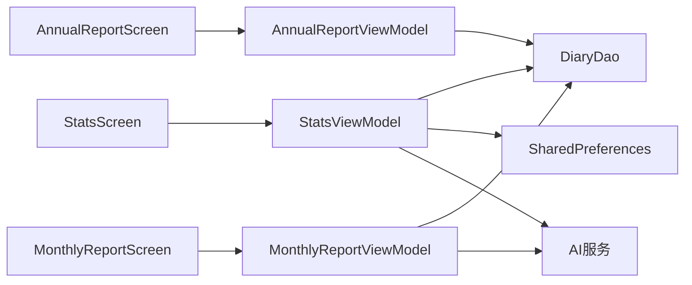

# 统计分析

<cite>
**本文引用的文件**
- [StatsScreen.kt](file://app/src/main/java/com/diary/app/ui/stats/StatsScreen.kt)
- [StatsViewModel.kt](file://app/src/main/java/com/diary/app/ui/stats/StatsViewModel.kt)
- [WordCloudView.kt](file://app/src/main/java/com/diary/app/ui/stats/WordCloudView.kt)
- [SentimentAnalyzer.kt](file://app/src/main/java/com/diary/app/data/SentimentAnalyzer.kt)
- [MonthlyReport.kt](file://app/src/main/java/com/diary/app/ui/monthlyreport/MonthlyReport.kt)
- [MonthlyReportViewModel.kt](file://app/src/main/java/com/diary/app/ui/monthlyreport/MonthlyReportViewModel.kt)
- [AnnualReportScreen.kt](file://app/src/main/java/com/diary/app/ui/annualreport/AnnualReportScreen.kt)
- [AnnualReportViewModel.kt](file://app/src/main/java/com/diary/app/ui/annualreport/AnnualReportViewModel.kt)
- [StatsHeatmapDataTest.kt](file://app/src/test/java/com/diary/app/ui/stats/StatsHeatmapDataTest.kt)
</cite>

## 目录
1. [简介](#简介)
2. [项目结构](#项目结构)
3. [核心组件](#核心组件)
4. [架构概览](#架构概览)
5. [详细组件分析](#详细组件分析)
6. [依赖关系分析](#依赖关系分析)
7. [性能考量](#性能考量)
8. [故障排查指南](#故障排查指南)
9. [结论](#结论)
10. [附录](#附录)

## 简介
本文件系统化梳理日记应用的统计分析模块，覆盖数据统计计算逻辑、图表渲染机制、词云生成算法，并深入解析月度报告与年度报告的生成流程、数据聚合策略与可视化呈现。同时，文档补充热力图绘制、趋势分析、情感分析等高级功能，以及数据导出、报告定制、分享能力的实现思路；并提供统计指标扩展、自定义图表、性能优化与大数据量处理、缓存策略及内存管理的最佳实践。

## 项目结构
统计分析模块由“视图层 + 视图模型 + 数据层”三层构成，配合报告生成与可视化组件协同工作：
- 视图层：Compose UI 屏幕负责展示统计卡片、图表与交互入口（如词云点击、热力图日期选择）。
- 视图模型：基于 Kotlin Flow 的状态流，封装数据聚合、缓存与异步任务调度。
- 数据层：DAO 查询与本地缓存，支撑词云与报告的数据源。

**图表来源**
- [StatsScreen.kt](file://app/src/main/java/com/diary/app/ui/stats/StatsScreen.kt)
- [StatsViewModel.kt](file://app/src/main/java/com/diary/app/ui/stats/StatsViewModel.kt)
- [MonthlyReportViewModel.kt](file://app/src/main/java/com/diary/app/ui/monthlyreport/MonthlyReportViewModel.kt)
- [AnnualReportViewModel.kt](file://app/src/main/java/com/diary/app/ui/annualreport/AnnualReportViewModel.kt)

**章节来源**
- [StatsScreen.kt](file://app/src/main/java/com/diary/app/ui/stats/StatsScreen.kt)
- [StatsViewModel.kt](file://app/src/main/java/com/diary/app/ui/stats/StatsViewModel.kt)
- [MonthlyReportViewModel.kt](file://app/src/main/java/com/diary/app/ui/monthlyreport/MonthlyReportViewModel.kt)
- [AnnualReportViewModel.kt](file://app/src/main/java/com/diary/app/ui/annualreport/AnnualReportViewModel.kt)

## 核心组件
- 统计主界面与状态流
  - StatsScreen 负责组织统计卡片、热力图、趋势图、词云、天气与标签分布、心情洞察等模块。
  - StatsViewModel 通过 combine 组合 DAO 流与用户选择（如词云周期、热力图范围），输出 StatsState 并驱动 UI。
- 词云生成与渲染
  - WordCloudView 提供词频提取、布局与绘制，支持点击回调与颜色渐变。
- 报告生成
  - 月度报告：按月聚合条目、字数、标签、照片、写作时长、每日趋势等。
  - 年度报告：按年聚合月度趋势、最长静默期、最活跃时段与日期、天气与心情关联、标签排行等。
- 情感分析
  - SentimentAnalyzer 提供简单关键词匹配的情感打分与标签。

**章节来源**
- [StatsScreen.kt](file://app/src/main/java/com/diary/app/ui/stats/StatsScreen.kt)
- [StatsViewModel.kt](file://app/src/main/java/com/diary/app/ui/stats/StatsViewModel.kt)
- [WordCloudView.kt](file://app/src/main/java/com/diary/app/ui/stats/WordCloudView.kt)
- [SentimentAnalyzer.kt](file://app/src/main/java/com/diary/app/data/SentimentAnalyzer.kt)
- [MonthlyReport.kt](file://app/src/main/java/com/diary/app/ui/monthlyreport/MonthlyReport.kt)
- [MonthlyReportViewModel.kt](file://app/src/main/java/com/diary/app/ui/monthlyreport/MonthlyReportViewModel.kt)
- [AnnualReportScreen.kt](file://app/src/main/java/com/diary/app/ui/annualreport/AnnualReportScreen.kt)
- [AnnualReportViewModel.kt](file://app/src/main/java/com/diary/app/ui/annualreport/AnnualReportViewModel.kt)

## 架构概览
统计分析采用 MVVM + Flow 的响应式架构：
- StatsViewModel 将 DAO 的预览数据流与标签使用流合并，结合用户选择（词云周期、热力图范围）计算统计指标，输出统一状态。
- 词云与报告分别以独立 ViewModel 承载，复用 DAO 查询与 AI 服务。
- 可视化组件通过 Compose Canvas 与自绘控件完成图表渲染，确保流畅与可定制。

**图表来源**
- [StatsViewModel.kt](file://app/src/main/java/com/diary/app/ui/stats/StatsViewModel.kt)
- [StatsScreen.kt](file://app/src/main/java/com/diary/app/ui/stats/StatsScreen.kt)

**章节来源**
- [StatsViewModel.kt](file://app/src/main/java/com/diary/app/ui/stats/StatsViewModel.kt)
- [StatsScreen.kt](file://app/src/main/java/com/diary/app/ui/stats/StatsScreen.kt)

## 详细组件分析

### 统计主界面与状态流
- 状态聚合
  - 入口统计：总条数、当前记录天数、本月条数、词统计、写作习惯、心情趋势、天气分布、标签使用、热力图数据、心情-天气洞察。
  - 词云状态：周期切换触发重新提取词频，支持加载态与空态提示。
  - AI 分析：关键词检索上下文，调用 AI 服务生成洞察。
- 交互与导航
  - 热力图日期点击打开当日日记列表弹窗。
  - 词云周期切换与词点击分析。
  - 导航至月度报告入口。

**图表来源**
- [StatsScreen.kt](file://app/src/main/java/com/diary/app/ui/stats/StatsScreen.kt)
- [StatsViewModel.kt](file://app/src/main/java/com/diary/app/ui/stats/StatsViewModel.kt)

**章节来源**
- [StatsScreen.kt](file://app/src/main/java/com/diary/app/ui/stats/StatsScreen.kt)
- [StatsViewModel.kt](file://app/src/main/java/com/diary/app/ui/stats/StatsViewModel.kt)

### 词云生成算法
- 文本预处理与分词
  - 支持中英文混合文本，剔除停用词与常见虚词，保留 2-3 字中文词与 4+ 英文词。
  - 过滤仅出现一次的词，优先短词，限制输出数量。
- 频率统计与归一化
  - 统计词频，按最大最小值归一化字号与颜色强度。
- 布局与碰撞检测
  - 采用螺旋式位置搜索，避免重叠，支持点击区域叠加。
- 渲染与交互
  - Canvas 绘制文字，支持主色与辅色渐变，点击回调触发分析。

**图表来源**
- [WordCloudView.kt](file://app/src/main/java/com/diary/app/ui/stats/WordCloudView.kt)

**章节来源**
- [WordCloudView.kt](file://app/src/main/java/com/diary/app/ui/stats/WordCloudView.kt)

### 热力图绘制与数据聚合
- 数据聚合
  - 按指定天数回溯，统计每日条数，支持 30/90/180/365 天范围。
  - 单日多条目计数合并。
- 渲染策略
  - 月内范围使用日历网格布局，跨月范围使用紧凑列布局，标注月边界与图例。
  - 不同计数区间采用不同透明度色阶，今日高亮。
- 交互
  - 点击日期弹窗展示当日日记列表，支持跳转详情。

**图表来源**
- [StatsViewModel.kt](file://app/src/main/java/com/diary/app/ui/stats/StatsViewModel.kt)
- [StatsScreen.kt](file://app/src/main/java/com/diary/app/ui/stats/StatsScreen.kt)

**章节来源**
- [StatsViewModel.kt](file://app/src/main/java/com/diary/app/ui/stats/StatsViewModel.kt)
- [StatsScreen.kt](file://app/src/main/java/com/diary/app/ui/stats/StatsScreen.kt)
- [StatsHeatmapDataTest.kt](file://app/src/test/java/com/diary/app/ui/stats/StatsHeatmapDataTest.kt)

### 趋势分析与写作习惯
- 月度趋势
  - 最近 6 个月按月统计条数，绘制柱状图，支持动画与当前月高亮。
- 心情趋势
  - 对比最近 30 天与前 30 天平均心情，判定上升/下降/平稳。
- 写作习惯
  - 周均频率、最活跃星期、最活跃时段、平均写作时长（可选）。

**图表来源**
- [StatsViewModel.kt](file://app/src/main/java/com/diary/app/ui/stats/StatsViewModel.kt)
- [StatsScreen.kt](file://app/src/main/java/com/diary/app/ui/stats/StatsScreen.kt)

**章节来源**
- [StatsViewModel.kt](file://app/src/main/java/com/diary/app/ui/stats/StatsViewModel.kt)
- [StatsScreen.kt](file://app/src/main/java/com/diary/app/ui/stats/StatsScreen.kt)

### 心情-天气洞察
- 计算逻辑
  - 过滤同时具备“心情”和“天气”的条目，按天气分组求平均心情，比较最佳与最差天气。
  - 输出洞察文案与 per-weather 平均值列表，用于可视化。
- 可视化
  - 每天气温条形图，颜色映射到心情等级。

**章节来源**
- [StatsViewModel.kt](file://app/src/main/java/com/diary/app/ui/stats/StatsViewModel.kt)
- [StatsScreen.kt](file://app/src/main/java/com/diary/app/ui/stats/StatsScreen.kt)

### 情感分析
- 关键词匹配
  - 正面/负面/中性词库，计算正负词差额占总数的比例，得到 -1~1 的分数。
- 标签与场景检测
  - 提供情感标签、压力内容检测、新话题检测、深夜内容检测等辅助能力。

**章节来源**
- [SentimentAnalyzer.kt](file://app/src/main/java/com/diary/app/data/SentimentAnalyzer.kt)

### 月度报告生成流程
- 数据聚合
  - 按月时间窗口查询预览，统计条数、字数、平均心情、最长条目、夜间条目、最早写作时间、最活跃日期、标签统计、照片数量、总写作时长。
- 年度对比
  - 与上一年同月对比条数、平均心情、字数增量。
- AI 回顾
  - 基于聚合结果生成温和自然的月度回顾文案。

**图表来源**
- [MonthlyReportViewModel.kt](file://app/src/main/java/com/diary/app/ui/monthlyreport/MonthlyReportViewModel.kt)
- [MonthlyReport.kt](file://app/src/main/java/com/diary/app/ui/monthlyreport/MonthlyReport.kt)

**章节来源**
- [MonthlyReportViewModel.kt](file://app/src/main/java/com/diary/app/ui/monthlyreport/MonthlyReportViewModel.kt)
- [MonthlyReport.kt](file://app/src/main/java/com/diary/app/ui/monthlyreport/MonthlyReport.kt)

### 年度报告生成流程
- 数据聚合
  - 按年筛选条目，统计月度趋势、最长静默期、最活跃时段/日期、天气与心情关联、标签排行、首条日期、最长连续天数、照片统计、最早/最晚写作时间、最多产日期等。
- 可视化卡片
  - 心情旅程曲线、最多产月份柱状图、深夜写作者圆弧图、最长一篇、最沉默期、最开心的一天、写作习惯分布、天气-心情关联、标签风格、照片故事、里程碑、结尾页等。

**图表来源**
- [AnnualReportViewModel.kt](file://app/src/main/java/com/diary/app/ui/annualreport/AnnualReportViewModel.kt)
- [AnnualReportScreen.kt](file://app/src/main/java/com/diary/app/ui/annualreport/AnnualReportScreen.kt)

**章节来源**
- [AnnualReportViewModel.kt](file://app/src/main/java/com/diary/app/ui/annualreport/AnnualReportViewModel.kt)
- [AnnualReportScreen.kt](file://app/src/main/java/com/diary/app/ui/annualreport/AnnualReportScreen.kt)

## 依赖关系分析
- 组件耦合
  - StatsScreen 依赖 StatsViewModel 的状态流；词云与热力图作为子组件直接消费状态。
  - 报告页面各自持有独立 ViewModel，减少相互影响。
- 外部依赖
  - DAO 提供数据源；AI 服务用于分析与生成；SharedPreferences 用于词云缓存。
- 可能的循环依赖
  - 无直接循环；视图模型通过 Flow 解耦 UI 与数据层。

**图表来源**
- [StatsScreen.kt](file://app/src/main/java/com/diary/app/ui/stats/StatsScreen.kt)
- [StatsViewModel.kt](file://app/src/main/java/com/diary/app/ui/stats/StatsViewModel.kt)
- [MonthlyReportViewModel.kt](file://app/src/main/java/com/diary/app/ui/monthlyreport/MonthlyReportViewModel.kt)
- [AnnualReportViewModel.kt](file://app/src/main/java/com/diary/app/ui/annualreport/AnnualReportViewModel.kt)

**章节来源**
- [StatsViewModel.kt](file://app/src/main/java/com/diary/app/ui/stats/StatsViewModel.kt)
- [MonthlyReportViewModel.kt](file://app/src/main/java/com/diary/app/ui/monthlyreport/MonthlyReportViewModel.kt)
- [AnnualReportViewModel.kt](file://app/src/main/java/com/diary/app/ui/annualreport/AnnualReportViewModel.kt)

## 性能考量
- 数据聚合优化
  - 使用 groupingBy/eachCount 进行日粒度计数，避免重复扫描。
  - 词云提取限制输出数量与过滤噪声词，降低渲染开销。
- 渲染优化
  - Canvas 绘制集中于单层，避免过度重组；动画使用轻量 tween。
  - 热力图按需渲染（月内网格 vs 紧凑列），减少布局复杂度。
- 缓存策略
  - 词云周期与词频结果缓存于 SharedPreferences，首次加载后快速回显。
- 内存管理
  - 词云布局结果按需记忆，避免重复计算；长列表使用 LazyColumn。
- 大数据量处理
  - 月度/年度报告按年/月窗口查询，避免一次性加载全量数据；必要时引入分页或懒加载。

[本节为通用指导，无需具体文件引用]

## 故障排查指南
- 词云为空
  - 检查输入文本是否为空或过短；确认周期选择与缓存命中情况。
- 热力图无数据
  - 核对日期范围与 DAO 查询时间边界；测试用例验证同日多条目计数正确。
- AI 分析失败
  - 检查网络与 AI 服务可用性；查看错误回退文案；确认请求参数与提示词格式。
- 报告为空
  - 确认目标年/月是否存在数据；检查 DAO 查询范围与时间区间的毫秒换算。

**章节来源**
- [StatsHeatmapDataTest.kt](file://app/src/test/java/com/diary/app/ui/stats/StatsHeatmapDataTest.kt)
- [StatsViewModel.kt](file://app/src/main/java/com/diary/app/ui/stats/StatsViewModel.kt)
- [MonthlyReportViewModel.kt](file://app/src/main/java/com/diary/app/ui/monthlyreport/MonthlyReportViewModel.kt)
- [AnnualReportViewModel.kt](file://app/src/main/java/com/diary/app/ui/annualreport/AnnualReportViewModel.kt)

## 结论
统计分析模块通过清晰的 MVVM 与 Flow 架构，实现了从基础统计到高级可视化的完整闭环。词云、热力图、趋势与报告等组件既可独立扩展，又能共享数据与 AI 能力。建议持续完善缓存与性能监控，增强可配置性与可扩展性，以应对更大规模数据与更丰富的分析需求。

## 附录
- 统计指标扩展建议
  - 新增：写作速度（字/分钟）、主题聚类、情绪波动指数、标签关联强度。
- 自定义图表
  - 可替换为第三方图表库或基于 Canvas 的自绘组件，保持数据接口不变。
- 数据导出与分享
  - 可在报告页增加导出 PDF/图片按钮，结合 Share API 实现一键分享。
- 大数据优化
  - 引入分页查询、增量缓存、后台聚合任务与内存池化，降低主线程阻塞。

[本节为通用指导，无需具体文件引用]