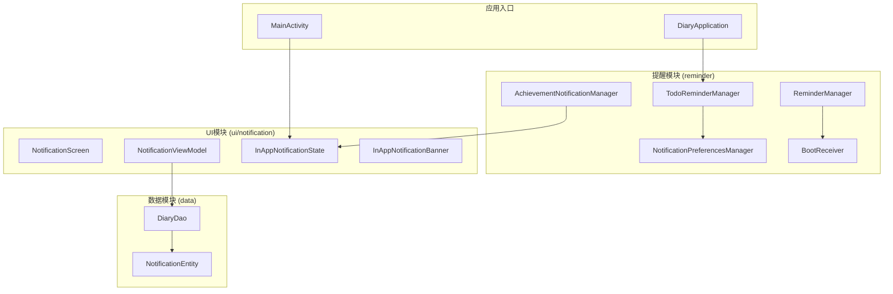
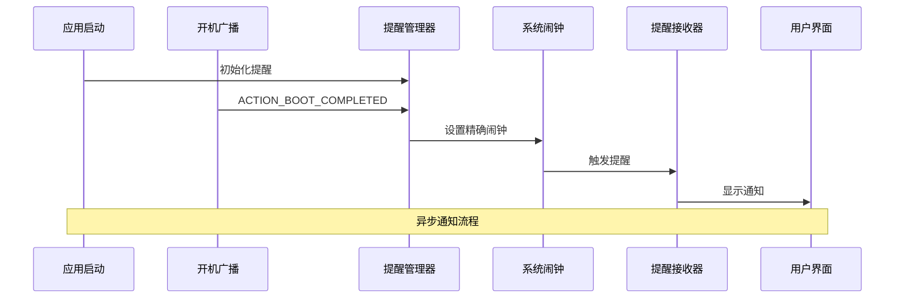
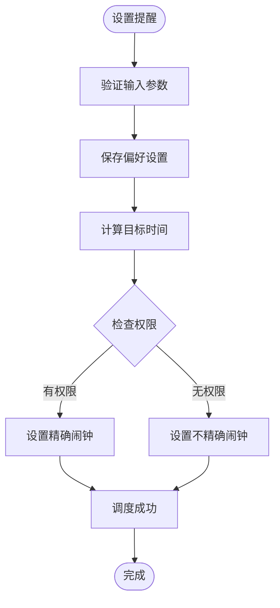
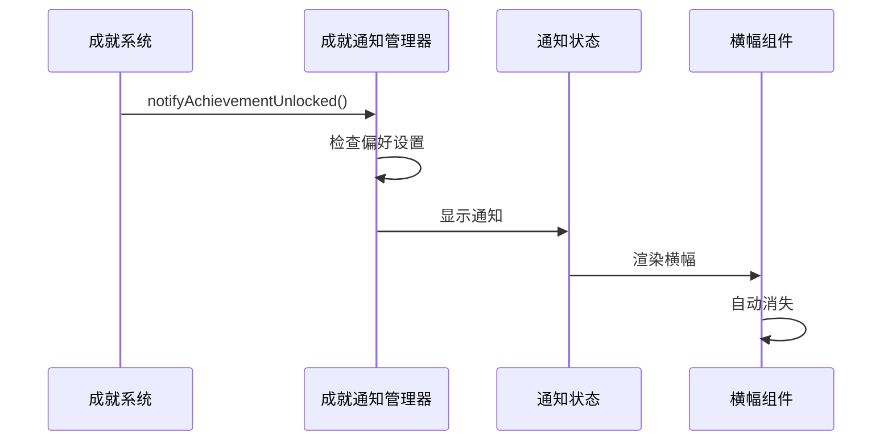
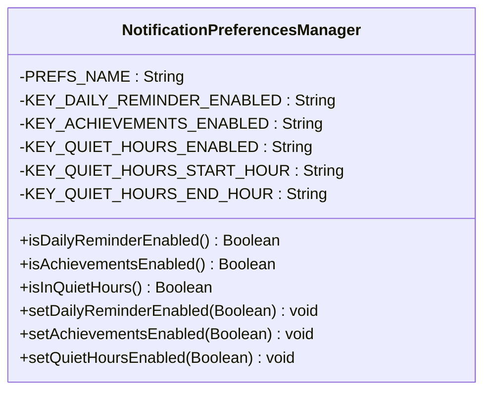
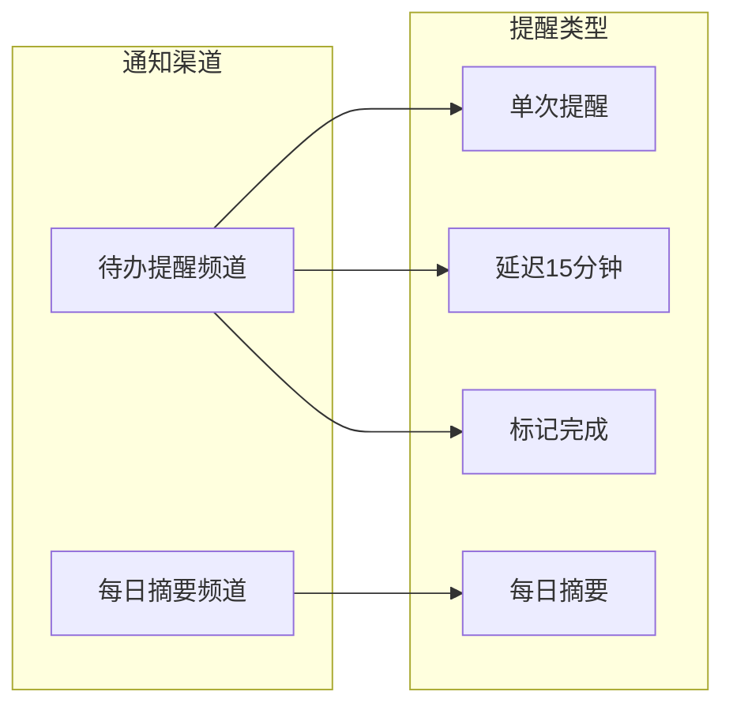
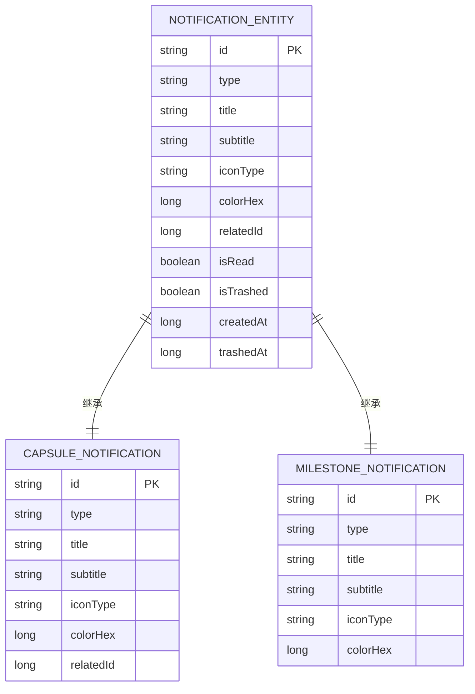
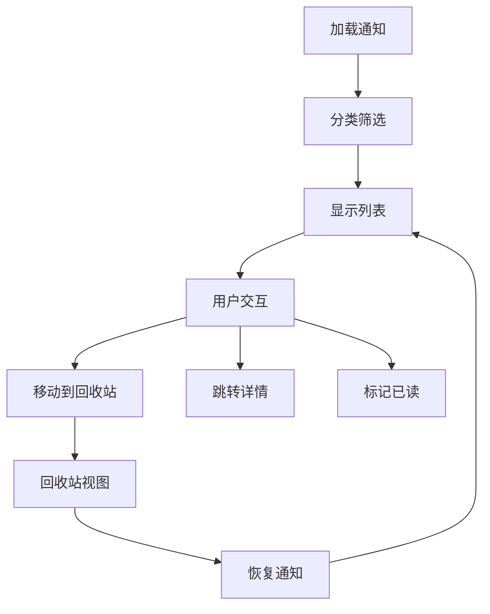
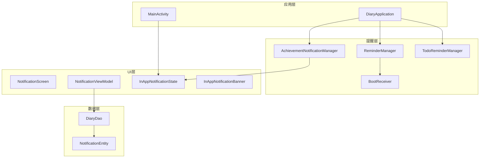

# 通知系统

<cite>
**本文档引用的文件**
- [ReminderManager.kt](file://app/src/main/java/com/diary/app/reminder/ReminderManager.kt)
- [AchievementNotificationManager.kt](file://app/src/main/java/com/diary/app/reminder/AchievementNotificationManager.kt)
- [NotificationPreferencesManager.kt](file://app/src/main/java/com/diary/app/reminder/NotificationPreferencesManager.kt)
- [TodoReminderManager.kt](file://app/src/main/java/com/diary/app/reminder/TodoReminderManager.kt)
- [BootReceiver.kt](file://app/src/main/java/com/diary/app/reminder/BootReceiver.kt)
- [NotificationEntity.kt](file://app/src/main/java/com/diary/app/data/NotificationEntity.kt)
- [NotificationViewModel.kt](file://app/src/main/java/com/diary/app/ui/notification/NotificationViewModel.kt)
- [NotificationScreen.kt](file://app/src/main/java/com/diary/app/ui/notification/NotificationScreen.kt)
- [InAppNotificationState.kt](file://app/src/main/java/com/diary/app/ui/notification/InAppNotificationState.kt)
- [InAppNotificationBanner.kt](file://app/src/main/java/com/diary/app/ui/notification/InAppNotificationBanner.kt)
- [DiaryApplication.kt](file://app/src/main/java/com/diary/app/DiaryApplication.kt)
- [MainActivity.kt](file://app/src/main/java/com/diary/app/MainActivity.kt)
- [DiaryDao.kt](file://app/src/main/java/com/diary/app/data/DiaryDao.kt)
</cite>

## 目录
1. [简介](#简介)
2. [项目结构](#项目结构)
3. [核心组件](#核心组件)
4. [架构概览](#架构概览)
5. [详细组件分析](#详细组件分析)
6. [依赖关系分析](#依赖关系分析)
7. [性能考虑](#性能考虑)
8. [故障排除指南](#故障排除指南)
9. [结论](#结论)
10. [附录](#附录)

## 简介
本通知系统模块为日记应用提供了完整的通知解决方案，包括：
- **提醒管理**：每日日记提醒、待办事项提醒、定时任务调度
- **成就通知**：成就解锁的内嵌横幅提示
- **系统通知**：基于Android通知渠道的系统级通知
- **通知偏好**：可配置的通知类型、静音时段、免打扰模式
- **通知存储**：本地数据库持久化存储
- **展示策略**：内嵌横幅与系统通知双通道展示

## 项目结构
通知系统采用分层架构设计，主要分布在以下包结构中：

**图表来源**
- [ReminderManager.kt:11-119](file://app/src/main/java/com/diary/app/reminder/ReminderManager.kt#L11-L119)
- [AchievementNotificationManager.kt:23-87](file://app/src/main/java/com/diary/app/reminder/AchievementNotificationManager.kt#L23-L87)
- [NotificationPreferencesManager.kt:12-140](file://app/src/main/java/com/diary/app/reminder/NotificationPreferencesManager.kt#L12-L140)
- [TodoReminderManager.kt:27-365](file://app/src/main/java/com/diary/app/reminder/TodoReminderManager.kt#L27-L365)

**章节来源**
- [ReminderManager.kt:1-119](file://app/src/main/java/com/diary/app/reminder/ReminderManager.kt#L1-L119)
- [AchievementNotificationManager.kt:1-87](file://app/src/main/java/com/diary/app/reminder/AchievementNotificationManager.kt#L1-L87)
- [NotificationPreferencesManager.kt:1-140](file://app/src/main/java/com/diary/app/reminder/NotificationPreferencesManager.kt#L1-L140)
- [TodoReminderManager.kt:1-365](file://app/src/main/java/com/diary/app/reminder/TodoReminderManager.kt#L1-L365)

## 核心组件
通知系统由四大核心组件构成，每个组件都有明确的职责分工：

### 提醒管理器 (ReminderManager)
负责每日日记提醒的调度和管理，支持精确到秒的闹钟调度和自定义提醒消息。

### 成就通知管理器 (AchievementNotificationManager)
专门处理成就解锁的内嵌横幅通知，提供异步检查和去重机制。

### 通知偏好管理器 (NotificationPreferencesManager)
集中管理所有通知类型的开关和静音时段配置，提供统一的偏好设置接口。

### 待办提醒管理器 (TodoReminderManager)
处理待办事项的系统通知，包括单次提醒和每日摘要通知。

**章节来源**
- [ReminderManager.kt:11-119](file://app/src/main/java/com/diary/app/reminder/ReminderManager.kt#L11-L119)
- [AchievementNotificationManager.kt:23-87](file://app/src/main/java/com/diary/app/reminder/AchievementNotificationManager.kt#L23-L87)
- [NotificationPreferencesManager.kt:12-140](file://app/src/main/java/com/diary/app/reminder/NotificationPreferencesManager.kt#L12-L140)
- [TodoReminderManager.kt:27-365](file://app/src/main/java/com/diary/app/reminder/TodoReminderManager.kt#L27-L365)

## 架构概览
通知系统采用事件驱动的架构模式，通过广播接收器和协程实现异步处理：

**图表来源**
- [BootReceiver.kt:7-18](file://app/src/main/java/com/diary/app/reminder/BootReceiver.kt#L7-L18)
- [ReminderManager.kt:62-98](file://app/src/main/java/com/diary/app/reminder/ReminderManager.kt#L62-L98)

系统架构采用分层设计：
- **表示层**：Compose UI组件，负责用户交互
- **业务逻辑层**：各管理器对象，处理具体业务逻辑
- **数据访问层**：Room数据库，提供数据持久化
- **系统服务层**：Android通知系统和闹钟服务

## 详细组件分析

### 提醒管理器 (ReminderManager)
ReminderManager是通知系统的核心调度组件，实现了精确的定时提醒功能。

#### 核心功能特性
- **精确闹钟调度**：支持setExactAndAllowWhileIdle确保高精度
- **自适应降级**：在权限不足时自动降级为不精确闹钟
- **动态消息轮换**：每日轮换不同的提醒语句
- **持久化配置**：使用SharedPreferences存储提醒设置

#### 数据流图

**图表来源**
- [ReminderManager.kt:62-98](file://app/src/main/java/com/diary/app/reminder/ReminderManager.kt#L62-L98)

**章节来源**
- [ReminderManager.kt:11-119](file://app/src/main/java/com/diary/app/reminder/ReminderManager.kt#L11-L119)

### 成就通知管理器 (AchievementNotificationManager)
专门处理成就解锁的内嵌横幅通知，提供优雅的用户体验。

#### 设计模式
采用观察者模式和单例模式，通过InAppNotificationState进行状态管理。

#### 通知流程

**图表来源**
- [AchievementNotificationManager.kt:34-75](file://app/src/main/java/com/diary/app/reminder/AchievementNotificationManager.kt#L34-L75)

**章节来源**
- [AchievementNotificationManager.kt:23-87](file://app/src/main/java/com/diary/app/reminder/AchievementNotificationManager.kt#L23-L87)

### 通知偏好管理器 (NotificationPreferencesManager)
提供统一的通知偏好配置中心，支持多种通知类型的独立控制。

#### 偏好配置结构

**图表来源**
- [NotificationPreferencesManager.kt:12-140](file://app/src/main/java/com/diary/app/reminder/NotificationPreferencesManager.kt#L12-L140)

**章节来源**
- [NotificationPreferencesManager.kt:12-140](file://app/src/main/java/com/diary/app/reminder/NotificationPreferencesManager.kt#L12-L140)

### 待办提醒管理器 (TodoReminderManager)
处理复杂的待办事项通知系统，包括单次提醒和每日摘要。

#### 通知渠道管理

**图表来源**
- [TodoReminderManager.kt:28-57](file://app/src/main/java/com/diary/app/reminder/TodoReminderManager.kt#L28-L57)

**章节来源**
- [TodoReminderManager.kt:27-365](file://app/src/main/java/com/diary/app/reminder/TodoReminderManager.kt#L27-L365)

### 通知数据模型 (NotificationEntity)
定义了通知的数据库存储结构，支持灵活的通知类型扩展。

#### 数据模型关系

**图表来源**
- [NotificationEntity.kt:6-20](file://app/src/main/java/com/diary/app/data/NotificationEntity.kt#L6-L20)

**章节来源**
- [NotificationEntity.kt:1-20](file://app/src/main/java/com/diary/app/data/NotificationEntity.kt#L1-L20)

### 通知UI组件 (NotificationScreen)
提供完整的通知浏览和管理界面，支持分类筛选和回收站功能。

#### UI交互流程

**图表来源**
- [NotificationScreen.kt:80-172](file://app/src/main/java/com/diary/app/ui/notification/NotificationScreen.kt#L80-L172)

**章节来源**
- [NotificationScreen.kt:1-854](file://app/src/main/java/com/diary/app/ui/notification/NotificationScreen.kt#L1-L854)

## 依赖关系分析

### 组件依赖图

**图表来源**
- [DiaryApplication.kt:29-98](file://app/src/main/java/com/diary/app/DiaryApplication.kt#L29-L98)
- [MainActivity.kt:377-377](file://app/src/main/java/com/diary/app/MainActivity.kt#L377-L377)

### 数据流依赖
通知系统遵循清晰的数据流向：
1. **数据生成**：NotificationViewModel根据业务规则生成通知
2. **数据存储**：转换为NotificationEntity存储到数据库
3. **数据检索**：UI层从数据库读取并展示
4. **状态同步**：用户操作更新数据库状态

**章节来源**
- [NotificationViewModel.kt:139-667](file://app/src/main/java/com/diary/app/ui/notification/NotificationViewModel.kt#L139-L667)
- [DiaryDao.kt:546-574](file://app/src/main/java/com/diary/app/data/DiaryDao.kt#L546-L574)

## 性能考虑

### 优化策略
1. **懒加载机制**：通知生成仅在需要时执行
2. **缓存策略**：使用SharedPreferences避免重复计算
3. **协程并发**：异步处理数据库操作和网络请求
4. **内存管理**：及时释放不再使用的资源

### 存储优化
- **增量更新**：只生成当天新增的通知
- **索引优化**：为常用查询字段建立数据库索引
- **批量操作**：减少数据库事务次数

### 电池优化
- **精确闹钟**：在允许范围内使用最高精度
- **智能调度**：避免在设备休眠时频繁唤醒
- **权限适配**：根据系统版本调整调度策略

## 故障排除指南

### 常见问题及解决方案

#### 通知无法显示
1. **检查权限**：确认应用具有通知权限
2. **验证渠道**：确保通知渠道已正确创建
3. **检查偏好**：确认相关通知类型未被禁用

#### 提醒不准确
1. **时区设置**：验证设备时区配置
2. **系统限制**：检查电池优化设置
3. **权限检查**：确认精确闹钟权限已授予

#### 数据不同步
1. **清理缓存**：清除SharedPreferences中的缓存数据
2. **重启服务**：重新初始化相关管理器
3. **检查数据库**：验证数据完整性

**章节来源**
- [BootReceiver.kt:7-18](file://app/src/main/java/com/diary/app/reminder/BootReceiver.kt#L7-L18)
- [NotificationPreferencesManager.kt:114-130](file://app/src/main/java/com/diary/app/reminder/NotificationPreferencesManager.kt#L114-L130)

## 结论
该通知系统模块展现了良好的软件工程实践：

### 设计优势
- **模块化设计**：各组件职责清晰，便于维护和扩展
- **异步处理**：采用协程和广播机制，提升用户体验
- **配置灵活**：支持丰富的偏好设置和静音时段
- **数据持久化**：完整的本地存储和状态管理

### 技术亮点
- **精确调度**：支持高精度的定时提醒功能
- **优雅降级**：在权限受限时自动适配最佳方案
- **性能优化**：多层缓存和异步处理确保流畅体验
- **错误处理**：完善的异常捕获和恢复机制

该系统为日记应用提供了完整、可靠、用户友好的通知解决方案，具备良好的扩展性和维护性。

## 附录

### API参考

#### 提醒管理器API
| 方法 | 参数 | 返回值 | 描述 |
|------|------|--------|------|
| scheduleReminder | context, hour, minute | void | 设置每日提醒 |
| cancelReminder | context | void | 取消提醒设置 |
| getReminderMessage | context | String | 获取提醒消息 |
| isReminderEnabled | context | Boolean | 检查提醒是否启用 |

#### 通知偏好API
| 方法 | 参数 | 返回值 | 描述 |
|------|------|--------|------|
| isDailyReminderEnabled | context | Boolean | 检查日记提醒 |
| isAchievementsEnabled | context | Boolean | 检查成就通知 |
| isInQuietHours | context | Boolean | 检查静音时段 |
| setQuietHoursStart | context, hour, minute | void | 设置开始时间 |
| setQuietHoursEnd | context, hour, minute | void | 设置结束时间 |

### 最佳实践建议
1. **代码组织**：保持单一职责原则，避免功能耦合
2. **错误处理**：为所有外部调用添加适当的异常处理
3. **性能监控**：定期检查通知调度的准确性
4. **用户反馈**：提供清晰的通知状态指示
5. **测试覆盖**：为关键路径编写单元测试和集成测试