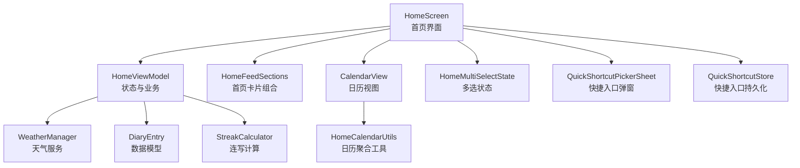
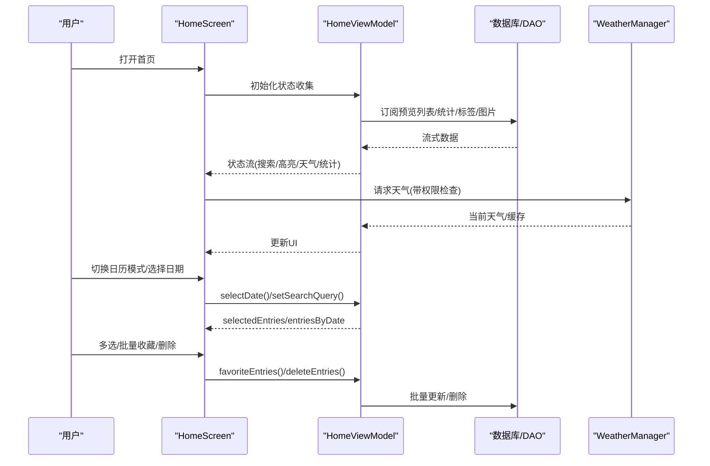
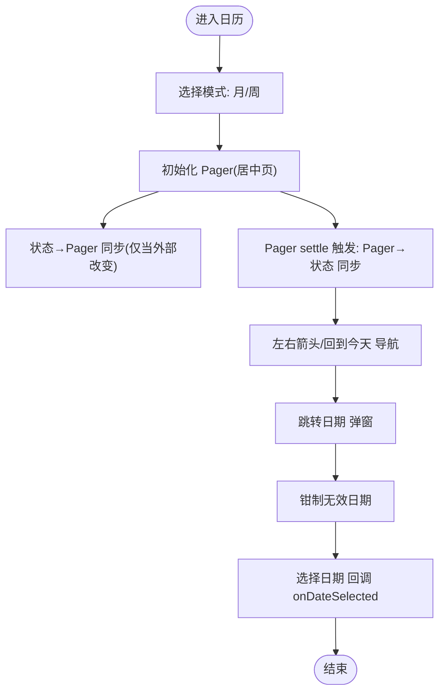
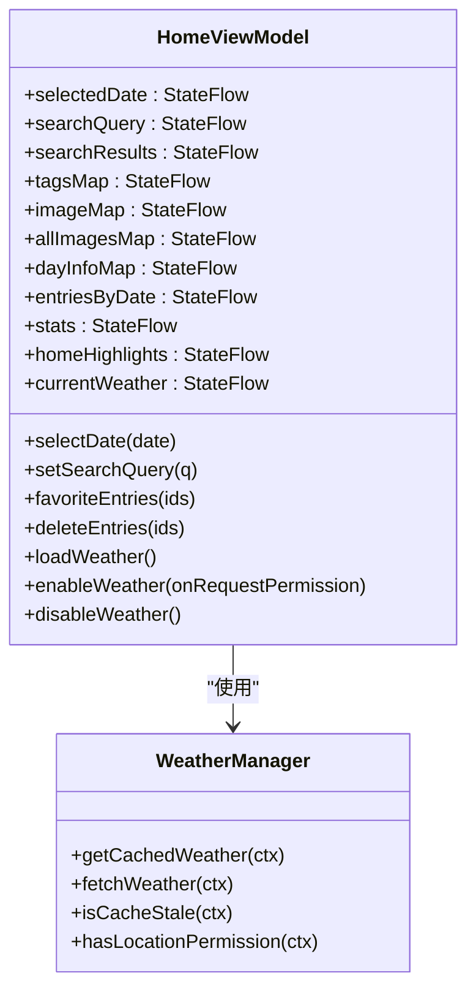
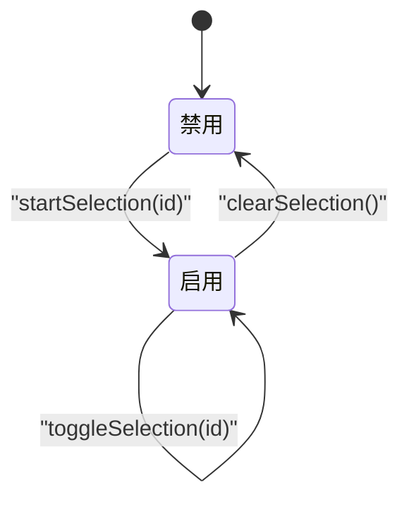
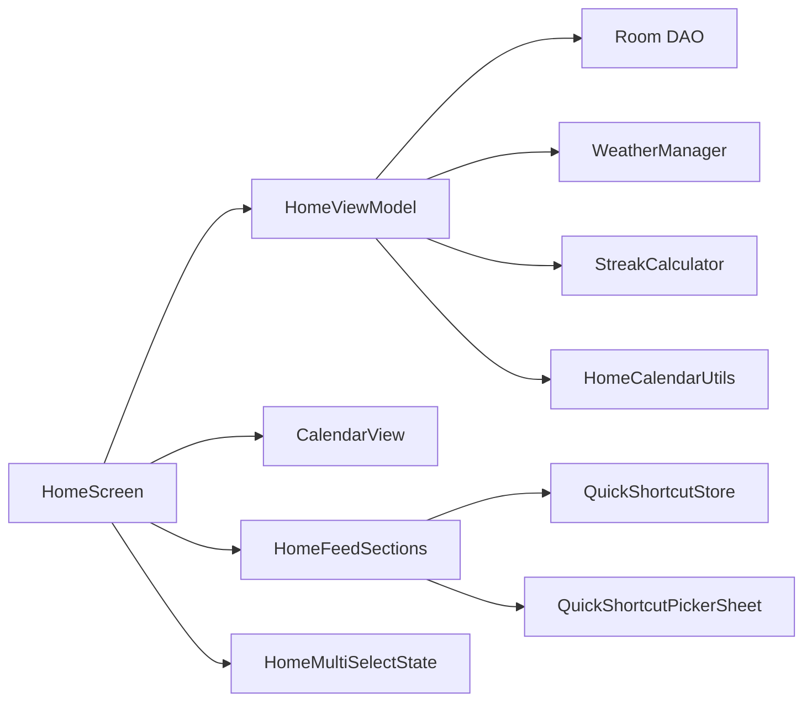

# 首页与日历

<cite>
**本文引用的文件**   
- [HomeScreen.kt](file://app/src/main/java/com/diary/app/ui/home/HomeScreen.kt)
- [HomeViewModel.kt](file://app/src/main/java/com/diary/app/ui/home/HomeViewModel.kt)
- [HomeFeedSections.kt](file://app/src/main/java/com/diary/app/ui/home/HomeFeedSections.kt)
- [CalendarView.kt](file://app/src/main/java/com/diary/app/ui/home/CalendarView.kt)
- [HomeCalendarUtils.kt](file://app/src/main/java/com/diary/app/ui/home/HomeCalendarUtils.kt)
- [HomeMultiSelectState.kt](file://app/src/main/java/com/diary/app/ui/home/HomeMultiSelectState.kt)
- [QuickShortcutPickerSheet.kt](file://app/src/main/java/com/diary/app/ui/home/QuickShortcutPickerSheet.kt)
- [QuickShortcutStore.kt](file://app/src/main/java/com/diary/app/ui/home/QuickShortcutStore.kt)
- [WeatherManager.kt](file://app/src/main/java/com/diary/app/weather/WeatherManager.kt)
- [DiaryEntry.kt](file://app/src/main/java/com/diary/app/data/DiaryEntry.kt)
- [StreakCalculator.kt](file://app/src/main/java/com/diary/app/util/StreakCalculator.kt)
- [HomeMultiSelectStateTest.kt](file://app/src/test/java/com/diary/app/ui/home/HomeMultiSelectStateTest.kt)
- [HomeScreenLogicTest.kt](file://app/src/test/java/com/diary/app/ui/home/HomeScreenLogicTest.kt)
- [CalendarViewLogicTest.kt](file://app/src/test/java/com/diary/app/ui/home/CalendarViewLogicTest.kt)
</cite>

## 目录
1. [简介](#简介)
2. [项目结构](#项目结构)
3. [核心组件](#核心组件)
4. [架构总览](#架构总览)
5. [详细组件分析](#详细组件分析)
6. [依赖关系分析](#依赖关系分析)
7. [性能考量](#性能考量)
8. [故障排查指南](#故障排查指南)
9. [结论](#结论)
10. [附录](#附录)

## 简介
本文件面向“首页与日历”模块，系统化梳理首页布局设计、日历视图实现、动态内容流管理、HomeFeedSections 的内容分区机制、快捷功能面板、天气信息集成等关键能力。同时覆盖多选状态管理、批量操作处理、性能优化策略、日历导航与日期选择、事件标记、首页自定义配置、内容排序算法以及用户体验优化方案。

## 项目结构
首页与日历相关代码主要位于 app/src/main/java/com/diary/app/ui/home 下，围绕 HomeScreen（首页界面）、HomeViewModel（状态与业务逻辑）、CalendarView（日历渲染）三大核心展开，并辅以 HomeFeedSections（首页卡片组合）、HomeMultiSelectState（多选状态）、QuickShortcut*（快捷入口）与 WeatherManager（天气）等模块协同工作。

图表来源
- [HomeScreen.kt:159-554](file://app/src/main/java/com/diary/app/ui/home/HomeScreen.kt#L159-L554)
- [HomeViewModel.kt:80-398](file://app/src/main/java/com/diary/app/ui/home/HomeViewModel.kt#L80-L398)
- [CalendarView.kt:118-529](file://app/src/main/java/com/diary/app/ui/home/CalendarView.kt#L118-L529)
- [HomeFeedSections.kt:73-196](file://app/src/main/java/com/diary/app/ui/home/HomeFeedSections.kt#L73-L196)
- [HomeMultiSelectState.kt:1-30](file://app/src/main/java/com/diary/app/ui/home/HomeMultiSelectState.kt#L1-L30)
- [QuickShortcutPickerSheet.kt:48-305](file://app/src/main/java/com/diary/app/ui/home/QuickShortcutPickerSheet.kt#L48-L305)
- [QuickShortcutStore.kt:45-72](file://app/src/main/java/com/diary/app/ui/home/QuickShortcutStore.kt#L45-L72)
- [WeatherManager.kt:49-432](file://app/src/main/java/com/diary/app/weather/WeatherManager.kt#L49-L432)
- [DiaryEntry.kt:8-32](file://app/src/main/java/com/diary/app/data/DiaryEntry.kt#L8-L32)
- [StreakCalculator.kt:13-26](file://app/src/main/java/com/diary/app/util/StreakCalculator.kt#L13-L26)
- [HomeCalendarUtils.kt:3-30](file://app/src/main/java/com/diary/app/ui/home/HomeCalendarUtils.kt#L3-L30)

章节来源
- [HomeScreen.kt:159-554](file://app/src/main/java/com/diary/app/ui/home/HomeScreen.kt#L159-L554)
- [HomeViewModel.kt:80-398](file://app/src/main/java/com/diary/app/ui/home/HomeViewModel.kt#L80-L398)

## 核心组件
- 首页界面 HomeScreen：负责整体布局、状态收集、交互编排与子组件组合。
- 首页视图模型 HomeViewModel：封装数据流（搜索、高亮、统计、天气、标签、图片映射等），提供批量操作与权限控制。
- 首页卡片组合 HomeFeedSections：拆分首页内容分区（快捷入口、日历、日期头部、条目流、搜索结果等）。
- 日历视图 CalendarView：支持月/周模式切换、滑动翻页、回到今天、跳转日期、事件标记与动画。
- 多选状态 HomeMultiSelectState：统一管理多选启用、选中集合与切换行为。
- 快捷入口 QuickShortcut*：持久化配置、底部弹窗编辑与替换。
- 天气服务 WeatherManager：定位、缓存、刷新与图标映射。
- 数据与工具 DiaryEntry、StreakCalculator、HomeCalendarUtils：支撑数据模型与统计/聚合逻辑。

章节来源
- [HomeScreen.kt:159-554](file://app/src/main/java/com/diary/app/ui/home/HomeScreen.kt#L159-L554)
- [HomeViewModel.kt:80-398](file://app/src/main/java/com/diary/app/ui/home/HomeViewModel.kt#L80-L398)
- [HomeFeedSections.kt:73-196](file://app/src/main/java/com/diary/app/ui/home/HomeFeedSections.kt#L73-L196)
- [CalendarView.kt:118-529](file://app/src/main/java/com/diary/app/ui/home/CalendarView.kt#L118-L529)
- [HomeMultiSelectState.kt:1-30](file://app/src/main/java/com/diary/app/ui/home/HomeMultiSelectState.kt#L1-L30)
- [QuickShortcutPickerSheet.kt:48-305](file://app/src/main/java/com/diary/app/ui/home/QuickShortcutPickerSheet.kt#L48-L305)
- [QuickShortcutStore.kt:45-72](file://app/src/main/java/com/diary/app/ui/home/QuickShortcutStore.kt#L45-L72)
- [WeatherManager.kt:49-432](file://app/src/main/java/com/diary/app/weather/WeatherManager.kt#L49-L432)
- [DiaryEntry.kt:8-32](file://app/src/main/java/com/diary/app/data/DiaryEntry.kt#L8-L32)
- [StreakCalculator.kt:13-26](file://app/src/main/java/com/diary/app/util/StreakCalculator.kt#L13-L26)
- [HomeCalendarUtils.kt:3-30](file://app/src/main/java/com/diary/app/ui/home/HomeCalendarUtils.kt#L3-L30)

## 架构总览
首页采用“界面-视图模型-数据层”的分层设计，通过 StateFlow/collectAsState 将数据库查询与网络请求结果以响应式方式注入 UI；日历作为独立可复用组件，通过回调与外部状态联动；天气模块以缓存优先策略降低网络开销；多选状态在首页与日历之间保持一致语义。

图表来源
- [HomeScreen.kt:183-245](file://app/src/main/java/com/diary/app/ui/home/HomeScreen.kt#L183-L245)
- [HomeViewModel.kt:231-396](file://app/src/main/java/com/diary/app/ui/home/HomeViewModel.kt#L231-L396)
- [WeatherManager.kt:54-67](file://app/src/main/java/com/diary/app/weather/WeatherManager.kt#L54-L67)

## 详细组件分析

### 首页布局与内容分区（HomeFeedSections）
- 内容分区机制
  - 英雄区（HomeHeroSection）：问候语、日期、统计、天气、AI洞察等。
  - 搜索栏与结果（HomeSearchBar + HomeSearchResultCard）：输入防抖、结果计数、跳转到时间线。
  - “那年今日”卡片（HomeOnThisDayCard）：跨年回忆展示。
  - 快捷入口面板（HomeQuickShortcutsSection + QuickShortcutPickerSheet/Store）：可编辑、最多4项。
  - 日历卡片（HomeCalendarSectionCard + CalendarView）：月/周模式、事件标记、回到今天、跳转日期。
  - 日期头部与条目流（HomeSelectedDateHeader + HomeEntryFeedCard）：按日分组、图片轮播、元信息展示、多选交互。
- 布局要点
  - 使用 LazyColumn 组织分区，合理间距与占位，避免重绘。
  - 分区显隐由查询状态与条件函数控制（如搜索时隐藏浏览分区）。

章节来源
- [HomeFeedSections.kt:73-196](file://app/src/main/java/com/diary/app/ui/home/HomeFeedSections.kt#L73-L196)
- [HomeFeedSections.kt:198-304](file://app/src/main/java/com/diary/app/ui/home/HomeFeedSections.kt#L198-L304)
- [HomeFeedSections.kt:306-624](file://app/src/main/java/com/diary/app/ui/home/HomeFeedSections.kt#L306-L624)
- [HomeFeedSections.kt:626-744](file://app/src/main/java/com/diary/app/ui/home/HomeFeedSections.kt#L626-L744)
- [HomeFeedSections.kt:746-800](file://app/src/main/java/com/diary/app/ui/home/HomeFeedSections.kt#L746-L800)

### 日历视图实现（CalendarView）
- 模式与导航
  - 支持 MONTH/WEEK 两种模式，使用 HorizontalPager 以 CENTER_PAGE 为中心进行无限滚动。
  - 顶部左右箭头与“回到今天”按钮，底部“跳转日期”弹窗。
- 事件标记与样式
  - 依据 DayInfo（情绪主色、强调色、混合情绪标识、当日条数）为日期单元绘制渐变背景与天气徽标。
  - 今日与选中日期有突出视觉反馈。
- 翻页同步
  - 通过 LaunchedEffect 与 snapshotFlow 在“状态→Pager→状态”之间建立单向同步，避免循环更新。
- 跳转日期
  - WheelPicker 实现年/月/日滚轮选择，自动对无效日期进行钳制（如2月31日钳制为2月最后一天）。

图表来源
- [CalendarView.kt:118-529](file://app/src/main/java/com/diary/app/ui/home/CalendarView.kt#L118-L529)
- [CalendarViewLogicTest.kt:10-61](file://app/src/test/java/com/diary/app/ui/home/CalendarViewLogicTest.kt#L10-L61)

章节来源
- [CalendarView.kt:118-529](file://app/src/main/java/com/diary/app/ui/home/CalendarView.kt#L118-L529)
- [HomeCalendarUtils.kt:3-30](file://app/src/main/java/com/diary/app/ui/home/HomeCalendarUtils.kt#L3-L30)
- [CalendarViewLogicTest.kt:10-61](file://app/src/test/java/com/diary/app/ui/home/CalendarViewLogicTest.kt#L10-L61)

### 动态内容流管理（HomeViewModel）
- 数据流
  - 预览列表、标签映射、图片映射、未读通知数、AI洞察、天气、高亮（随机回顾/当年今日）。
  - 搜索：debounce(300ms) + flatMapLatest 查询，避免频繁 IO。
  - 高亮：nonce 驱动刷新，确保随机回顾变化。
  - 统计：连写长度（基于 StreakCalculator）、当月数量、总数。
- 批量操作
  - 批量收藏/删除：批量接口，减少事务次数。
- 天气
  - 缓存优先、过期刷新；权限检查后拉取；可禁用。

图表来源
- [HomeViewModel.kt:80-398](file://app/src/main/java/com/diary/app/ui/home/HomeViewModel.kt#L80-L398)
- [WeatherManager.kt:49-139](file://app/src/main/java/com/diary/app/weather/WeatherManager.kt#L49-L139)

章节来源
- [HomeViewModel.kt:80-398](file://app/src/main/java/com/diary/app/ui/home/HomeViewModel.kt#L80-L398)
- [StreakCalculator.kt:13-26](file://app/src/main/java/com/diary/app/util/StreakCalculator.kt#L13-L26)

### 多选状态管理与批量操作
- 多选状态
  - HomeMultiSelectState：启用标志、选中集合、切换与清空。
  - 首页卡片长按进入多选，点击进入详情；多选状态下显示操作栏。
- 批量操作
  - 收藏/删除：批量接口，完成后清空多选。
- 单测验证
  - 行为覆盖：起始、切换、清空等。

图表来源
- [HomeMultiSelectState.kt:1-30](file://app/src/main/java/com/diary/app/ui/home/HomeMultiSelectState.kt#L1-L30)
- [HomeMultiSelectStateTest.kt:10-48](file://app/src/test/java/com/diary/app/ui/home/HomeMultiSelectStateTest.kt#L10-L48)

章节来源
- [HomeMultiSelectState.kt:1-30](file://app/src/main/java/com/diary/app/ui/home/HomeMultiSelectState.kt#L1-L30)
- [HomeMultiSelectStateTest.kt:10-48](file://app/src/test/java/com/diary/app/ui/home/HomeMultiSelectStateTest.kt#L10-L48)

### 快捷功能面板与自定义
- 面板组成
  - 展示固定数量的快捷入口，支持点击跳转。
- 自定义流程
  - 底部弹窗：当前项可替换或删除；可从候选集中添加；保存后持久化。
- 默认与上限
  - 默认项集合；最多4项。

章节来源
- [HomeFeedSections.kt:106-196](file://app/src/main/java/com/diary/app/ui/home/HomeFeedSections.kt#L106-L196)
- [QuickShortcutPickerSheet.kt:48-305](file://app/src/main/java/com/diary/app/ui/home/QuickShortcutPickerSheet.kt#L48-L305)
- [QuickShortcutStore.kt:45-72](file://app/src/main/java/com/diary/app/ui/home/QuickShortcutStore.kt#L45-L72)

### 天气信息集成
- 权限与定位
  - 位置权限检查；无权限时引导授权；失败回退默认城市。
- 缓存与刷新
  - 本地缓存1小时；过期则异步刷新；先返回缓存再更新。
- 图标映射
  - 中文描述映射到统一类型，供 UI 渲染。

章节来源
- [WeatherManager.kt:54-139](file://app/src/main/java/com/diary/app/weather/WeatherManager.kt#L54-L139)
- [WeatherManager.kt:141-153](file://app/src/main/java/com/diary/app/weather/WeatherManager.kt#L141-L153)
- [HomeViewModel.kt:325-381](file://app/src/main/java/com/diary/app/ui/home/HomeViewModel.kt#L325-L381)

### 首页自定义配置与内容排序
- 自定义配置
  - 快捷入口数量上限与默认值；持久化存储键名与读写。
- 内容排序算法
  - 连写长度：以“最晚日期向前回溯连续存在即+1”的方式计算。
  - 日历聚合：按日分组，统计主/强调情绪等级、是否混合、条目数。

章节来源
- [QuickShortcutStore.kt:45-72](file://app/src/main/java/com/diary/app/ui/home/QuickShortcutStore.kt#L45-L72)
- [StreakCalculator.kt:13-26](file://app/src/main/java/com/diary/app/util/StreakCalculator.kt#L13-L26)
- [HomeCalendarUtils.kt:10-30](file://app/src/main/java/com/diary/app/ui/home/HomeCalendarUtils.kt#L10-L30)

## 依赖关系分析
- 组件耦合
  - HomeScreen 依赖 HomeViewModel 提供的状态流；CalendarView 与 HomeViewModel 解耦，仅通过回调与外部状态联动。
  - WeatherManager 与 HomeViewModel 解耦，通过方法调用注入。
- 外部依赖
  - Room 数据库（DAO 查询）、网络（高德天气 API）、Android 权限系统。
- 可能的环路
  - 通过“状态→Pager→状态”的单向同步避免翻页环路；日历与首页通过回调解耦。

图表来源
- [HomeScreen.kt:183-245](file://app/src/main/java/com/diary/app/ui/home/HomeScreen.kt#L183-L245)
- [HomeViewModel.kt:80-398](file://app/src/main/java/com/diary/app/ui/home/HomeViewModel.kt#L80-L398)
- [CalendarView.kt:118-529](file://app/src/main/java/com/diary/app/ui/home/CalendarView.kt#L118-L529)
- [HomeFeedSections.kt:73-196](file://app/src/main/java/com/diary/app/ui/home/HomeFeedSections.kt#L73-L196)
- [HomeMultiSelectState.kt:1-30](file://app/src/main/java/com/diary/app/ui/home/HomeMultiSelectState.kt#L1-L30)
- [QuickShortcutPickerSheet.kt:48-305](file://app/src/main/java/com/diary/app/ui/home/QuickShortcutPickerSheet.kt#L48-L305)
- [QuickShortcutStore.kt:45-72](file://app/src/main/java/com/diary/app/ui/home/QuickShortcutStore.kt#L45-L72)
- [WeatherManager.kt:49-432](file://app/src/main/java/com/diary/app/weather/WeatherManager.kt#L49-L432)
- [StreakCalculator.kt:13-26](file://app/src/main/java/com/diary/app/util/StreakCalculator.kt#L13-L26)
- [HomeCalendarUtils.kt:3-30](file://app/src/main/java/com/diary/app/ui/home/HomeCalendarUtils.kt#L3-L30)

## 性能考量
- 数据加载
  - 搜索防抖（300ms）减少查询压力；分页/分组（按日）降低一次性渲染成本。
- 渲染优化
  - 图片使用 Coil 异步加载与淡入；卡片边框与渐变背景按需绘制；多选选中态仅在必要时叠加描边。
- 网络与缓存
  - 天气缓存1小时；先返回缓存再刷新；权限缺失时不发起网络请求。
- 计算优化
  - 连写长度与日历聚合在 ViewModel 中以 StateFlow 形式组合，避免重复计算。
- 用户体验
  - 按压缩放、滑动翻页、回到今天、跳转日期等交互均提供即时反馈与边界限制（如不可跳至未来）。

## 故障排查指南
- 天气不显示
  - 检查位置权限是否授予；若未授予，调用 enableWeather 并触发授权；确认缓存是否过期。
- 日历无法翻页
  - 确认模式切换与当前月份/周起始是否正确；检查“回到今天”按钮可用性。
- 搜索无结果
  - 确认搜索词非空白且数据库中有匹配；查看“搜索为空状态”逻辑。
- 多选异常
  - 检查 HomeMultiSelectState 的启用/清空流程；确认批量操作后状态被重置。

章节来源
- [WeatherManager.kt:134-139](file://app/src/main/java/com/diary/app/weather/WeatherManager.kt#L134-L139)
- [HomeScreenLogicTest.kt:16-30](file://app/src/test/java/com/diary/app/ui/home/HomeScreenLogicTest.kt#L16-L30)
- [HomeMultiSelectStateTest.kt:10-48](file://app/src/test/java/com/diary/app/ui/home/HomeMultiSelectStateTest.kt#L10-L48)

## 结论
首页与日历模块通过清晰的分层与职责划分，实现了高性能、可扩展且易用的主页体验。日历作为高内聚组件与首页松耦合，配合响应式数据流与缓存策略，在保证流畅度的同时兼顾了功能完整性。多选与批量操作进一步提升了效率；天气与快捷入口增强了个性化与可达性。

## 附录
- 关键路径参考
  - 首页入口与状态收集：[HomeScreen.kt:183-245](file://app/src/main/java/com/diary/app/ui/home/HomeScreen.kt#L183-L245)
  - 日历翻页与事件标记：[CalendarView.kt:118-529](file://app/src/main/java/com/diary/app/ui/home/CalendarView.kt#L118-L529)
  - 多选状态与批量操作：[HomeMultiSelectState.kt:1-30](file://app/src/main/java/com/diary/app/ui/home/HomeMultiSelectState.kt#L1-L30)
  - 快捷入口自定义：[QuickShortcutPickerSheet.kt:48-305](file://app/src/main/java/com/diary/app/ui/home/QuickShortcutPickerSheet.kt#L48-L305)
  - 天气集成：[WeatherManager.kt:49-139](file://app/src/main/java/com/diary/app/weather/WeatherManager.kt#L49-L139)