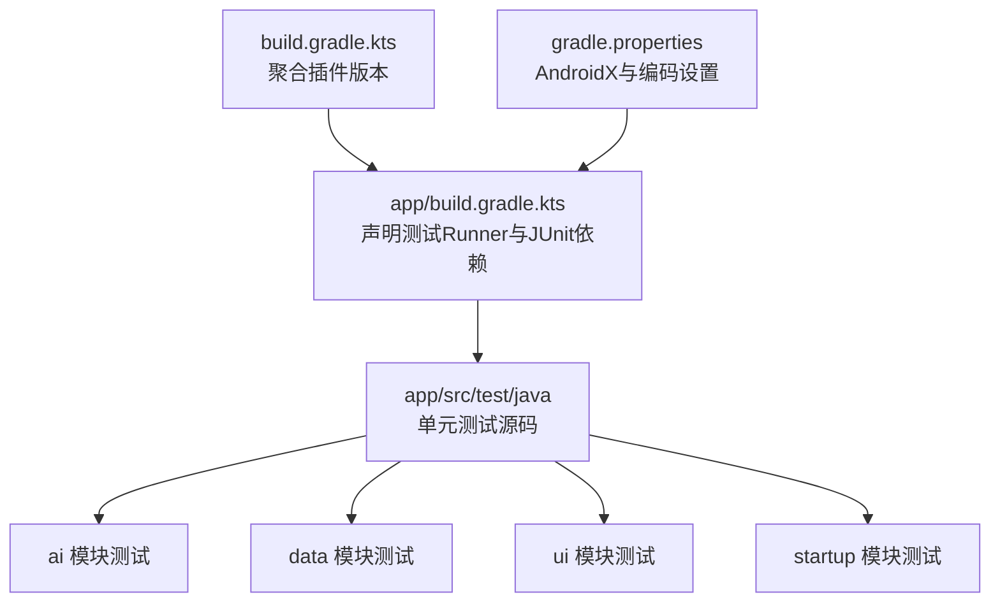
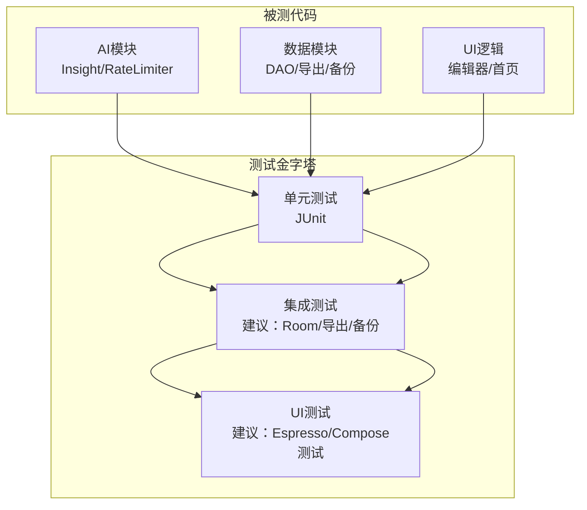
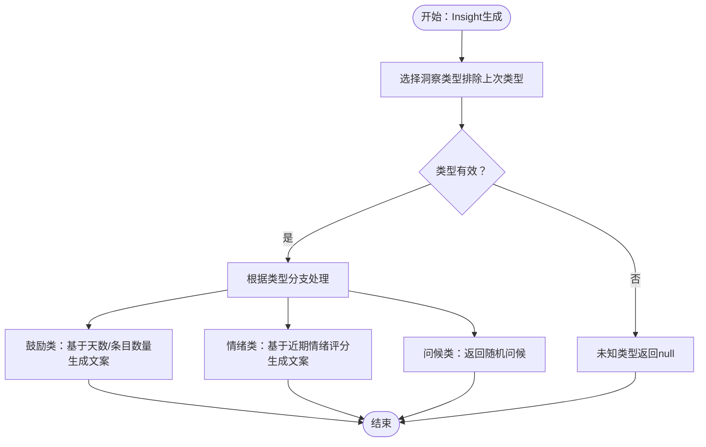
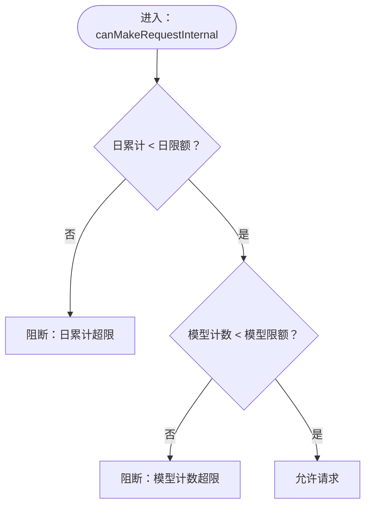
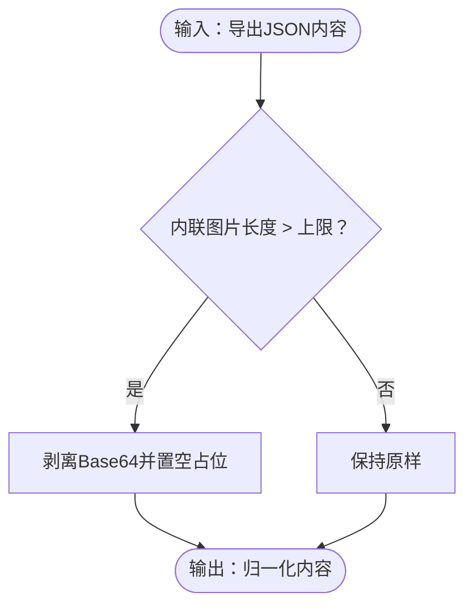
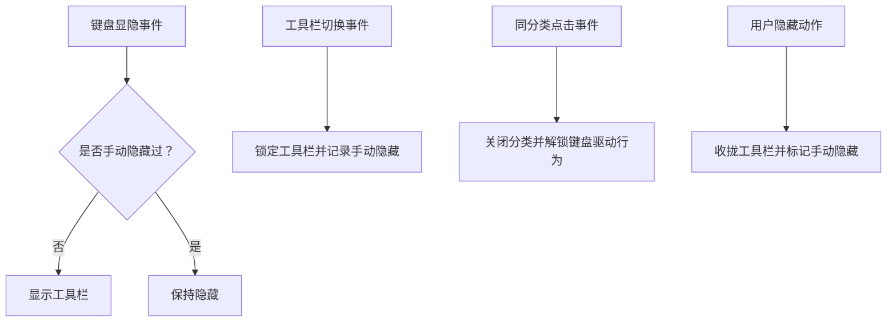
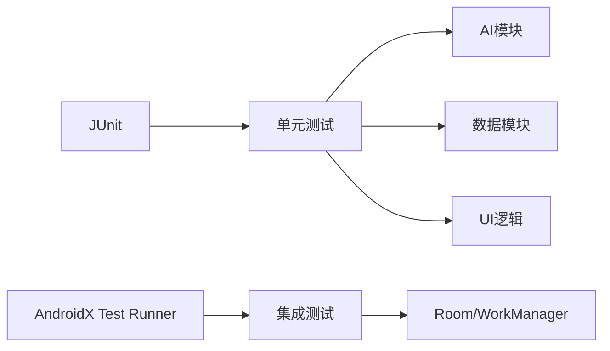

# 测试策略

<cite>
**本文引用的文件**
- [app/build.gradle.kts](file://app/build.gradle.kts)
- [build.gradle.kts](file://build.gradle.kts)
- [gradle.properties](file://gradle.properties)
- [app/src/test/java/com/diary/app/ai/InsightGeneratorTest.kt](file://app/src/test/java/com/diary/app/ai/InsightGeneratorTest.kt)
- [app/src/test/java/com/diary/app/ai/RateLimiterTest.kt](file://app/src/test/java/com/diary/app/ai/RateLimiterTest.kt)
- [app/src/test/java/com/diary/app/data/DiaryDaoSourceTest.kt](file://app/src/test/java/com/diary/app/data/DiaryDaoSourceTest.kt)
- [app/src/test/java/com/diary/app/data/DiaryExportUtilsTest.kt](file://app/src/test/java/com/diary/app/data/DiaryExportUtilsTest.kt)
- [app/src/test/java/com/diary/app/data/BackupManagerUtilsTest.kt](file://app/src/test/java/com/diary/app/data/BackupManagerUtilsTest.kt)
- [app/src/test/java/com/diary/app/ui/home/HomeScreenLogicTest.kt](file://app/src/test/java/com/diary/app/ui/home/HomeScreenLogicTest.kt)
- [app/src/test/java/com/diary/app/ui/editor/EditorChromeStateTest.kt](file://app/src/test/java/com/diary/app/ui/editor/EditorChromeStateTest.kt)
</cite>

## 目录
1. [引言](#引言)
2. [项目结构](#项目结构)
3. [核心组件](#核心组件)
4. [架构概览](#架构概览)
5. [详细组件分析](#详细组件分析)
6. [依赖分析](#依赖分析)
7. [性能考虑](#性能考虑)
8. [故障排查指南](#故障排查指南)
9. [结论](#结论)
10. [附录](#附录)

## 引言
本测试策略文档面向DiaryApp项目，系统化阐述单元测试、集成测试与UI测试的组织方式与实施要点，覆盖数据层、业务逻辑层与UI层，并明确测试工具链（JUnit、Espresso等）的选型与配置，提供测试数据准备与模拟对象构建方法，以及持续集成与自动化测试的落地建议。

## 项目结构
当前仓库中存在标准的Android应用测试布局：单元测试位于app/src/test/java下，按包结构组织，涵盖ai、data、startup、ui等模块；尚未发现app/src/androidTest目录，表明尚未启用Instrumentation/UI测试套件。Gradle配置中已声明JUnit依赖与Android测试Runner，为后续扩展Espresso等UI测试奠定基础。

**图表来源**
- [app/build.gradle.kts:25](file://app/build.gradle.kts#L25)
- [app/build.gradle.kts:140](file://app/build.gradle.kts#L140)

**章节来源**
- [app/build.gradle.kts:14](file://app/build.gradle.kts#L14)
- [app/build.gradle.kts:25](file://app/build.gradle.kts#L25)
- [app/build.gradle.kts:140](file://app/build.gradle.kts#L140)
- [build.gradle.kts:1](file://build.gradle.kts#L1)
- [gradle.properties:1](file://gradle.properties#L1)

## 核心组件
- 单元测试（JUnit）
  - 覆盖AI洞察生成、限流控制、数据导出归一化、备份文件名规范化、DAO查询安全策略、编辑器UI状态管理、首页逻辑判断等。
  - 示例路径：
    - [InsightGeneratorTest.kt](file://app/src/test/java/com/diary/app/ai/InsightGeneratorTest.kt)
    - [RateLimiterTest.kt](file://app/src/test/java/com/diary/app/ai/RateLimiterTest.kt)
    - [DiaryExportUtilsTest.kt](file://app/src/test/java/com/diary/app/data/DiaryExportUtilsTest.kt)
    - [BackupManagerUtilsTest.kt](file://app/src/test/java/com/diary/app/data/BackupManagerUtilsTest.kt)
    - [DiaryDaoSourceTest.kt](file://app/src/test/java/com/diary/app/data/DiaryDaoSourceTest.kt)
    - [EditorChromeStateTest.kt](file://app/src/test/java/com/diary/app/ui/editor/EditorChromeStateTest.kt)
    - [HomeScreenLogicTest.kt](file://app/src/test/java/com/diary/app/ui/home/HomeScreenLogicTest.kt)

- 集成测试（建议）
  - 基于现有Room DAO与导出流程，建议新增针对数据库事务、批量导出、媒体裁剪与备份扫描的集成测试，验证跨组件协作与边界条件。

- UI测试（建议）
  - 基于现有Compose UI与导航逻辑，建议引入Espresso或Compose测试框架，对关键交互（如编辑器工具栏可见性、首页快捷入口解析、搜索空态显示）进行端到端验证。

**章节来源**
- [app/src/test/java/com/diary/app/ai/InsightGeneratorTest.kt:1](file://app/src/test/java/com/diary/app/ai/InsightGeneratorTest.kt#L1)
- [app/src/test/java/com/diary/app/ai/RateLimiterTest.kt:1](file://app/src/test/java/com/diary/app/ai/RateLimiterTest.kt#L1)
- [app/src/test/java/com/diary/app/data/DiaryExportUtilsTest.kt:1](file://app/src/test/java/com/diary/app/data/DiaryExportUtilsTest.kt#L1)
- [app/src/test/java/com/diary/app/data/BackupManagerUtilsTest.kt:1](file://app/src/test/java/com/diary/app/data/BackupManagerUtilsTest.kt#L1)
- [app/src/test/java/com/diary/app/data/DiaryDaoSourceTest.kt:1](file://app/src/test/java/com/diary/app/data/DiaryDaoSourceTest.kt#L1)
- [app/src/test/java/com/diary/app/ui/editor/EditorChromeStateTest.kt:1](file://app/src/test/java/com/diary/app/ui/editor/EditorChromeStateTest.kt#L1)
- [app/src/test/java/com/diary/app/ui/home/HomeScreenLogicTest.kt:1](file://app/src/test/java/com/diary/app/ui/home/HomeScreenLogicTest.kt#L1)

## 架构概览
下图展示测试金字塔在DiaryApp中的分层分布：底层为单元测试，中间为集成测试，顶层为UI测试。当前仓库以单元测试为主，建议逐步补充集成与UI测试。

## 详细组件分析

### AI模块测试策略
- 覆盖范围
  - 洞察类型选择排除上一次类型、不同用户画像下的鼓励类洞察文案、近期情绪趋势下的情绪类洞察、问候类与未知类型的处理、旧条目不参与近期窗口等场景。
- 测试方法
  - 使用参数化与边界值构造样本数据，断言返回文本与类型一致性；通过时间计算模拟“近期”窗口。
- 关键用例路径
  - [InsightGeneratorTest.kt:18-60](file://app/src/test/java/com/diary/app/ai/InsightGeneratorTest.kt#L18-L60)
  - [InsightGeneratorTest.kt:74-115](file://app/src/test/java/com/diary/app/ai/InsightGeneratorTest.kt#L74-L115)
  - [InsightGeneratorTest.kt:119-167](file://app/src/test/java/com/diary/app/ai/InsightGeneratorTest.kt#L119-L167)
  - [InsightGeneratorTest.kt:171-180](file://app/src/test/java/com/diary/app/ai/InsightGeneratorTest.kt#L171-L180)
  - [InsightGeneratorTest.kt:184-194](file://app/src/test/java/com/diary/app/ai/InsightGeneratorTest.kt#L184-L194)
  - [InsightGeneratorTest.kt:198-208](file://app/src/test/java/com/diary/app/ai/InsightGeneratorTest.kt#L198-L208)

**图表来源**
- [app/src/test/java/com/diary/app/ai/InsightGeneratorTest.kt:18-60](file://app/src/test/java/com/diary/app/ai/InsightGeneratorTest.kt#L18-L60)
- [app/src/test/java/com/diary/app/ai/InsightGeneratorTest.kt:74-115](file://app/src/test/java/com/diary/app/ai/InsightGeneratorTest.kt#L74-L115)
- [app/src/test/java/com/diary/app/ai/InsightGeneratorTest.kt:119-167](file://app/src/test/java/com/diary/app/ai/InsightGeneratorTest.kt#L119-L167)
- [app/src/test/java/com/diary/app/ai/InsightGeneratorTest.kt:171-180](file://app/src/test/java/com/diary/app/ai/InsightGeneratorTest.kt#L171-L180)
- [app/src/test/java/com/diary/app/ai/InsightGeneratorTest.kt:184-194](file://app/src/test/java/com/diary/app/ai/InsightGeneratorTest.kt#L184-L194)
- [app/src/test/java/com/diary/app/ai/InsightGeneratorTest.kt:198-208](file://app/src/test/java/com/diary/app/ai/InsightGeneratorTest.kt#L198-L208)

**章节来源**
- [app/src/test/java/com/diary/app/ai/InsightGeneratorTest.kt:1](file://app/src/test/java/com/diary/app/ai/InsightGeneratorTest.kt#L1)

### 限流器测试策略
- 覆盖范围
  - 日累计与模型级限额的边界与越界行为、自定义限额生效、零限额阻断请求等。
- 测试方法
  - 通过穷举边界值与典型组合断言允许/阻断结果，验证UsageStats默认限额与模型用量映射。
- 关键用例路径
  - [RateLimiterTest.kt:12-45](file://app/src/test/java/com/diary/app/ai/RateLimiterTest.kt#L12-L45)
  - [RateLimiterTest.kt:58-67](file://app/src/test/java/com/diary/app/ai/RateLimiterTest.kt#L58-L67)
  - [RateLimiterTest.kt:76-85](file://app/src/test/java/com/diary/app/ai/RateLimiterTest.kt#L76-L85)
  - [RateLimiterTest.kt:88-98](file://app/src/test/java/com/diary/app/ai/RateLimiterTest.kt#L88-L98)

**图表来源**
- [app/src/test/java/com/diary/app/ai/RateLimiterTest.kt:12-45](file://app/src/test/java/com/diary/app/ai/RateLimiterTest.kt#L12-L45)
- [app/src/test/java/com/diary/app/ai/RateLimiterTest.kt:58-67](file://app/src/test/java/com/diary/app/ai/RateLimiterTest.kt#L58-L67)
- [app/src/test/java/com/diary/app/ai/RateLimiterTest.kt:76-85](file://app/src/test/java/com/diary/app/ai/RateLimiterTest.kt#L76-L85)
- [app/src/test/java/com/diary/app/ai/RateLimiterTest.kt:88-98](file://app/src/test/java/com/diary/app/ai/RateLimiterTest.kt#L88-L98)

**章节来源**
- [app/src/test/java/com/diary/app/ai/RateLimiterTest.kt:1](file://app/src/test/java/com/diary/app/ai/RateLimiterTest.kt#L1)

### 数据导出与DAO安全查询测试策略
- 覆盖范围
  - 导出内容归一化：普通内容保持不变、超长内联图片payload剥离、空Base64清理；DAO安全查询：超长内联内容降级、批量导出调用链验证。
- 测试方法
  - 构造含超长Base64的Quill富文本JSON，断言导出后不再包含原始payload且占位为空；读取源码与导出器源码，断言函数签名与调用存在性。
- 关键用例路径
  - [DiaryExportUtilsTest.kt:10-16](file://app/src/test/java/com/diary/app/data/DiaryExportUtilsTest.kt#L10-L16)
  - [DiaryExportUtilsTest.kt:19-27](file://app/src/test/java/com/diary/app/data/DiaryExportUtilsTest.kt#L19-L27)
  - [DiaryDaoSourceTest.kt:10-18](file://app/src/test/java/com/diary/app/data/DiaryDaoSourceTest.kt#L10-L18)

**图表来源**
- [app/src/test/java/com/diary/app/data/DiaryExportUtilsTest.kt:10-16](file://app/src/test/java/com/diary/app/data/DiaryExportUtilsTest.kt#L10-L16)
- [app/src/test/java/com/diary/app/data/DiaryExportUtilsTest.kt:19-27](file://app/src/test/java/com/diary/app/data/DiaryExportUtilsTest.kt#L19-L27)

**章节来源**
- [app/src/test/java/com/diary/app/data/DiaryExportUtilsTest.kt:1](file://app/src/test/java/com/diary/app/data/DiaryExportUtilsTest.kt#L1)
- [app/src/test/java/com/diary/app/data/DiaryDaoSourceTest.kt:1](file://app/src/test/java/com/diary/app/data/DiaryDaoSourceTest.kt#L1)

### 备份文件名规范化测试策略
- 覆盖范围
  - 文件名去空白、非法字符替换、扩展名迁移（.json -> .diarybackup）、扫描前缀与扩展名集合校验。
- 测试方法
  - 断言规范化后的字符串与期望一致，验证扫描集合包含预期项。
- 关键用例路径
  - [BackupManagerUtilsTest.kt:10-15](file://app/src/test/java/com/diary/app/data/BackupManagerUtilsTest.kt#L10-L15)
  - [BackupManagerUtilsTest.kt:18-23](file://app/src/test/java/com/diary/app/data/BackupManagerUtilsTest.kt#L18-L23)
  - [BackupManagerUtilsTest.kt:26-31](file://app/src/test/java/com/diary/app/data/BackupManagerUtilsTest.kt#L26-L31)
  - [BackupManagerUtilsTest.kt:34-39](file://app/src/test/java/com/diary/app/data/BackupManagerUtilsTest.kt#L34-L39)
  - [BackupManagerUtilsTest.kt:42-51](file://app/src/test/java/com/diary/app/data/BackupManagerUtilsTest.kt#L42-L51)

**章节来源**
- [app/src/test/java/com/diary/app/data/BackupManagerUtilsTest.kt:1](file://app/src/test/java/com/diary/app/data/BackupManagerUtilsTest.kt#L1)

### 编辑器UI状态测试策略
- 覆盖范围
  - 键盘显隐对工具栏的影响、手动隐藏锁定机制、同分类点击关闭与解锁键盘驱动行为、用户隐藏动作的收拢效果。
- 测试方法
  - 以EditorChromeState为输入，断言状态转换后的字段值与布尔标志。
- 关键用例路径
  - [EditorChromeStateTest.kt:11-26](file://app/src/test/java/com/diary/app/ui/editor/EditorChromeStateTest.kt#L11-L26)
  - [EditorChromeStateTest.kt:29-35](file://app/src/test/java/com/diary/app/ui/editor/EditorChromeStateTest.kt#L29-L35)
  - [EditorChromeStateTest.kt:38-47](file://app/src/test/java/com/diary/app/ui/editor/EditorChromeStateTest.kt#L38-L47)
  - [EditorChromeStateTest.kt:50-58](file://app/src/test/java/com/diary/app/ui/editor/EditorChromeStateTest.kt#L50-L58)

**图表来源**
- [app/src/test/java/com/diary/app/ui/editor/EditorChromeStateTest.kt:11-26](file://app/src/test/java/com/diary/app/ui/editor/EditorChromeStateTest.kt#L11-L26)
- [app/src/test/java/com/diary/app/ui/editor/EditorChromeStateTest.kt:29-35](file://app/src/test/java/com/diary/app/ui/editor/EditorChromeStateTest.kt#L29-L35)
- [app/src/test/java/com/diary/app/ui/editor/EditorChromeStateTest.kt:38-47](file://app/src/test/java/com/diary/app/ui/editor/EditorChromeStateTest.kt#L38-L47)
- [app/src/test/java/com/diary/app/ui/editor/EditorChromeStateTest.kt:50-58](file://app/src/test/java/com/diary/app/ui/editor/EditorChromeStateTest.kt#L50-L58)

**章节来源**
- [app/src/test/java/com/diary/app/ui/editor/EditorChromeStateTest.kt:1](file://app/src/test/java/com/diary/app/ui/editor/EditorChromeStateTest.kt#L1)

### 首页逻辑测试策略
- 覆盖范围
  - 快捷入口解析（todo优先于timeline）、搜索空态显示条件、浏览分区在搜索时隐藏、首页高亮状态刷新合并逻辑。
- 测试方法
  - 以samplePreview构造轻量数据模型，断言布尔表达式与状态合并结果。
- 关键用例路径
  - [HomeScreenLogicTest.kt:12-14](file://app/src/test/java/com/diary/app/ui/home/HomeScreenLogicTest.kt#L12-L14)
  - [HomeScreenLogicTest.kt:17-23](file://app/src/test/java/com/diary/app/ui/home/HomeScreenLogicTest.kt#L17-L23)
  - [HomeScreenLogicTest.kt:26-30](file://app/src/test/java/com/diary/app/ui/home/HomeScreenLogicTest.kt#L26-L30)
  - [HomeScreenLogicTest.kt:33-52](file://app/src/test/java/com/diary/app/ui/home/HomeScreenLogicTest.kt#L33-L52)

**章节来源**
- [app/src/test/java/com/diary/app/ui/home/HomeScreenLogicTest.kt:1](file://app/src/test/java/com/diary/app/ui/home/HomeScreenLogicTest.kt#L1)

## 依赖分析
- 测试运行时依赖
  - JUnit：用于所有单元测试的基础断言与测试生命周期。
  - AndroidX Test Runner：在Gradle中声明，为未来扩展Instrumentation测试做准备。
- 组件耦合
  - AI模块测试独立性强，仅依赖内部数据模型；数据模块测试依赖导出与DAO源码存在性；UI逻辑测试依赖Compose状态模型与导航常量。
- 外部依赖与集成点
  - Room、WorkManager、Biometric、健康连接等外部库在当前测试集中未直接覆盖，建议在集成测试中补充。

**图表来源**
- [app/build.gradle.kts:25](file://app/build.gradle.kts#L25)
- [app/build.gradle.kts:140](file://app/build.gradle.kts#L140)

**章节来源**
- [app/build.gradle.kts:25](file://app/build.gradle.kts#L25)
- [app/build.gradle.kts:140](file://app/build.gradle.kts#L140)

## 性能考虑
- 单元测试应避免I/O与网络调用，必要时使用Mock或In-Memory实现。
- 对AI生成与限流逻辑，建议固定时间基准或使用FakeClock以保证可重复性。
- 集成测试中对数据库与文件操作，采用临时目录与最小化数据集，缩短执行时间。
- UI测试建议使用稳定元素标识与等待策略，减少随机失败。

## 故障排查指南
- 测试失败定位
  - 从失败用例入手，核对输入数据与断言条件，确认边界值与异常路径是否覆盖。
  - 对依赖外部资源（如API、文件系统）的测试，检查本地环境变量与权限。
- 常见问题
  - 时间相关断言不稳定：统一使用固定时间源或可控时钟。
  - UI状态断言偶发失败：增加显式等待或重试策略。
  - 数据库集成测试失败：确保迁移脚本与Schema一致，清理残留数据。

## 结论
DiaryApp当前以完善的单元测试为基础，覆盖AI、数据与UI逻辑的关键分支。建议下一步引入集成测试与UI测试，完善数据库与文件系统的端到端验证，并在CI中自动化执行全量测试套件，保障发布质量与回归稳定性。

## 附录

### 测试工具与配置建议
- 单元测试
  - 框架：JUnit
  - 运行器：AndroidJUnitRunner（已在Gradle中声明）
  - 依赖：在app/build.gradle.kts中添加JUnit与Compose测试依赖
- 集成测试
  - Room：使用In-Memory Database或Test Support Library
  - 导出/备份：使用临时目录与最小化数据集
- UI测试
  - Espresso：适用于传统View系统
  - Compose测试：推荐使用Compose测试框架进行UI状态与交互验证
  - 配置：在app/build.gradle.kts中添加androidx.test.*依赖

**章节来源**
- [app/build.gradle.kts:25](file://app/build.gradle.kts#L25)
- [app/build.gradle.kts:140](file://app/build.gradle.kts#L140)