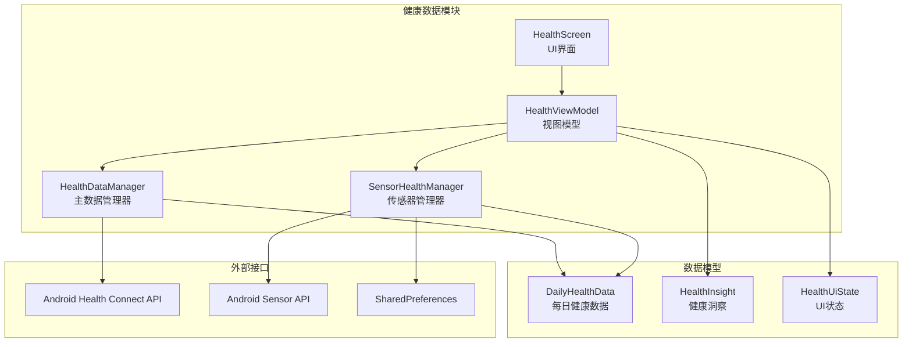
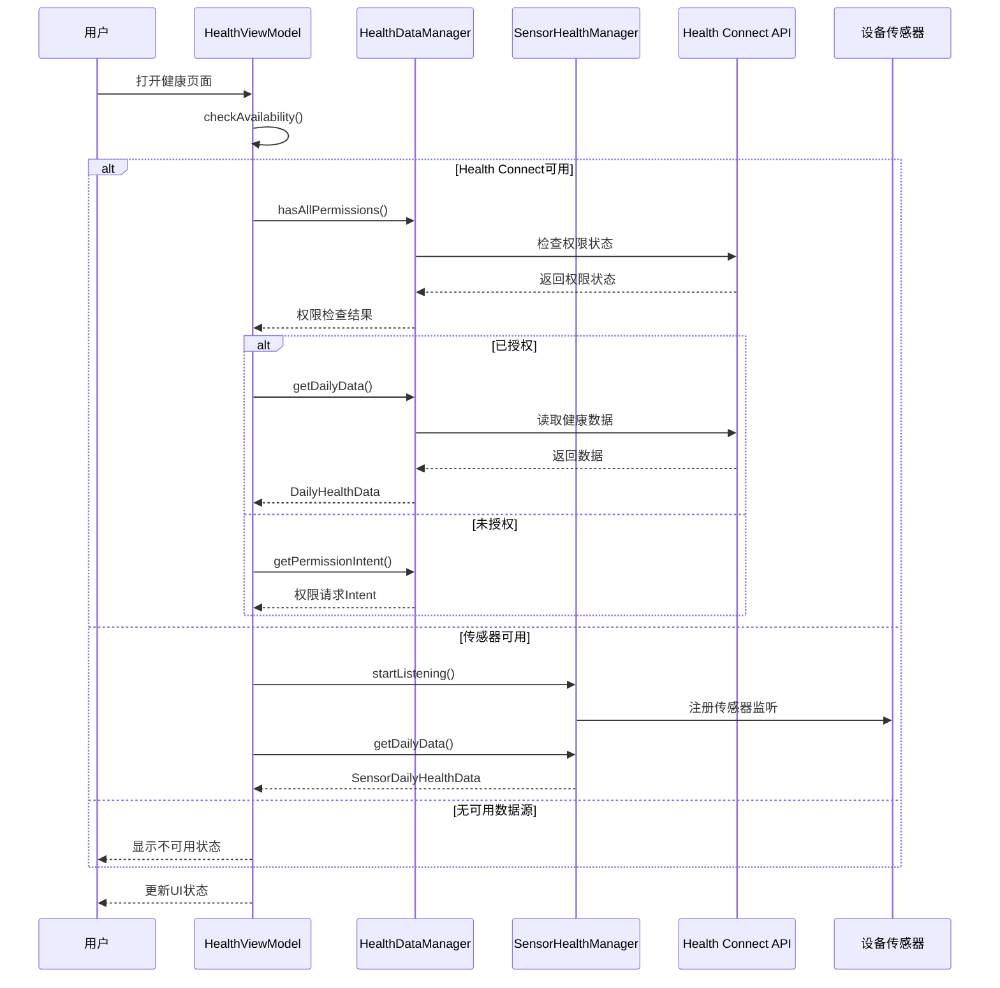
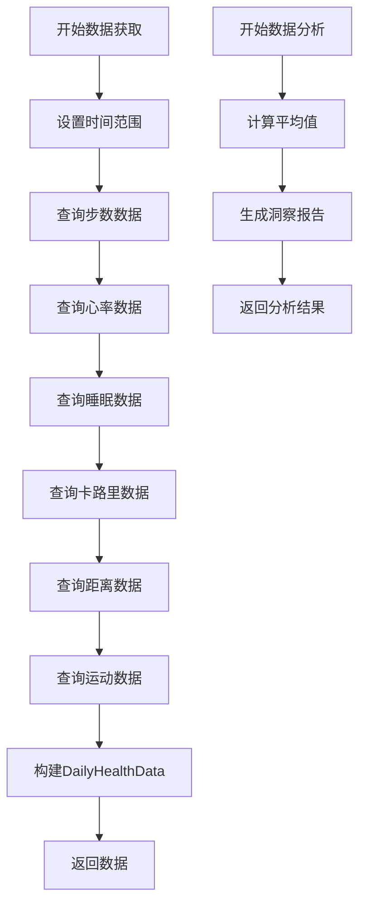
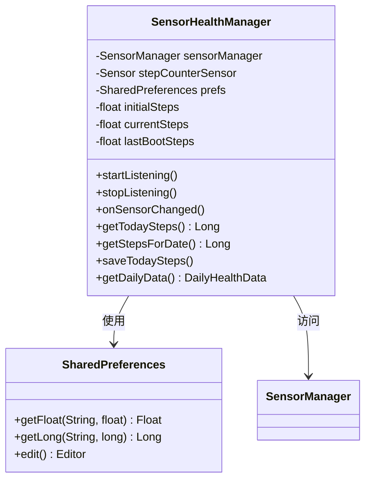
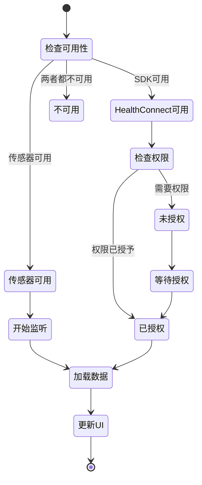
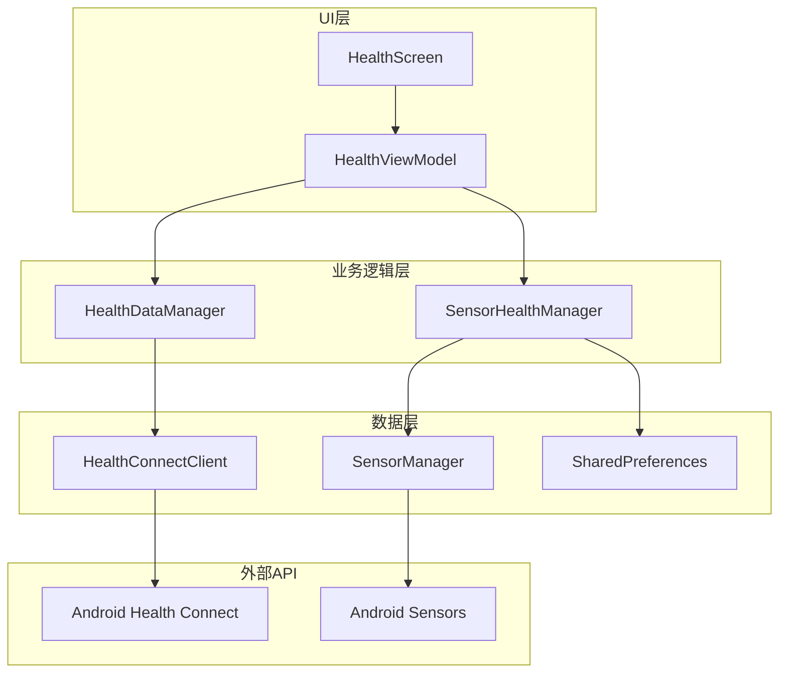

# 健康数据集成

<cite>
**本文档引用的文件**
- [HealthDataManager.kt](file://app/src/main/java/com/diary/app/health/HealthDataManager.kt)
- [SensorHealthManager.kt](file://app/src/main/java/com/diary/app/health/SensorHealthManager.kt)
- [HealthScreen.kt](file://app/src/main/java/com/diary/app/ui/health/HealthScreen.kt)
- [HealthViewModel.kt](file://app/src/main/java/com/diary/app/ui/health/HealthViewModel.kt)
- [AndroidManifest.xml](file://app/src/main/AndroidManifest.xml)
</cite>

## 目录
1. [简介](#简介)
2. [项目结构](#项目结构)
3. [核心组件](#核心组件)
4. [架构概览](#架构概览)
5. [详细组件分析](#详细组件分析)
6. [依赖关系分析](#依赖关系分析)
7. [性能考虑](#性能考虑)
8. [故障排除指南](#故障排除指南)
9. [结论](#结论)

## 简介

DiaryApp的健康数据集成功能是一个完整的健康数据管理系统，旨在为用户提供全面的健康数据分析和可视化。该系统通过两种主要模式为用户提供健康数据：基于Android Health Connect API的完整数据访问，以及基于设备传感器的降级模式。

该功能支持多种健康指标的收集、处理和存储，包括步数、心率、睡眠、卡路里消耗、距离和运动时间等数据类型。系统提供了实时监控和历史数据分析能力，并通过直观的图表界面展示健康趋势。

## 项目结构

健康数据功能位于应用的特定包结构中，采用清晰的分层架构设计：

**图表来源**
- [HealthDataManager.kt:1-300](file://app/src/main/java/com/diary/app/health/HealthDataManager.kt#L1-L300)
- [SensorHealthManager.kt:1-137](file://app/src/main/java/com/diary/app/health/SensorHealthManager.kt#L1-L137)
- [HealthViewModel.kt:1-199](file://app/src/main/java/com/diary/app/ui/health/HealthViewModel.kt#L1-L199)

**章节来源**
- [HealthDataManager.kt:1-300](file://app/src/main/java/com/diary/app/health/HealthDataManager.kt#L1-L300)
- [SensorHealthManager.kt:1-137](file://app/src/main/java/com/diary/app/health/SensorHealthManager.kt#L1-L137)
- [HealthViewModel.kt:1-199](file://app/src/main/java/com/diary/app/ui/health/HealthViewModel.kt#L1-L199)

## 核心组件

### 数据模型

系统定义了两个核心数据模型来表示健康数据：

**DailyHealthData** - 表示单日健康数据的完整结构：
- 日期信息
- 步数统计
- 心率指标（平均值、最小值、最大值）
- 睡眠时长
- 卡路里消耗
- 距离统计
- 运动时间

**HealthInsight** - 表示健康分析结果：
- 洞察类型枚举
- 标题和描述
- 建议和推荐

### 权限管理

系统支持多种健康数据权限：
- 步数读取权限
- 睡眠数据权限
- 心率数据权限
- 卡路里消耗权限
- 距离数据权限
- 运动会话权限

**章节来源**
- [HealthDataManager.kt:24-49](file://app/src/main/java/com/diary/app/health/HealthDataManager.kt#L24-L49)
- [HealthDataManager.kt:55-67](file://app/src/main/java/com/diary/app/health/HealthDataManager.kt#L55-L67)

## 架构概览

健康数据系统采用双模式架构，确保在不同设备配置下都能提供最佳用户体验：

**图表来源**
- [HealthViewModel.kt:38-77](file://app/src/main/java/com/diary/app/ui/health/HealthViewModel.kt#L38-L77)
- [HealthDataManager.kt:76-87](file://app/src/main/java/com/diary/app/health/HealthDataManager.kt#L76-L87)
- [SensorHealthManager.kt:31-41](file://app/src/main/java/com/diary/app/health/SensorHealthManager.kt#L31-L41)

## 详细组件分析

### HealthDataManager - 主数据管理器

HealthDataManager是健康数据系统的核心组件，负责与Android Health Connect API进行交互：

#### 主要功能特性

**权限管理**：
- 自动检测Health Connect SDK可用性
- 管理多类型健康数据权限
- 提供权限请求Intent

**数据获取**：
- 支持按日、周、月的数据范围查询
- 使用聚合查询优化性能
- 处理时间范围过滤

**数据分析**：
- 自动生成健康洞察报告
- 提供数据完整性分析
- 生成个性化健康建议

#### 数据处理流程

**图表来源**
- [HealthDataManager.kt:89-175](file://app/src/main/java/com/diary/app/health/HealthDataManager.kt#L89-L175)
- [HealthDataManager.kt:199-284](file://app/src/main/java/com/diary/app/health/HealthDataManager.kt#L199-L284)

**章节来源**
- [HealthDataManager.kt:51-87](file://app/src/main/java/com/diary/app/health/HealthDataManager.kt#L51-L87)
- [HealthDataManager.kt:89-197](file://app/src/main/java/com/diary/app/health/HealthDataManager.kt#L89-L197)

### SensorHealthManager - 传感器管理器

SensorHealthManager提供降级模式下的健康数据支持，专门针对没有Google Play服务的设备：

#### 核心特性

**步数传感器支持**：
- 使用Android内置步数计数器传感器
- 支持设备重启后的数据恢复
- 提供历史数据持久化

**数据存储机制**：
- 使用SharedPreferences存储历史数据
- 实现跨设备重启的数据持久化
- 提供每日数据查询功能

#### 传感器数据处理

**图表来源**
- [SensorHealthManager.kt:18-136](file://app/src/main/java/com/diary/app/health/SensorHealthManager.kt#L18-L136)

**章节来源**
- [SensorHealthManager.kt:13-136](file://app/src/main/java/com/diary/app/health/SensorHealthManager.kt#L13-L136)

### HealthViewModel - 视图模型

HealthViewModel协调UI状态管理和数据加载逻辑：

#### 状态管理

**HealthUiState**包含所有UI相关的状态信息：
- 可用性状态
- 权限状态
- 加载状态
- 当前选中的标签页
- 健康数据集合
- 健康洞察列表
- 错误信息

#### 数据加载策略

**图表来源**
- [HealthViewModel.kt:38-77](file://app/src/main/java/com/diary/app/ui/health/HealthViewModel.kt#L38-L77)
- [HealthViewModel.kt:83-145](file://app/src/main/java/com/diary/app/ui/health/HealthViewModel.kt#L83-L145)

**章节来源**
- [HealthViewModel.kt:17-28](file://app/src/main/java/com/diary/app/ui/health/HealthViewModel.kt#L17-L28)
- [HealthViewModel.kt:30-77](file://app/src/main/java/com/diary/app/ui/health/HealthViewModel.kt#L30-L77)

### HealthScreen - UI界面

HealthScreen提供完整的健康数据可视化界面：

#### 界面布局

**标签页导航**：
- 今日视图：显示当日详细健康数据
- 本周视图：展示一周健康趋势图表
- 月度视图：显示一个月的健康数据趋势

**数据卡片**：
- 步数进度条显示
- 心率数据展示
- 睡眠、卡路里、距离、运动等指标
- 健康洞察卡片

#### 图表组件

**周趋势图表**：
- 动态柱状图展示步数趋势
- 平滑动画效果
- 自适应标签显示

**洞察卡片**：
- 不同类型的健康建议
- 图标和颜色编码
- 清晰的建议内容

**章节来源**
- [HealthScreen.kt:146-249](file://app/src/main/java/com/diary/app/ui/health/HealthScreen.kt#L146-L249)
- [HealthScreen.kt:576-628](file://app/src/main/java/com/diary/app/ui/health/HealthScreen.kt#L576-L628)

## 依赖关系分析

健康数据系统具有清晰的依赖层次结构：

**图表来源**
- [HealthDataManager.kt:7](file://app/src/main/java/com/diary/app/health/HealthDataManager.kt#L7)
- [SensorHealthManager.kt:20](file://app/src/main/java/com/diary/app/health/SensorHealthManager.kt#L20)

### 外部依赖

系统依赖以下关键外部组件：
- **Android Health Connect SDK**：提供健康数据访问能力
- **Android Sensor API**：提供步数传感器支持
- **SharedPreferences**：提供本地数据持久化
- **Android Manifest权限**：声明必要的健康数据权限

**章节来源**
- [AndroidManifest.xml:20-26](file://app/src/main/AndroidManifest.xml#L20-L26)
- [AndroidManifest.xml:133-154](file://app/src/main/AndroidManifest.xml#L133-L154)

## 性能考虑

### 数据查询优化

系统采用了多种性能优化策略：

**聚合查询**：
- 使用Health Connect的聚合API减少网络调用
- 合并多个数据查询到单个请求中
- 减少数据传输量和处理时间

**缓存机制**：
- 传感器数据使用SharedPreferences本地缓存
- 历史数据持久化存储
- 避免重复的数据查询

**异步处理**：
- 所有数据操作都是异步执行
- 使用协程避免阻塞主线程
- 提供流畅的用户体验

### 内存管理

**数据生命周期**：
- ViewModel自动管理数据生命周期
- 在应用退出时自动清理资源
- 防止内存泄漏

**UI更新优化**：
- 使用StateFlow避免不必要的UI重绘
- 组件级别的状态更新
- 减少UI线程的压力

## 故障排除指南

### 常见问题及解决方案

**Health Connect不可用**：
- 检查设备是否安装Google Play服务
- 确认Health Connect应用已启用
- 验证设备兼容性

**权限拒绝**：
- 引导用户到系统设置授予权限
- 提供清晰的权限说明
- 支持重新授权流程

**传感器数据缺失**：
- 确认设备支持步数传感器
- 检查传感器权限
- 验证设备传感器状态

**数据同步延迟**：
- 等待Health Connect数据同步完成
- 检查设备网络连接
- 重启Health Connect应用

### 错误处理机制

系统实现了完善的错误处理：
- 异常捕获和日志记录
- 用户友好的错误提示
- 自动重试机制
- 降级模式支持

**章节来源**
- [HealthDataManager.kt:171-175](file://app/src/main/java/com/diary/app/health/HealthDataManager.kt#L171-L175)
- [HealthViewModel.kt:94-100](file://app/src/main/java/com/diary/app/ui/health/HealthViewModel.kt#L94-L100)

## 结论

DiaryApp的健康数据集成功能展现了现代Android应用的优秀实践：

**技术优势**：
- 双模式架构确保了广泛的设备兼容性
- 完善的错误处理和降级机制
- 优雅的UI设计和用户体验
- 高效的数据处理和存储策略

**功能特点**：
- 支持多种健康指标的全面分析
- 提供实时监控和历史趋势分析
- 丰富的数据可视化选项
- 个性化的健康建议和洞察

**扩展潜力**：
- 易于添加新的健康数据类型
- 支持更多的第三方健康设备
- 可扩展的分析算法和洞察生成
- 与其他应用功能的深度集成

该系统为用户提供了可靠、准确且易于使用的健康数据管理体验，是Android健康数据集成的最佳实践案例。