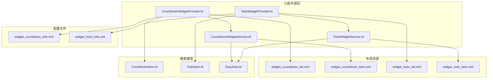
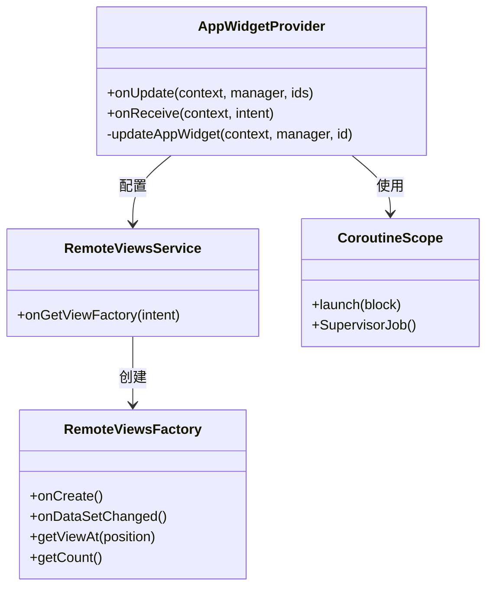
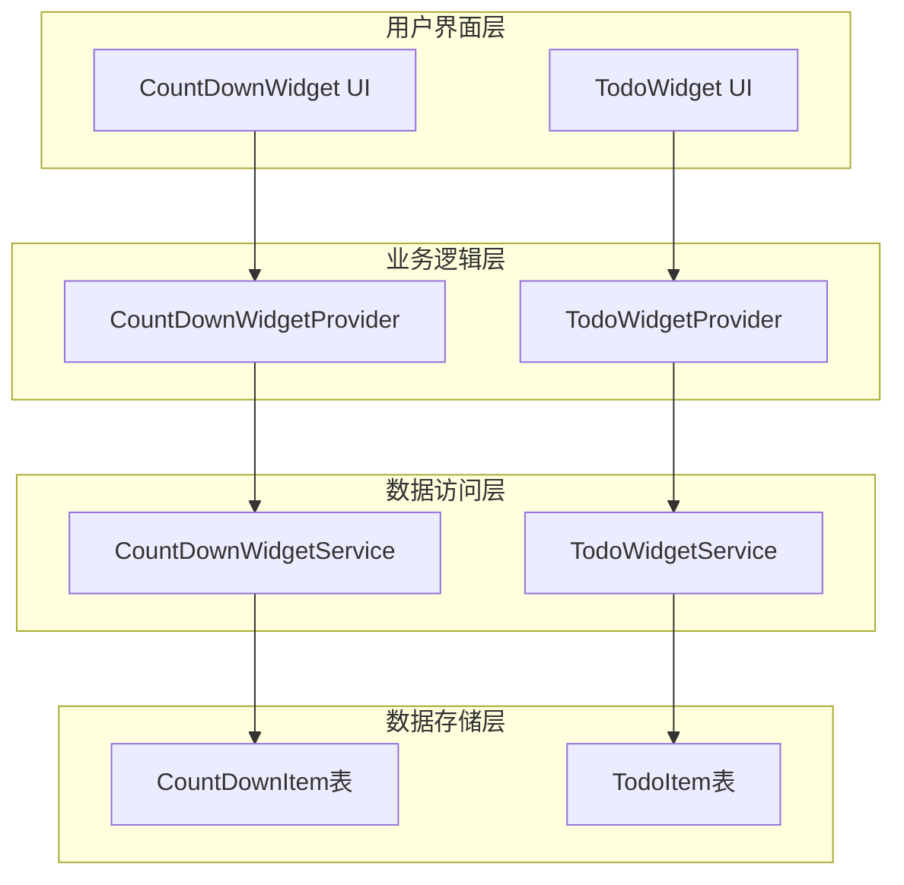
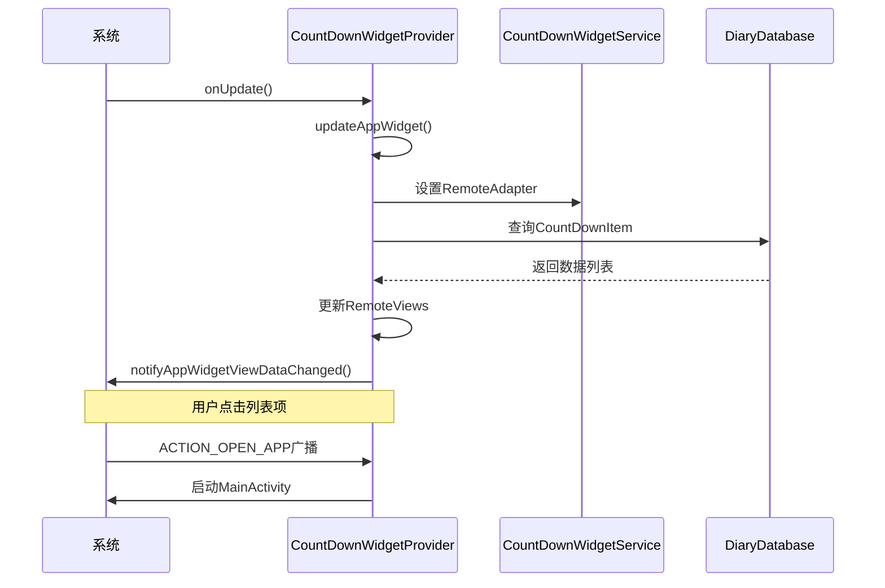
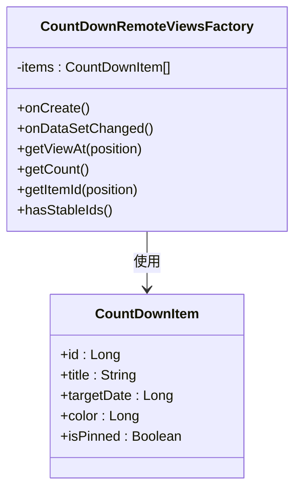
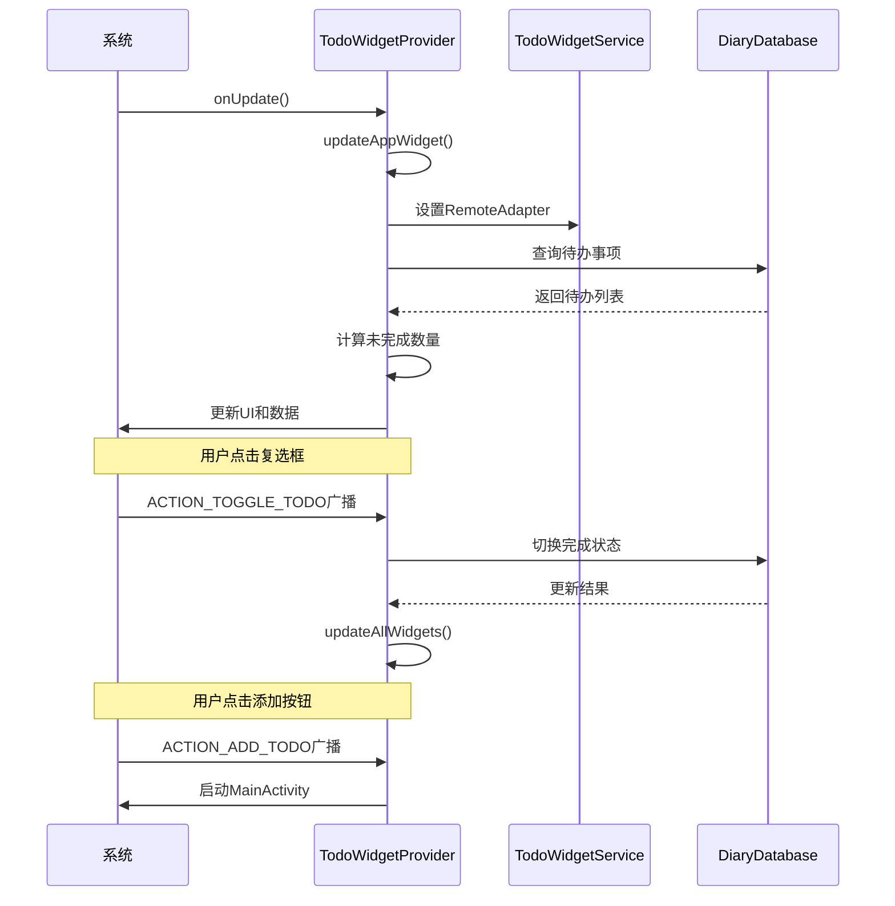
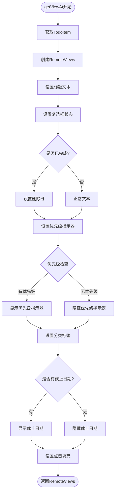
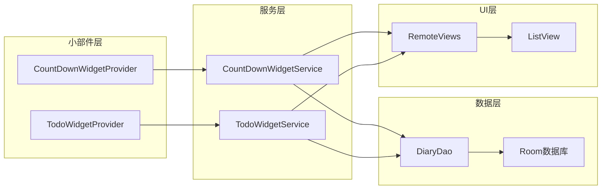
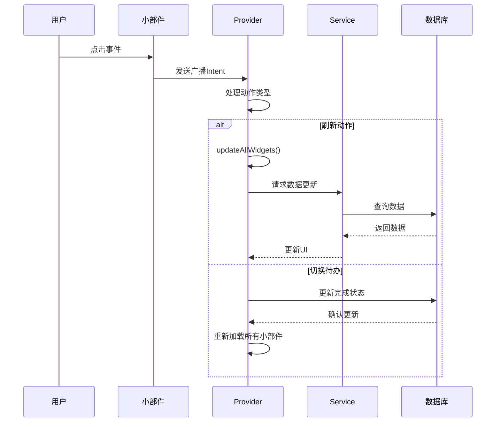

# 桌面小部件系统

<cite>
**本文档引用的文件**
- [CountDownWidgetProvider.kt](file://app/src/main/java/com/diary/app/widget/CountDownWidgetProvider.kt)
- [CountDownWidgetService.kt](file://app/src/main/java/com/diary/app/widget/CountDownWidgetService.kt)
- [TodoWidgetProvider.kt](file://app/src/main/java/com/diary/app/widget/TodoWidgetProvider.kt)
- [TodoWidgetService.kt](file://app/src/main/java/com/diary/app/widget/TodoWidgetService.kt)
- [widget_countdown_list.xml](file://app/src/main/res/layout/widget_countdown_list.xml)
- [widget_countdown_item.xml](file://app/src/main/res/layout/widget_countdown_item.xml)
- [widget_todo_list.xml](file://app/src/main/res/layout/widget_todo_list.xml)
- [widget_todo_item.xml](file://app/src/main/res/layout/widget_todo_item.xml)
- [widget_countdown_info.xml](file://app/src/main/res/xml/widget_countdown_info.xml)
- [widget_todo_info.xml](file://app/src/main/res/xml/widget_todo_info.xml)
- [CountDownItem.kt](file://app/src/main/java/com/diary/app/data/CountDownItem.kt)
- [TodoItem.kt](file://app/src/main/java/com/diary/app/data/TodoItem.kt)
- [DiaryDao.kt](file://app/src/main/java/com/diary/app/data/DiaryDao.kt)
</cite>

## 目录
1. [简介](#简介)
2. [项目结构](#项目结构)
3. [核心组件](#核心组件)
4. [架构概览](#架构概览)
5. [详细组件分析](#详细组件分析)
6. [依赖关系分析](#依赖关系分析)
7. [性能考虑](#性能考虑)
8. [故障排除指南](#故障排除指南)
9. [结论](#结论)

## 简介

DiaryApp的桌面小部件系统提供了两个主要的小部件：倒计时小部件（CountDownWidget）和待办事项小部件（TodoWidget）。这两个小部件都基于Android的AppWidget框架构建，使用RemoteViews进行UI渲染，并通过RemoteViewsService实现动态列表内容。

系统采用协程进行异步数据加载，避免阻塞主线程。每个小部件都有独立的Provider类负责生命周期管理和事件处理，以及对应的Service类处理列表项的动态生成。

## 项目结构

桌面小部件系统的文件组织遵循Android标准结构：

**图表来源**
- [CountDownWidgetProvider.kt:1-126](file://app/src/main/java/com/diary/app/widget/CountDownWidgetProvider.kt#L1-L126)
- [TodoWidgetProvider.kt:1-175](file://app/src/main/java/com/diary/app/widget/TodoWidgetProvider.kt#L1-L175)
- [widget_countdown_list.xml:1-56](file://app/src/main/res/layout/widget_countdown_list.xml#L1-L56)
- [widget_todo_list.xml:1-81](file://app/src/main/res/layout/widget_todo_list.xml#L1-L81)

**章节来源**
- [CountDownWidgetProvider.kt:1-126](file://app/src/main/java/com/diary/app/widget/CountDownWidgetProvider.kt#L1-L126)
- [TodoWidgetProvider.kt:1-175](file://app/src/main/java/com/diary/app/widget/TodoWidgetProvider.kt#L1-L175)
- [widget_countdown_list.xml:1-56](file://app/src/main/res/layout/widget_countdown_list.xml#L1-L56)
- [widget_todo_list.xml:1-81](file://app/src/main/res/layout/widget_todo_list.xml#L1-L81)

## 核心组件

### 小部件Provider架构

每个小部件都包含两个核心组件：

1. **AppWidgetProvider类**：继承自Android的AppWidgetProvider，负责小部件的生命周期管理
2. **RemoteViewsService类**：提供动态列表内容的生成服务

### 数据模型

系统使用Room数据库作为数据存储层：

- **CountDownItem**：倒计时项目实体，包含标题、目标日期、颜色等属性
- **TodoItem**：待办事项实体，包含优先级、截止日期、完成状态等丰富属性

### 协程架构

所有数据访问都通过协程执行，使用SupervisorJob确保单个任务失败不影响其他任务：

**图表来源**
- [CountDownWidgetProvider.kt:23-126](file://app/src/main/java/com/diary/app/widget/CountDownWidgetProvider.kt#L23-L126)
- [TodoWidgetProvider.kt:25-175](file://app/src/main/java/com/diary/app/widget/TodoWidgetProvider.kt#L25-L175)
- [CountDownWidgetService.kt:16-87](file://app/src/main/java/com/diary/app/widget/CountDownWidgetService.kt#L16-L87)
- [TodoWidgetService.kt:17-135](file://app/src/main/java/com/diary/app/widget/TodoWidgetService.kt#L17-L135)

**章节来源**
- [CountDownItem.kt:1-17](file://app/src/main/java/com/diary/app/data/CountDownItem.kt#L1-L17)
- [TodoItem.kt:1-90](file://app/src/main/java/com/diary/app/data/TodoItem.kt#L1-L90)
- [DiaryDao.kt:495-501](file://app/src/main/java/com/diary/app/data/DiaryDao.kt#L495-L501)

## 架构概览

桌面小部件系统采用分层架构设计，每层职责明确：

**图表来源**
- [CountDownWidgetProvider.kt:23-126](file://app/src/main/java/com/diary/app/widget/CountDownWidgetProvider.kt#L23-L126)
- [TodoWidgetProvider.kt:25-175](file://app/src/main/java/com/diary/app/widget/TodoWidgetProvider.kt#L25-L175)
- [CountDownWidgetService.kt:16-87](file://app/src/main/java/com/diary/app/widget/CountDownWidgetService.kt#L16-L87)
- [TodoWidgetService.kt:17-135](file://app/src/main/java/com/diary/app/widget/TodoWidgetService.kt#L17-L135)

## 详细组件分析

### CountDownWidget组件分析

#### Provider类设计

CountDownWidgetProvider实现了完整的AppWidget生命周期管理：

**图表来源**
- [CountDownWidgetProvider.kt:25-126](file://app/src/main/java/com/diary/app/widget/CountDownWidgetProvider.kt#L25-L126)
- [CountDownWidgetService.kt:16-87](file://app/src/main/java/com/diary/app/widget/CountDownWidgetService.kt#L16-L87)

#### 服务端工厂模式

CountDownRemoteViewsFactory采用工厂模式生成列表项：

**图表来源**
- [CountDownWidgetService.kt:22-87](file://app/src/main/java/com/diary/app/widget/CountDownWidgetService.kt#L22-L87)
- [CountDownItem.kt:6-16](file://app/src/main/java/com/diary/app/data/CountDownItem.kt#L6-L16)

**章节来源**
- [CountDownWidgetProvider.kt:23-126](file://app/src/main/java/com/diary/app/widget/CountDownWidgetProvider.kt#L23-L126)
- [CountDownWidgetService.kt:16-87](file://app/src/main/java/com/diary/app/widget/CountDownWidgetService.kt#L16-L87)

### TodoWidget组件分析

#### 完整的交互流程

TodoWidget提供了更丰富的交互功能：

**图表来源**
- [TodoWidgetProvider.kt:27-175](file://app/src/main/java/com/diary/app/widget/TodoWidgetProvider.kt#L27-L175)
- [TodoWidgetService.kt:17-135](file://app/src/main/java/com/diary/app/widget/TodoWidgetService.kt#L17-L135)

#### 列表项的复杂逻辑

TodoRemoteViewsFactory处理多种显示状态：

**图表来源**
- [TodoWidgetService.kt:53-117](file://app/src/main/java/com/diary/app/widget/TodoWidgetService.kt#L53-L117)

**章节来源**
- [TodoWidgetProvider.kt:25-175](file://app/src/main/java/com/diary/app/widget/TodoWidgetProvider.kt#L25-L175)
- [TodoWidgetService.kt:17-135](file://app/src/main/java/com/diary/app/widget/TodoWidgetService.kt#L17-L135)

### 布局设计与交互逻辑

#### 倒计时小部件布局

倒计时小部件采用简洁的垂直布局设计：

| 组件 | 功能 | 样式 |
|------|------|------|
| 标题区域 | 显示小部件标题和项目数量 | 粗体16sp，主色调文本 |
| ListView | 显示倒计时项目列表 | 无分隔符，4dp间距 |
| 空状态视图 | 当没有项目时显示提示信息 | 居中显示，次级色调 |

#### 待办事项小部件布局

待办事项小部件具有更复杂的交互设计：

| 组件 | 功能 | 特殊处理 |
|------|------|----------|
| 标题区域 | 显示未完成任务数量 | 实时更新 |
| ListView | 显示待办事项列表 | 支持点击切换完成状态 |
| 添加按钮 | 启动添加待办界面 | 固定高度36dp，带图标 |
| 空状态视图 | 当没有任务时显示提示 | 居中显示，次级色调 |

**章节来源**
- [widget_countdown_list.xml:1-56](file://app/src/main/res/layout/widget_countdown_list.xml#L1-L56)
- [widget_countdown_item.xml:1-40](file://app/src/main/res/layout/widget_countdown_item.xml#L1-L40)
- [widget_todo_list.xml:1-81](file://app/src/main/res/layout/widget_todo_list.xml#L1-L81)
- [widget_todo_item.xml:1-79](file://app/src/main/res/layout/widget_todo_item.xml#L1-L79)

## 依赖关系分析

### 数据流依赖

**图表来源**
- [CountDownWidgetProvider.kt:81-123](file://app/src/main/java/com/diary/app/widget/CountDownWidgetProvider.kt#L81-L123)
- [TodoWidgetProvider.kt:100-155](file://app/src/main/java/com/diary/app/widget/TodoWidgetProvider.kt#L100-L155)
- [DiaryDao.kt:495-501](file://app/src/main/java/com/diary/app/data/DiaryDao.kt#L495-L501)

### 组件间通信

小部件组件间的通信通过Intent广播实现：

**图表来源**
- [CountDownWidgetProvider.kt:35-64](file://app/src/main/java/com/diary/app/widget/CountDownWidgetProvider.kt#L35-L64)
- [TodoWidgetProvider.kt:37-81](file://app/src/main/java/com/diary/app/widget/TodoWidgetProvider.kt#L37-L81)

**章节来源**
- [CountDownWidgetProvider.kt:35-64](file://app/src/main/java/com/diary/app/widget/CountDownWidgetProvider.kt#L35-L64)
- [TodoWidgetProvider.kt:37-81](file://app/src/main/java/com/diary/app/widget/TodoWidgetProvider.kt#L37-L81)

## 性能考虑

### 内存管理优化

1. **协程作用域管理**：使用SupervisorJob确保任务隔离，避免单个失败影响整体
2. **数据预取策略**：使用轻量级查询避免大字段加载导致的内存溢出
3. **列表项复用**：RemoteViewsFactory正确实现hasStableIds()提高列表滚动性能

### 后台更新频率控制

小部件配置了合理的更新间隔：

| 小部件类型 | 更新间隔 | 最小尺寸 | 功能特性 |
|------------|----------|----------|----------|
| 倒计时小部件 | 30分钟 | 180×110dp | 列表展示，空状态处理 |
| 待办事项小部件 | 30分钟 | 180×110dp | 交互式列表，添加按钮 |

### 数据访问优化

1. **批量查询限制**：倒计时最多10项，待办最多20项，避免过度数据传输
2. **一次性查询**：使用getAllCountDownItemsOnce()减少查询开销
3. **索引优化**：TodoItem表针对多个字段建立索引支持高效查询

**章节来源**
- [widget_countdown_info.xml:8-12](file://app/src/main/res/xml/widget_countdown_info.xml#L8-L12)
- [widget_todo_info.xml:8-12](file://app/src/main/res/xml/widget_todo_info.xml#L8-L12)
- [DiaryDao.kt:496-501](file://app/src/main/java/com/diary/app/data/DiaryDao.kt#L496-L501)

## 故障排除指南

### 常见问题诊断

1. **小部件不显示数据**
   - 检查数据库连接是否正常
   - 验证DAO查询方法是否正确实现
   - 确认RemoteViews更新调用

2. **点击事件无响应**
   - 检查PendingIntent配置
   - 验证广播动作常量定义
   - 确认onReceive方法中的when分支

3. **内存泄漏问题**
   - 确保协程作用域正确管理
   - 检查RemoteViewsFactory的onDestroy实现
   - 验证数据库引用的生命周期

### 调试建议

1. **启用日志记录**：在关键方法中添加日志输出
2. **监控内存使用**：使用Android Profiler观察内存变化
3. **测试不同屏幕尺寸**：验证小部件在各种尺寸下的表现

**章节来源**
- [CountDownWidgetProvider.kt:109-122](file://app/src/main/java/com/diary/app/widget/CountDownWidgetProvider.kt#L109-L122)
- [TodoWidgetProvider.kt:157-172](file://app/src/main/java/com/diary/app/widget/TodoWidgetProvider.kt#L157-L172)

## 结论

DiaryApp的桌面小部件系统展现了良好的架构设计和实现质量。系统采用了以下关键设计原则：

1. **清晰的分层架构**：从UI到数据的完整分层，职责分离明确
2. **协程异步处理**：避免阻塞主线程，提升用户体验
3. **工厂模式应用**：RemoteViewsFactory提供灵活的列表项生成
4. **性能优化策略**：内存管理和更新频率的平衡考虑
5. **错误处理机制**：异常捕获和优雅降级

两个小部件都实现了完整的功能集：数据展示、用户交互、状态管理和服务端数据同步。系统设计既满足了实用性需求，又保持了良好的可维护性和扩展性。