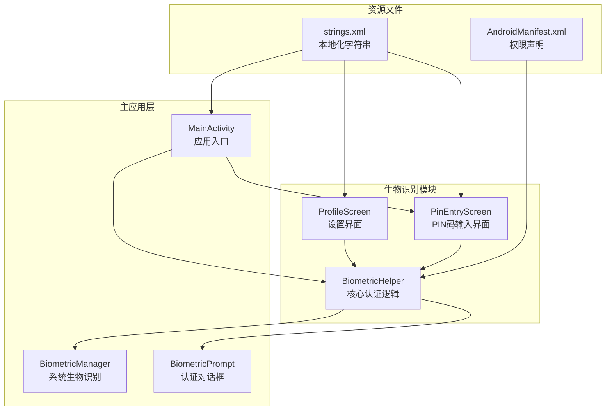
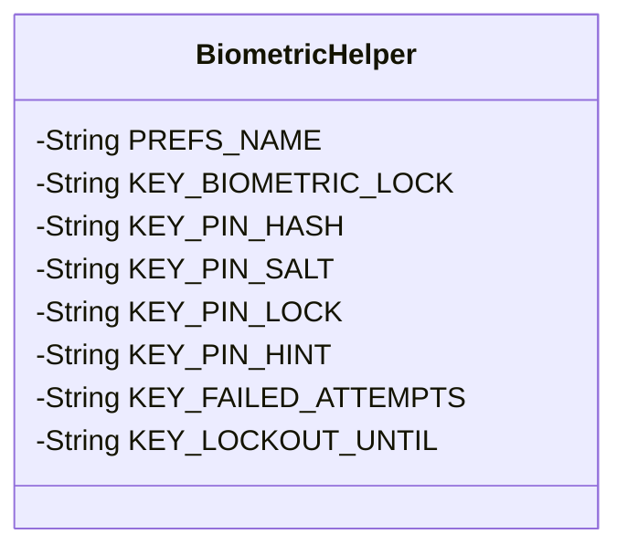
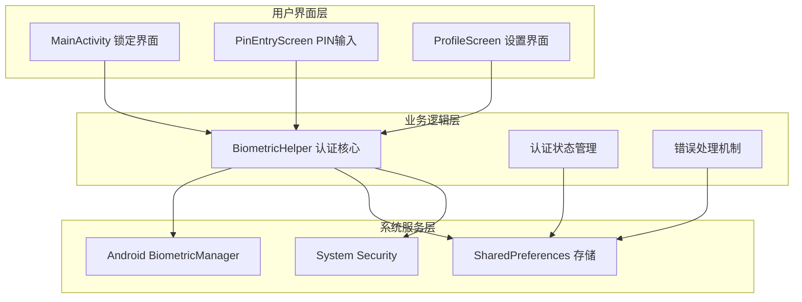
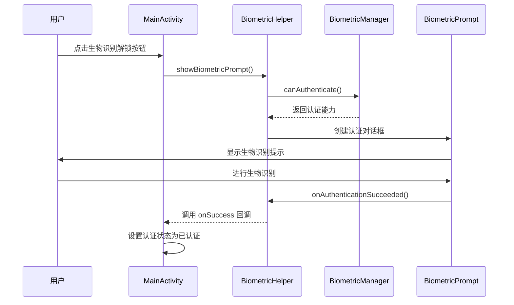
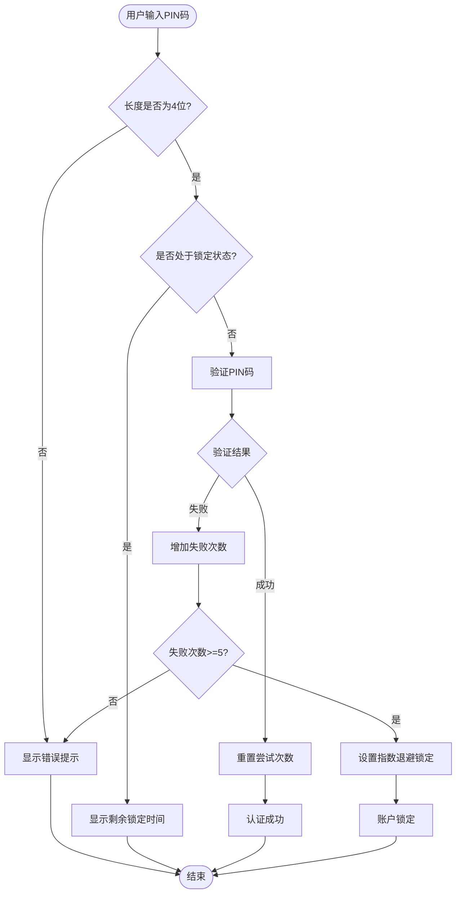
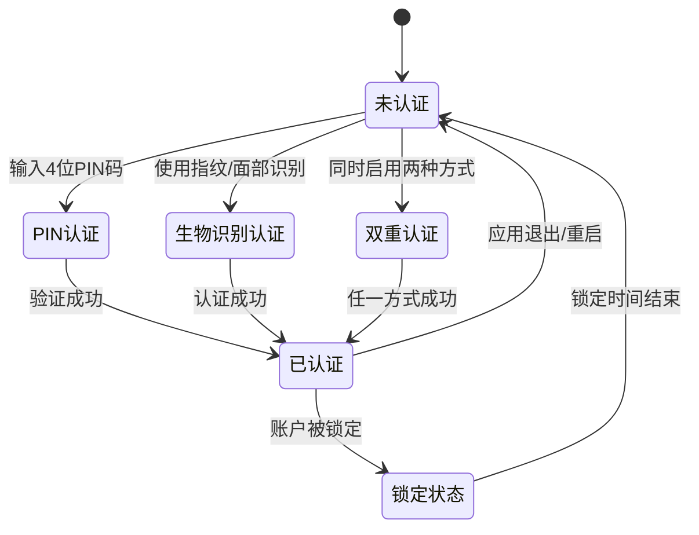
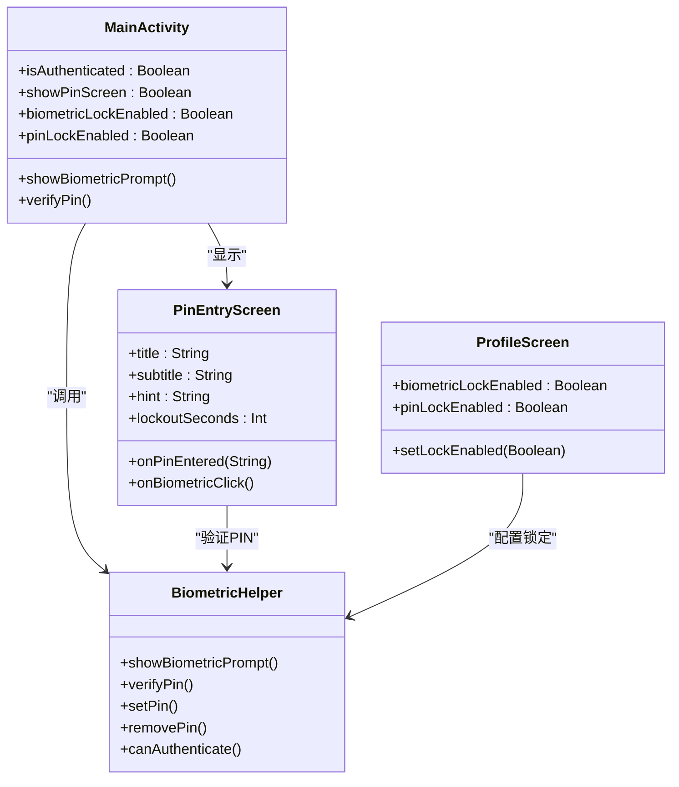
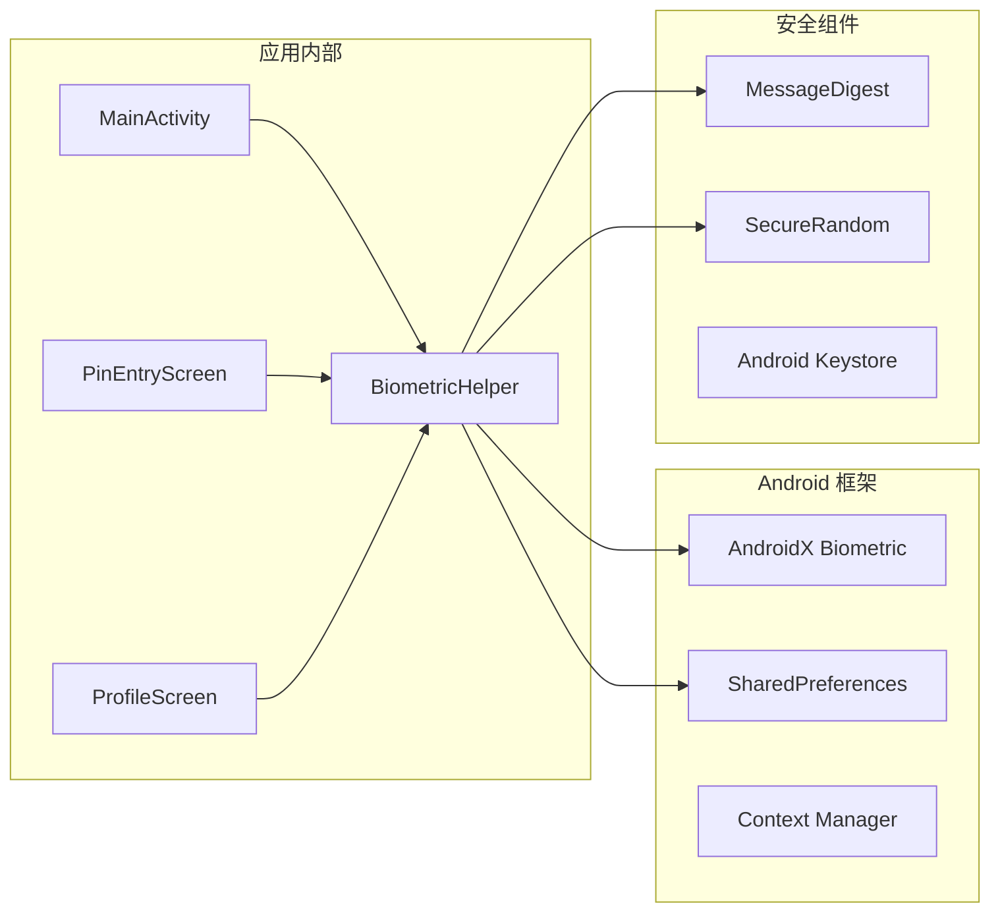
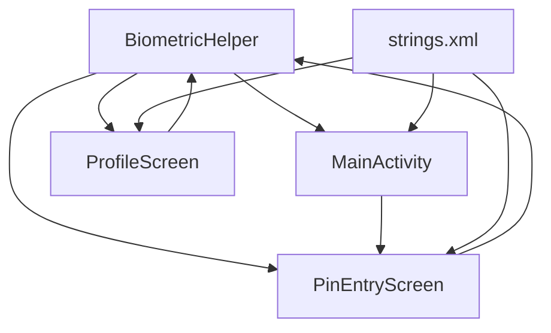

# 生物识别集成

<cite>
**本文档引用的文件**
- [BiometricHelper.kt](file://app/src/main/java/com/diary/app/biometric/BiometricHelper.kt)
- [MainActivity.kt](file://app/src/main/java/com/diary/app/MainActivity.kt)
- [ProfileScreen.kt](file://app/src/main/java/com/diary/app/ui/profile/ProfileScreen.kt)
- [PinEntryScreen.kt](file://app/src/main/java/com/diary/app/ui/lock/PinEntryScreen.kt)
- [strings.xml](file://app/src/main/res/values/strings.xml)
- [AndroidManifest.xml](file://app/src/main/AndroidManifest.xml)
</cite>

## 目录
1. [简介](#简介)
2. [项目结构](#项目结构)
3. [核心组件](#核心组件)
4. [架构概览](#架构概览)
5. [详细组件分析](#详细组件分析)
6. [依赖关系分析](#依赖关系分析)
7. [性能考虑](#性能考虑)
8. [故障排除指南](#故障排除指南)
9. [结论](#结论)

## 简介

DiaryApp 的生物识别集成功能提供了双重身份验证机制，结合了生物特征识别和传统 PIN 码锁定系统。该系统旨在为用户提供便捷且安全的应用访问控制，支持指纹识别和面部识别等多种生物特征认证方式。

该功能的核心价值在于：
- 提供无缝的用户体验，无需每次启动都手动输入密码
- 实现强健的安全机制，保护用户的个人日记内容
- 支持灵活的身份验证策略，用户可以选择最适合自己的认证方式
- 实现智能的错误处理和账户保护机制

## 项目结构

生物识别功能在项目中的组织结构如下：

**图表来源**
- [BiometricHelper.kt:1-205](file://app/src/main/java/com/diary/app/biometric/BiometricHelper.kt#L1-L205)
- [MainActivity.kt:128-273](file://app/src/main/java/com/diary/app/MainActivity.kt#L128-L273)
- [ProfileScreen.kt:547-568](file://app/src/main/java/com/diary/app/ui/profile/ProfileScreen.kt#L547-L568)

**章节来源**
- [BiometricHelper.kt:1-205](file://app/src/main/java/com/diary/app/biometric/BiometricHelper.kt#L1-L205)
- [MainActivity.kt:128-273](file://app/src/main/java/com/diary/app/MainActivity.kt#L128-L273)

## 核心组件

### BiometricHelper 类

BiometricHelper 是整个生物识别系统的核心组件，采用 Kotlin 对象单例模式实现。该类提供了完整的身份验证解决方案，包括生物识别和 PIN 码两种认证方式。

#### 主要功能特性

1. **双重认证支持**：同时支持生物识别和 PIN 码认证
2. **安全存储**：使用 SHA-256 哈希算法和盐值保护用户凭据
3. **智能锁机制**：实现指数退避的账户锁定策略
4. **会话管理**：提供认证状态的跟踪和管理
5. **系统集成**：深度集成 Android 生物识别框架

#### 关键常量定义

**图表来源**
- [BiometricHelper.kt:12-19](file://app/src/main/java/com/diary/app/biometric/BiometricHelper.kt#L12-L19)

**章节来源**
- [BiometricHelper.kt:11-41](file://app/src/main/java/com/diary/app/biometric/BiometricHelper.kt#L11-L41)

## 架构概览

生物识别系统的整体架构采用了分层设计模式，确保了良好的代码组织和职责分离。

**图表来源**
- [MainActivity.kt:251-258](file://app/src/main/java/com/diary/app/MainActivity.kt#L251-L258)
- [BiometricHelper.kt:166-203](file://app/src/main/java/com/diary/app/biometric/BiometricHelper.kt#L166-L203)

## 详细组件分析

### 认证流程详解

#### 生物识别认证流程

**图表来源**
- [MainActivity.kt:251-258](file://app/src/main/java/com/diary/app/MainActivity.kt#L251-L258)
- [BiometricHelper.kt:174-203](file://app/src/main/java/com/diary/app/biometric/BiometricHelper.kt#L174-L203)

#### PIN 码认证流程

**图表来源**
- [BiometricHelper.kt:70-109](file://app/src/main/java/com/diary/app/biometric/BiometricHelper.kt#L70-L109)

### 安全机制分析

#### 加密存储机制

系统实现了多层次的安全存储策略：

1. **哈希算法**：使用 SHA-256 算法对敏感数据进行不可逆加密
2. **盐值保护**：为每个用户生成唯一盐值，防止彩虹表攻击
3. **安全随机数**：使用 SecureRandom 生成高质量的随机盐值
4. **本地存储**：所有敏感信息存储在应用私有目录中

#### 会话管理机制

**图表来源**
- [MainActivity.kt:128-131](file://app/src/main/java/com/diary/app/MainActivity.kt#L128-L131)

#### 错误处理策略

系统实现了智能的错误处理和账户保护机制：

1. **指数退避锁定**：失败5次后开始指数退避（30秒、60秒、120秒...）
2. **实时锁定状态检查**：每次认证前检查当前锁定状态
3. **用户友好的错误提示**：提供清晰的错误信息和恢复指导
4. **自动解锁机制**：锁定时间结束后自动解锁

**章节来源**
- [BiometricHelper.kt:70-139](file://app/src/main/java/com/diary/app/biometric/BiometricHelper.kt#L70-L139)

### 组件交互关系

#### UI 组件集成

**图表来源**
- [MainActivity.kt:140-159](file://app/src/main/java/com/diary/app/MainActivity.kt#L140-L159)
- [PinEntryScreen.kt:53-61](file://app/src/main/java/com/diary/app/ui/lock/PinEntryScreen.kt#L53-L61)
- [ProfileScreen.kt:547-556](file://app/src/main/java/com/diary/app/ui/profile/ProfileScreen.kt#L547-L556)

**章节来源**
- [MainActivity.kt:128-168](file://app/src/main/java/com/diary/app/MainActivity.kt#L128-L168)
- [PinEntryScreen.kt:53-103](file://app/src/main/java/com/diary/app/ui/lock/PinEntryScreen.kt#L53-L103)

## 依赖关系分析

### 外部依赖

系统主要依赖以下外部库和框架：

**图表来源**
- [BiometricHelper.kt:3-9](file://app/src/main/java/com/diary/app/biometric/BiometricHelper.kt#L3-L9)

### 内部模块依赖

**图表来源**
- [MainActivity.kt:56-56](file://app/src/main/java/com/diary/app/MainActivity.kt#L56-L56)
- [ProfileScreen.kt:547-556](file://app/src/main/java/com/diary/app/ui/profile/ProfileScreen.kt#L547-L556)

**章节来源**
- [AndroidManifest.xml:1-157](file://app/src/main/AndroidManifest.xml#L1-L157)

## 性能考虑

### 认证性能优化

1. **异步执行**：生物识别认证完全在后台线程执行，避免阻塞主线程
2. **缓存策略**：认证状态在内存中缓存，减少重复验证开销
3. **资源管理**：及时释放生物识别资源，防止内存泄漏
4. **网络优化**：所有认证数据本地处理，无需网络请求

### 存储性能优化

1. **最小化存储**：只存储必要的认证元数据，避免冗余信息
2. **批量操作**：使用 apply() 方法进行批量 SharedPreferences 操作
3. **延迟初始化**：按需创建和初始化认证组件
4. **清理机制**：定期清理过期的认证状态和临时数据

## 故障排除指南

### 常见问题及解决方案

#### 生物识别不可用

**问题描述**：设备报告不支持生物识别功能

**可能原因**：
- 设备硬件不支持生物识别
- 系统设置中禁用了生物识别
- 未正确配置生物识别权限

**解决方案**：
1. 检查设备的生物识别硬件支持情况
2. 验证系统设置中的生物识别功能
3. 确认应用具有必要的生物识别权限

#### 认证失败频繁

**问题描述**：用户频繁遇到认证失败

**可能原因**：
- 生物识别传感器脏污或损坏
- 用户手指或面部遮挡物影响识别
- 环境光线条件不佳

**解决方案**：
1. 清洁生物识别传感器
2. 确保用户手指清洁干燥
3. 改善识别环境的光线条件
4. 建议用户使用备用 PIN 码认证

#### 账户锁定问题

**问题描述**：用户账户被意外锁定

**可能原因**：
- 连续多次认证失败
- 锁定时间配置不当
- 用户忘记 PIN 码

**解决方案**：
1. 等待锁定时间自然结束
2. 提供密码提示功能
3. 允许用户通过备用方式解锁
4. 调整锁定策略以适应用户需求

**章节来源**
- [BiometricHelper.kt:100-109](file://app/src/main/java/com/diary/app/biometric/BiometricHelper.kt#L100-L109)

### 最佳实践建议

1. **用户教育**：向用户解释生物识别的优势和局限性
2. **备用方案**：始终提供可靠的 PIN 码作为备用认证方式
3. **错误处理**：提供清晰的错误信息和恢复指导
4. **性能监控**：持续监控认证性能和用户体验指标
5. **安全审计**：定期审查安全策略的有效性和适用性

## 结论

DiaryApp 的生物识别集成功能展现了现代移动应用安全设计的最佳实践。通过将生物识别技术与传统的 PIN 码认证相结合，系统为用户提供了既便捷又安全的身份验证体验。

该系统的成功关键在于：

1. **多层次安全设计**：结合多种认证方式，提供纵深防御
2. **智能错误处理**：实现人性化的错误恢复机制
3. **优秀的用户体验**：简化认证流程，减少用户认知负担
4. **完善的性能优化**：确保认证过程的高效和流畅

未来可以考虑的功能增强包括：
- 支持更多类型的生物识别（虹膜扫描、声纹识别等）
- 实现更精细的权限控制和访问日志
- 集成企业级的安全策略和合规要求
- 提供更丰富的用户反馈和帮助信息

通过持续改进和优化，DiaryApp 的生物识别功能将继续为用户的安全和便利提供可靠保障。