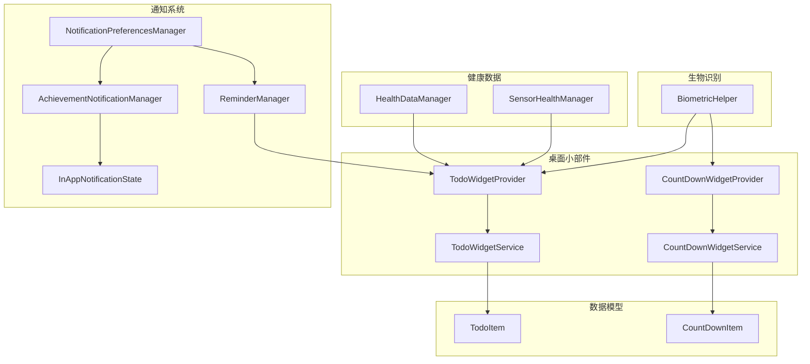
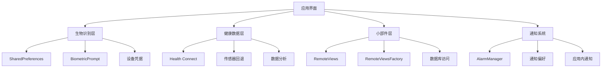
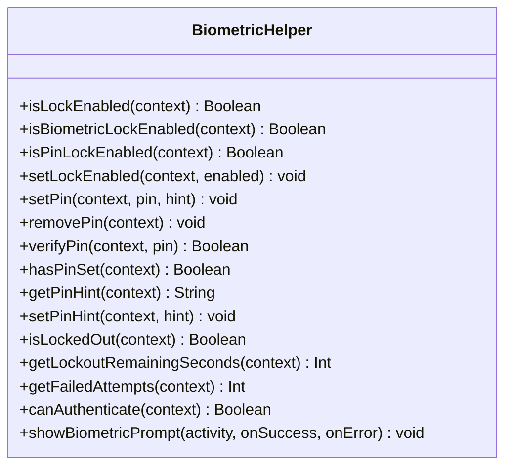
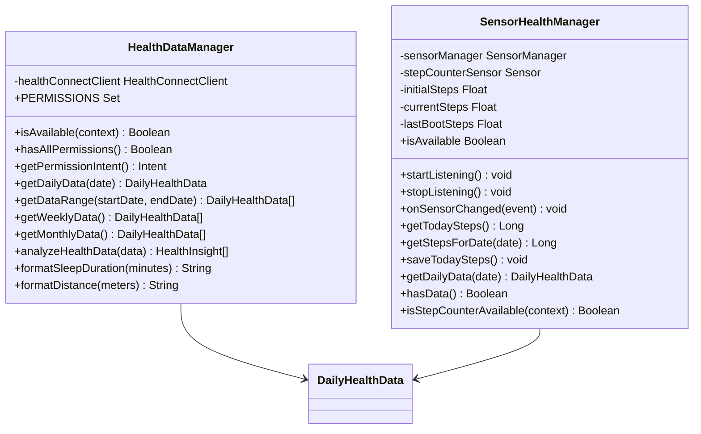
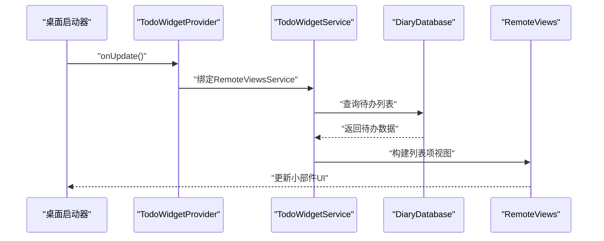
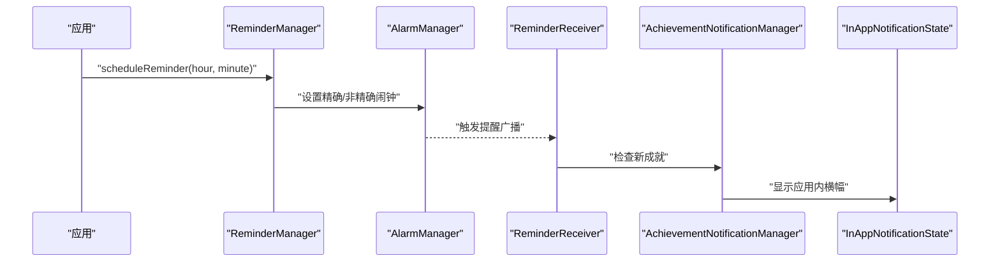
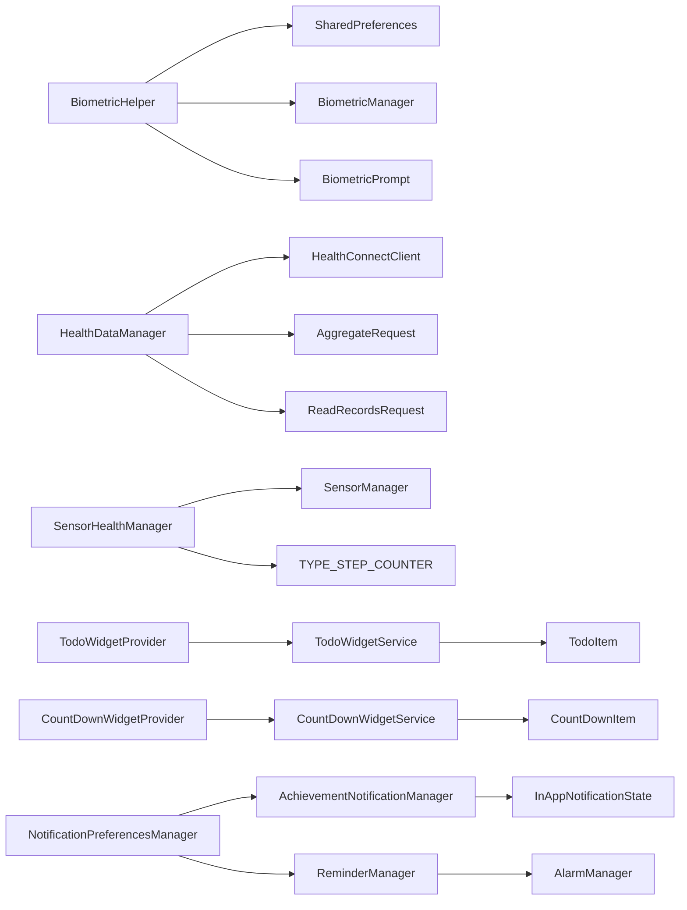

# 系统集成功能

<cite>
**本文档引用的文件**
- [BiometricHelper.kt](file://app/src/main/java/com/diary/app/biometric/BiometricHelper.kt)
- [HealthDataManager.kt](file://app/src/main/java/com/diary/app/health/HealthDataManager.kt)
- [SensorHealthManager.kt](file://app/src/main/java/com/diary/app/health/SensorHealthManager.kt)
- [TodoWidgetProvider.kt](file://app/src/main/java/com/diary/app/widget/TodoWidgetProvider.kt)
- [CountDownWidgetProvider.kt](file://app/src/main/java/com/diary/app/widget/CountDownWidgetProvider.kt)
- [TodoWidgetService.kt](file://app/src/main/java/com/diary/app/widget/TodoWidgetService.kt)
- [CountDownWidgetService.kt](file://app/src/main/java/com/diary/app/widget/CountDownWidgetService.kt)
- [AchievementNotificationManager.kt](file://app/src/main/java/com/diary/app/reminder/AchievementNotificationManager.kt)
- [ReminderManager.kt](file://app/src/main/java/com/diary/app/reminder/ReminderManager.kt)
- [NotificationPreferencesManager.kt](file://app/src/main/java/com/diary/app/reminder/NotificationPreferencesManager.kt)
- [InAppNotificationState.kt](file://app/src/main/java/com/diary/app/ui/notification/InAppNotificationState.kt)
- [TodoItem.kt](file://app/src/main/java/com/diary/app/data/TodoItem.kt)
- [CountDownItem.kt](file://app/src/main/java/com/diary/app/data/CountDownItem.kt)
- [widget_todo_info.xml](file://app/src/main/res/xml/widget_todo_info.xml)
- [widget_countdown_info.xml](file://app/src/main/res/xml/widget_countdown_info.xml)
</cite>

## 目录
1. [简介](#简介)
2. [项目结构](#项目结构)
3. [核心组件](#核心组件)
4. [架构概览](#架构概览)
5. [详细组件分析](#详细组件分析)
6. [依赖关系分析](#依赖关系分析)
7. [性能考虑](#性能考虑)
8. [故障排除指南](#故障排除指南)
9. [结论](#结论)

## 简介
本文件详细阐述DiaryApp的系统集成功能，涵盖以下关键领域：
- 生物识别集成：指纹与面部识别的安全机制实现
- 健康数据集成：Android Health Connect API的交互方案
- 桌面小部件：TodoWidget与CountDownWidget的功能特性
- 通知系统：本地通知、成就提醒与系统通知管理
- 权限申请与隐私保护：实现细节与最佳实践

## 项目结构
系统集成功能主要分布在以下模块：
- 生物识别：biometric包下的BiometricHelper
- 健康数据：health包下的HealthDataManager与SensorHealthManager
- 小部件：widget包下的WidgetProvider与WidgetService
- 通知：reminder包下的各管理器与ui/notification中的InAppNotificationState
- 数据模型：data包下的TodoItem与CountDownItem

**图表来源**
- [BiometricHelper.kt:11-205](file://app/src/main/java/com/diary/app/biometric/BiometricHelper.kt#L11-L205)
- [HealthDataManager.kt:51-300](file://app/src/main/java/com/diary/app/health/HealthDataManager.kt#L51-L300)
- [SensorHealthManager.kt:18-137](file://app/src/main/java/com/diary/app/health/SensorHealthManager.kt#L18-L137)
- [TodoWidgetProvider.kt:25-175](file://app/src/main/java/com/diary/app/widget/TodoWidgetProvider.kt#L25-L175)
- [CountDownWidgetProvider.kt:23-126](file://app/src/main/java/com/diary/app/widget/CountDownWidgetProvider.kt#L23-L126)
- [TodoWidgetService.kt:17-135](file://app/src/main/java/com/diary/app/widget/TodoWidgetService.kt#L17-L135)
- [CountDownWidgetService.kt:16-87](file://app/src/main/java/com/diary/app/widget/CountDownWidgetService.kt#L16-L87)
- [AchievementNotificationManager.kt:23-87](file://app/src/main/java/com/diary/app/reminder/AchievementNotificationManager.kt#L23-L87)
- [ReminderManager.kt:11-119](file://app/src/main/java/com/diary/app/reminder/ReminderManager.kt#L11-L119)
- [NotificationPreferencesManager.kt:12-140](file://app/src/main/java/com/diary/app/reminder/NotificationPreferencesManager.kt#L12-L140)
- [InAppNotificationState.kt:13-25](file://app/src/main/java/com/diary/app/ui/notification/InAppNotificationState.kt#L13-L25)
- [TodoItem.kt:18-90](file://app/src/main/java/com/diary/app/data/TodoItem.kt#L18-L90)
- [CountDownItem.kt:6-17](file://app/src/main/java/com/diary/app/data/CountDownItem.kt#L6-L17)

**章节来源**
- [BiometricHelper.kt:11-205](file://app/src/main/java/com/diary/app/biometric/BiometricHelper.kt#L11-L205)
- [HealthDataManager.kt:51-300](file://app/src/main/java/com/diary/app/health/HealthDataManager.kt#L51-L300)
- [SensorHealthManager.kt:18-137](file://app/src/main/java/com/diary/app/health/SensorHealthManager.kt#L18-L137)
- [TodoWidgetProvider.kt:25-175](file://app/src/main/java/com/diary/app/widget/TodoWidgetProvider.kt#L25-L175)
- [CountDownWidgetProvider.kt:23-126](file://app/src/main/java/com/diary/app/widget/CountDownWidgetProvider.kt#L23-L126)
- [TodoWidgetService.kt:17-135](file://app/src/main/java/com/diary/app/widget/TodoWidgetService.kt#L17-L135)
- [CountDownWidgetService.kt:16-87](file://app/src/main/java/com/diary/app/widget/CountDownWidgetService.kt#L16-L87)
- [AchievementNotificationManager.kt:23-87](file://app/src/main/java/com/diary/app/reminder/AchievementNotificationManager.kt#L23-L87)
- [ReminderManager.kt:11-119](file://app/src/main/java/com/diary/app/reminder/ReminderManager.kt#L11-L119)
- [NotificationPreferencesManager.kt:12-140](file://app/src/main/java/com/diary/app/reminder/NotificationPreferencesManager.kt#L12-L140)
- [InAppNotificationState.kt:13-25](file://app/src/main/java/com/diary/app/ui/notification/InAppNotificationState.kt#L13-L25)
- [TodoItem.kt:18-90](file://app/src/main/java/com/diary/app/data/TodoItem.kt#L18-L90)
- [CountDownItem.kt:6-17](file://app/src/main/java/com/diary/app/data/CountDownItem.kt#L6-L17)

## 核心组件
本节概述四大系统集成领域的核心组件及其职责。

- 生物识别安全层
  - 身份验证与锁屏：支持指纹与设备凭据（PIN/密码/图案）
  - 密码保护：盐值哈希存储、失败锁定与指数退避
  - 用户体验：可配置提示、自动迁移至更强认证

- 健康数据集成
  - Health Connect API：读取步数、心率、睡眠、卡路里、距离、运动时长
  - 传感器回退：无Google服务设备使用步计传感器
  - 数据洞察：基于周/月数据生成健康建议

- 桌面小部件
  - TodoWidget：待办清单列表、勾选切换、添加按钮、未完成计数
  - CountDownWidget：倒计时/正计时列表、日期剩余显示、颜色标记
  - 交互：广播动作处理、远程视图服务驱动

- 通知系统
  - 成就提醒：应用内横幅通知，避免打扰用户
  - 日常提醒：基于AlarmManager的定时提醒，支持精确/非精确模式
  - 配置管理：统一偏好设置，静默时段控制

**章节来源**
- [BiometricHelper.kt:11-205](file://app/src/main/java/com/diary/app/biometric/BiometricHelper.kt#L11-L205)
- [HealthDataManager.kt:51-300](file://app/src/main/java/com/diary/app/health/HealthDataManager.kt#L51-L300)
- [SensorHealthManager.kt:18-137](file://app/src/main/java/com/diary/app/health/SensorHealthManager.kt#L18-L137)
- [TodoWidgetProvider.kt:25-175](file://app/src/main/java/com/diary/app/widget/TodoWidgetProvider.kt#L25-L175)
- [CountDownWidgetProvider.kt:23-126](file://app/src/main/java/com/diary/app/widget/CountDownWidgetProvider.kt#L23-L126)
- [AchievementNotificationManager.kt:23-87](file://app/src/main/java/com/diary/app/reminder/AchievementNotificationManager.kt#L23-L87)
- [ReminderManager.kt:11-119](file://app/src/main/java/com/diary/app/reminder/ReminderManager.kt#L11-L119)
- [NotificationPreferencesManager.kt:12-140](file://app/src/main/java/com/diary/app/reminder/NotificationPreferencesManager.kt#L12-L140)

## 架构概览
系统集成功能采用分层架构，确保功能解耦与可维护性：

**图表来源**
- [BiometricHelper.kt:166-203](file://app/src/main/java/com/diary/app/biometric/BiometricHelper.kt#L166-L203)
- [HealthDataManager.kt:51-300](file://app/src/main/java/com/diary/app/health/HealthDataManager.kt#L51-L300)
- [SensorHealthManager.kt:18-137](file://app/src/main/java/com/diary/app/health/SensorHealthManager.kt#L18-L137)
- [TodoWidgetProvider.kt:100-155](file://app/src/main/java/com/diary/app/widget/TodoWidgetProvider.kt#L100-L155)
- [CountDownWidgetProvider.kt:81-123](file://app/src/main/java/com/diary/app/widget/CountDownWidgetProvider.kt#L81-L123)
- [AchievementNotificationManager.kt:23-87](file://app/src/main/java/com/diary/app/reminder/AchievementNotificationManager.kt#L23-L87)
- [ReminderManager.kt:70-118](file://app/src/main/java/com/diary/app/reminder/ReminderManager.kt#L70-L118)
- [NotificationPreferencesManager.kt:12-140](file://app/src/main/java/com/diary/app/reminder/NotificationPreferencesManager.kt#L12-L140)
- [InAppNotificationState.kt:13-25](file://app/src/main/java/com/diary/app/ui/notification/InAppNotificationState.kt#L13-L25)

## 详细组件分析

### 生物识别集成与安全机制
BiometricHelper提供统一的身份验证与锁屏管理，支持多种认证方式与安全策略。

**图表来源**
- [BiometricHelper.kt:11-205](file://app/src/main/java/com/diary/app/biometric/BiometricHelper.kt#L11-L205)

安全机制要点：
- 认证能力检测：支持强生物识别与设备凭据组合
- PIN保护：盐值SHA-256哈希存储，失败次数统计与指数锁定
- 用户体验：锁定状态提示、失败尝试计数、自动迁移至更安全的认证方式

**章节来源**
- [BiometricHelper.kt:21-139](file://app/src/main/java/com/diary/app/biometric/BiometricHelper.kt#L21-L139)
- [BiometricHelper.kt:166-203](file://app/src/main/java/com/diary/app/biometric/BiometricHelper.kt#L166-L203)

### 健康数据集成方案
系统通过Health Connect API与传感器回退方案实现健康数据集成。

**图表来源**
- [HealthDataManager.kt:51-300](file://app/src/main/java/com/diary/app/health/HealthDataManager.kt#L51-L300)
- [SensorHealthManager.kt:18-137](file://app/src/main/java/com/diary/app/health/SensorHealthManager.kt#L18-L137)

数据流与处理逻辑：
- Health Connect API：按日聚合/读取多类健康指标，异常捕获与默认值返回
- 传感器回退：检测重启、累计步数、仅提供当日步数
- 数据洞察：基于周/月数据计算平均值，生成睡眠、心率、活动量、一致性等洞察

**章节来源**
- [HealthDataManager.kt:76-197](file://app/src/main/java/com/diary/app/health/HealthDataManager.kt#L76-L197)
- [SensorHealthManager.kt:31-99](file://app/src/main/java/com/diary/app/health/SensorHealthManager.kt#L31-L99)

### 桌面小部件实现原理
TodoWidget与CountDownWidget通过AppWidgetProvider与RemoteViewsService实现动态列表与交互。

**图表来源**
- [TodoWidgetProvider.kt:27-35](file://app/src/main/java/com/diary/app/widget/TodoWidgetProvider.kt#L27-L35)
- [TodoWidgetProvider.kt:100-155](file://app/src/main/java/com/diary/app/widget/TodoWidgetProvider.kt#L100-L155)
- [TodoWidgetService.kt:35-44](file://app/src/main/java/com/diary/app/widget/TodoWidgetService.kt#L35-L44)

功能特性：
- TodoWidget：勾选切换、添加按钮、未完成计数、优先级与分类标签展示
- CountDownWidget：倒计时/正计时、剩余天数计算、颜色标记、打开应用
- 数据驱动：RemoteViewsFactory异步加载数据，稳定ID保证刷新效率

**章节来源**
- [TodoWidgetProvider.kt:25-175](file://app/src/main/java/com/diary/app/widget/TodoWidgetProvider.kt#L25-L175)
- [CountDownWidgetProvider.kt:23-126](file://app/src/main/java/com/diary/app/widget/CountDownWidgetProvider.kt#L23-L126)
- [TodoWidgetService.kt:23-135](file://app/src/main/java/com/diary/app/widget/TodoWidgetService.kt#L23-L135)
- [CountDownWidgetService.kt:22-87](file://app/src/main/java/com/diary/app/widget/CountDownWidgetService.kt#L22-L87)

### 通知系统架构
通知系统包含本地提醒、成就提醒与应用内横幅通知。

**图表来源**
- [ReminderManager.kt:62-98](file://app/src/main/java/com/diary/app/reminder/ReminderManager.kt#L62-L98)
- [AchievementNotificationManager.kt:34-61](file://app/src/main/java/com/diary/app/reminder/AchievementNotificationManager.kt#L34-L61)
- [InAppNotificationState.kt:17-23](file://app/src/main/java/com/diary/app/ui/notification/InAppNotificationState.kt#L17-L23)

管理与偏好：
- 统一偏好：每日提醒、成就提醒、天气预警、静默时段
- 静默时段：跨午夜的时间区间判断，避免夜间打扰
- 成就提醒：去抖动标记，避免重复通知同一成就

**章节来源**
- [NotificationPreferencesManager.kt:40-131](file://app/src/main/java/com/diary/app/reminder/NotificationPreferencesManager.kt#L40-L131)
- [AchievementNotificationManager.kt:23-87](file://app/src/main/java/com/diary/app/reminder/AchievementNotificationManager.kt#L23-L87)
- [InAppNotificationState.kt:13-25](file://app/src/main/java/com/diary/app/ui/notification/InAppNotificationState.kt#L13-L25)

## 依赖关系分析
系统集成功能的依赖关系如下：

**图表来源**
- [BiometricHelper.kt:166-203](file://app/src/main/java/com/diary/app/biometric/BiometricHelper.kt#L166-L203)
- [HealthDataManager.kt:51-300](file://app/src/main/java/com/diary/app/health/HealthDataManager.kt#L51-L300)
- [SensorHealthManager.kt:18-137](file://app/src/main/java/com/diary/app/health/SensorHealthManager.kt#L18-L137)
- [TodoWidgetProvider.kt:100-155](file://app/src/main/java/com/diary/app/widget/TodoWidgetProvider.kt#L100-L155)
- [CountDownWidgetProvider.kt:81-123](file://app/src/main/java/com/diary/app/widget/CountDownWidgetProvider.kt#L81-L123)
- [TodoWidgetService.kt:35-44](file://app/src/main/java/com/diary/app/widget/TodoWidgetService.kt#L35-L44)
- [CountDownWidgetService.kt:30-37](file://app/src/main/java/com/diary/app/widget/CountDownWidgetService.kt#L30-L37)
- [AchievementNotificationManager.kt:23-87](file://app/src/main/java/com/diary/app/reminder/AchievementNotificationManager.kt#L23-L87)
- [ReminderManager.kt:70-118](file://app/src/main/java/com/diary/app/reminder/ReminderManager.kt#L70-L118)
- [NotificationPreferencesManager.kt:12-140](file://app/src/main/java/com/diary/app/reminder/NotificationPreferencesManager.kt#L12-L140)

**章节来源**
- [widget_todo_info.xml:1-13](file://app/src/main/res/xml/widget_todo_info.xml#L1-L13)
- [widget_countdown_info.xml:1-13](file://app/src/main/res/xml/widget_countdown_info.xml#L1-L13)

## 性能考虑
- 小部件数据加载：使用协程在IO线程执行数据库查询，避免阻塞主线程
- 健康数据聚合：Health Connect API请求按日聚合，减少网络开销
- 传感器监听：仅在前台启用步计传感器监听，后台停止以节省电量
- 通知调度：API 31+上降级为非精确闹钟，兼容性与功耗平衡

## 故障排除指南
常见问题与解决方案：
- 生物识别不可用
  - 检查设备是否具备强生物识别或设备凭据
  - 确认系统设置中已启用相应认证方式
- 健康数据为空
  - Health Connect未安装或版本不支持：检查SDK状态
  - 权限未授予：引导用户到健康数据应用进行授权
- 小部件不更新
  - 确认AppWidgetProvider已注册且updatePeriodMillis设置合理
  - 检查RemoteViewsFactory数据加载是否抛出异常
- 通知未送达
  - API 31+需SCHEDULE_EXACT_ALARM权限；若缺失则使用setAndAllowWhileIdle
  - 静默时段设置导致通知被抑制

**章节来源**
- [BiometricHelper.kt:166-172](file://app/src/main/java/com/diary/app/biometric/BiometricHelper.kt#L166-L172)
- [HealthDataManager.kt:65-87](file://app/src/main/java/com/diary/app/health/HealthDataManager.kt#L65-L87)
- [ReminderManager.kt:89-97](file://app/src/main/java/com/diary/app/reminder/ReminderManager.kt#L89-L97)
- [NotificationPreferencesManager.kt:114-130](file://app/src/main/java/com/diary/app/reminder/NotificationPreferencesManager.kt#L114-L130)

## 结论
DiaryApp的系统集成功能通过模块化设计实现了：
- 安全可靠的身份验证与锁屏保护
- 兼容性强的健康数据采集与分析
- 高效易用的桌面小部件与通知体系
- 完善的权限管理与隐私保护策略

这些组件协同工作，为用户提供无缝、安全且个性化的日记体验。