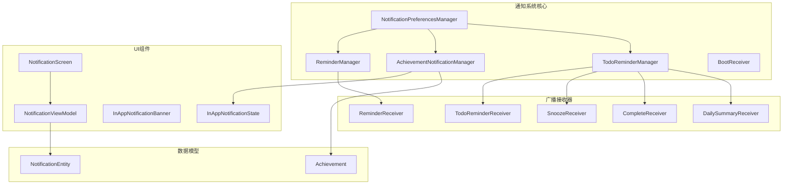
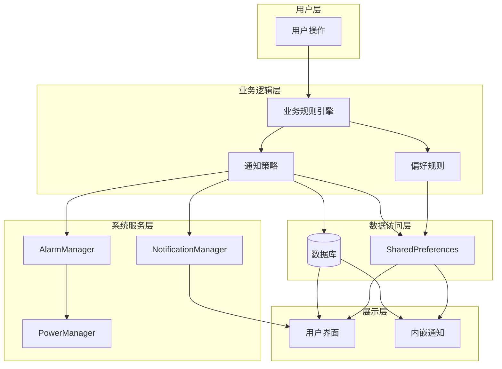
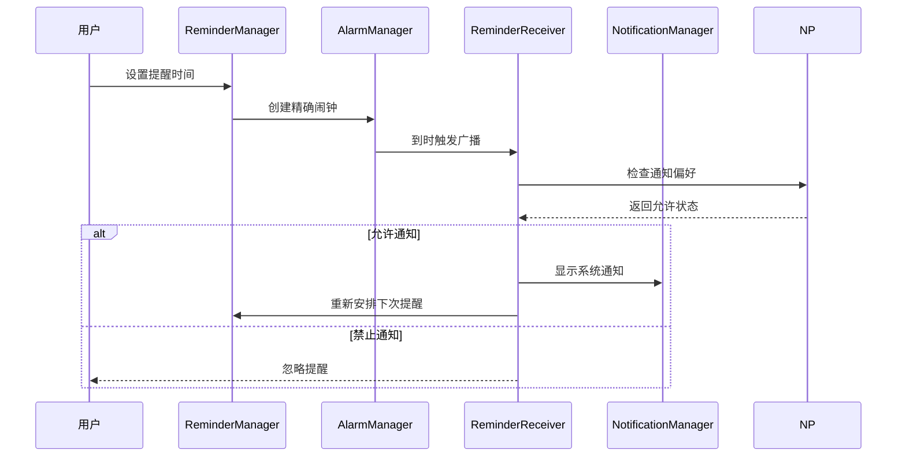
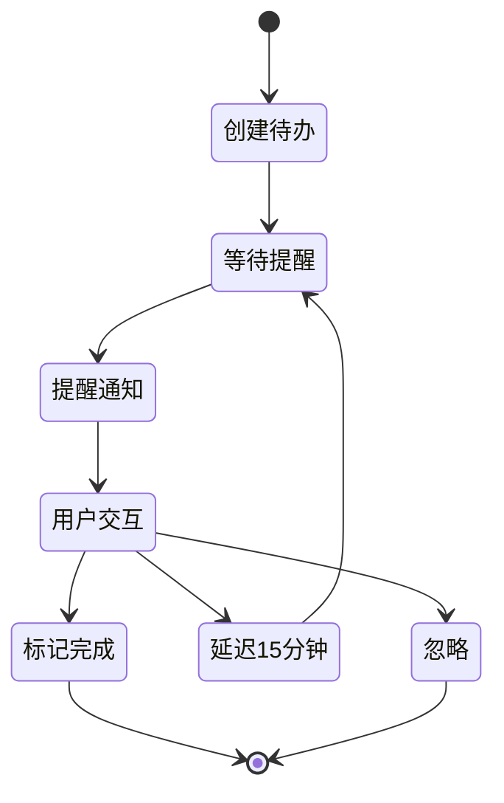
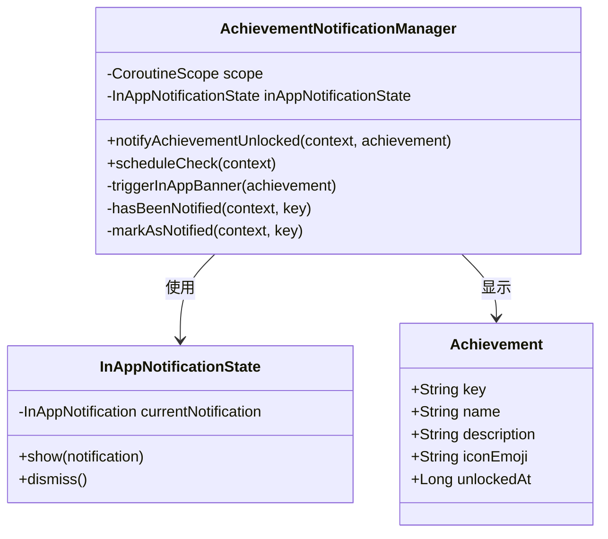
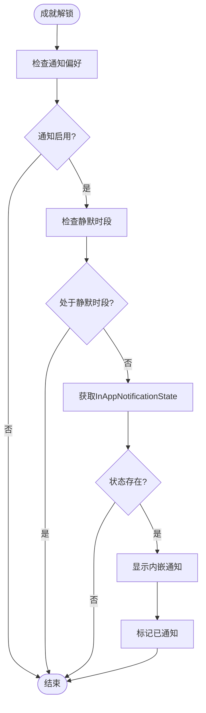
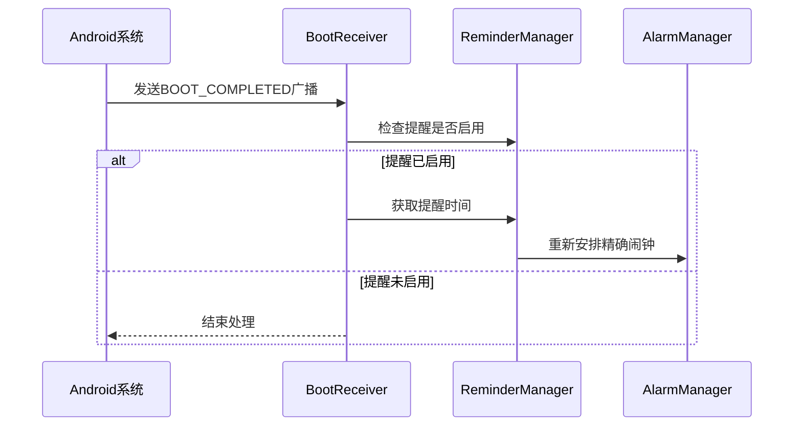
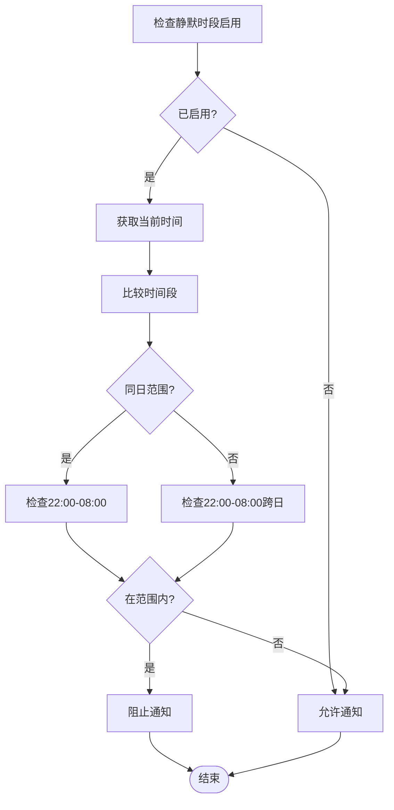
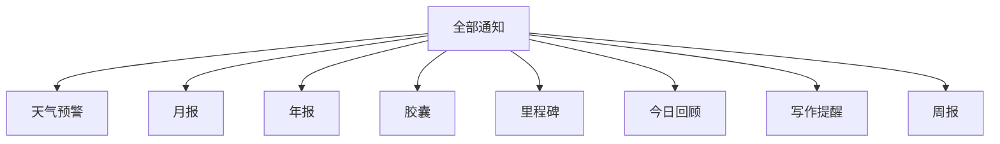
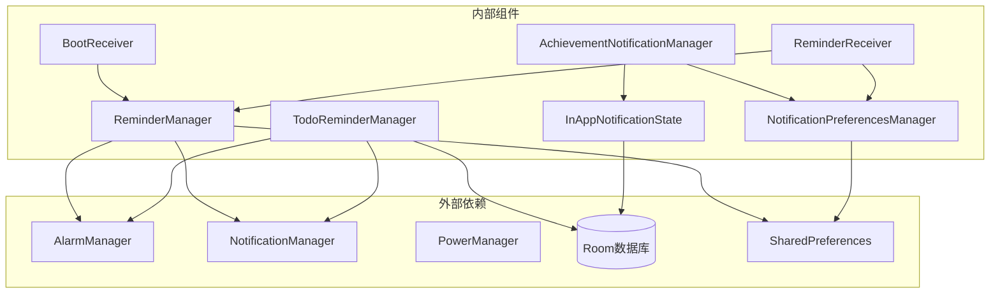

# 通知系统

<cite>
**本文档引用的文件**
- [ReminderManager.kt](file://app/src/main/java/com/diary/app/reminder/ReminderManager.kt)
- [AchievementNotificationManager.kt](file://app/src/main/java/com/diary/app/reminder/AchievementNotificationManager.kt)
- [BootReceiver.kt](file://app/src/main/java/com/diary/app/reminder/BootReceiver.kt)
- [NotificationPreferencesManager.kt](file://app/src/main/java/com/diary/app/reminder/NotificationPreferencesManager.kt)
- [TodoReminderManager.kt](file://app/src/main/java/com/diary/app/reminder/TodoReminderManager.kt)
- [ReminderReceiver.kt](file://app/src/main/java/com/diary/app/reminder/ReminderReceiver.kt)
- [InAppNotificationState.kt](file://app/src/main/java/com/diary/app/ui/notification/InAppNotificationState.kt)
- [InAppNotificationBanner.kt](file://app/src/main/java/com/diary/app/ui/notification/InAppNotificationBanner.kt)
- [NotificationScreen.kt](file://app/src/main/java/com/diary/app/ui/notification/NotificationScreen.kt)
- [NotificationViewModel.kt](file://app/src/main/java/com/diary/app/ui/notification/NotificationViewModel.kt)
- [NotificationEntity.kt](file://app/src/main/java/com/diary/app/data/NotificationEntity.kt)
- [Achievement.kt](file://app/src/main/java/com/diary/app/data/Achievement.kt)
- [AndroidManifest.xml](file://app/src/main/AndroidManifest.xml)
</cite>

## 目录
1. [简介](#简介)
2. [项目结构](#项目结构)
3. [核心组件](#核心组件)
4. [架构概览](#架构概览)
5. [详细组件分析](#详细组件分析)
6. [依赖关系分析](#依赖关系分析)
7. [性能考虑](#性能考虑)
8. [故障排除指南](#故障排除指南)
9. [结论](#结论)

## 简介
DiaryApp 的通知系统是一个综合性的通知管理框架，涵盖了本地通知、成就提醒和系统通知三大核心功能模块。该系统采用分层架构设计，通过统一的偏好设置管理器控制通知行为，并提供了灵活的通知样式定制和用户隐私保护机制。

系统主要包含以下通知类型：
- **日常日记提醒**：基于用户设定的时间进行定时提醒
- **待办事项通知**：个人任务管理和提醒功能
- **成就解锁提醒**：应用内成就系统的即时反馈
- **系统通知**：基于数据库生成的各种通知类型
- **天气预警**：环境监测相关的提醒通知

## 项目结构
通知系统主要分布在以下目录中：

**图表来源**
- [ReminderManager.kt:1-119](file://app/src/main/java/com/diary/app/reminder/ReminderManager.kt#L1-L119)
- [AchievementNotificationManager.kt:1-87](file://app/src/main/java/com/diary/app/reminder/AchievementNotificationManager.kt#L1-L87)
- [NotificationPreferencesManager.kt:1-140](file://app/src/main/java/com/diary/app/reminder/NotificationPreferencesManager.kt#L1-L140)

**章节来源**
- [AndroidManifest.xml:71-92](file://app/src/main/AndroidManifest.xml#L71-L92)

## 核心组件
通知系统由多个相互协作的组件构成，每个组件都有明确的职责分工：

### 通知管理器家族
- **ReminderManager**：负责日常日记提醒的定时调度和管理
- **TodoReminderManager**：处理待办事项的提醒和通知
- **AchievementNotificationManager**：管理成就解锁的内嵌通知

### 偏好设置系统
- **NotificationPreferencesManager**：统一管理所有通知类型的开关和静默时段设置

### 广播接收器
- **BootReceiver**：应用重启后的通知恢复机制
- **ReminderReceiver**：日常提醒的触发器
- **TodoReminderReceiver/SnoozeReceiver/CompleteReceiver**：待办事项的交互处理

### UI展示层
- **InAppNotificationState/Banner**：成就解锁的内嵌通知显示
- **NotificationScreen/ViewModel**：系统通知的集中管理界面

**章节来源**
- [ReminderManager.kt:11-119](file://app/src/main/java/com/diary/app/reminder/ReminderManager.kt#L11-L119)
- [TodoReminderManager.kt:27-365](file://app/src/main/java/com/diary/app/reminder/TodoReminderManager.kt#L27-L365)
- [AchievementNotificationManager.kt:23-87](file://app/src/main/java/com/diary/app/reminder/AchievementNotificationManager.kt#L23-L87)

## 架构概览
通知系统采用分层架构设计，确保各组件间的松耦合和高内聚：

**图表来源**
- [NotificationPreferencesManager.kt:12-140](file://app/src/main/java/com/diary/app/reminder/NotificationPreferencesManager.kt#L12-L140)
- [ReminderManager.kt:62-107](file://app/src/main/java/com/diary/app/reminder/ReminderManager.kt#L62-L107)

## 详细组件分析

### ReminderManager - 日常提醒管理器
ReminderManager 是通知系统的核心调度器，负责日常日记提醒的定时管理。

#### 核心功能特性
- **定时调度**：基于 AlarmManager 实现精确的定时提醒
- **偏好存储**：使用 SharedPreferences 存储用户设置
- **消息轮换**：提供多种提醒语句的自动轮换机制
- **权限适配**：兼容不同 Android 版本的权限要求

#### 定时任务调度机制

**图表来源**
- [ReminderManager.kt:62-98](file://app/src/main/java/com/diary/app/reminder/ReminderManager.kt#L62-L98)
- [ReminderReceiver.kt:13-25](file://app/src/main/java/com/diary/app/reminder/ReminderReceiver.kt#L13-L25)

#### 数据存储结构
- **偏好文件**：`diary_reminder_prefs`
- **关键键值**：
  - `reminder_enabled`：提醒开关状态
  - `reminder_hour`：提醒小时
  - `reminder_minute`：提醒分钟
  - `reminder_message`：自定义提醒消息

**章节来源**
- [ReminderManager.kt:13-48](file://app/src/main/java/com/diary/app/reminder/ReminderManager.kt#L13-L48)
- [ReminderManager.kt:62-107](file://app/src/main/java/com/diary/app/reminder/ReminderManager.kt#L62-L107)

### TodoReminderManager - 待办事项提醒管理器
TodoReminderManager 提供完整的待办事项管理系统，包括个人提醒和每日摘要通知。

#### 通知通道管理
系统创建两个独立的通知通道以区分不同类型的通知：

| 通道ID | 通道名称 | 用途 | 重要性级别 |
|--------|----------|------|------------|
| `todo_reminder` | 待办提醒 | 单个待办事项提醒 | DEFAULT |
| `todo_summary` | 每日摘要 | 每日待办汇总通知 | DEFAULT |

#### 待办事项生命周期

**图表来源**
- [TodoReminderManager.kt:250-365](file://app/src/main/java/com/diary/app/reminder/TodoReminderManager.kt#L250-L365)

#### 通知动作按钮
- **延迟15分钟**：通过 SnoozeReceiver 实现
- **标记完成**：通过 CompleteReceiver 实现
- **打开应用**：直接导航到待办页面

**章节来源**
- [TodoReminderManager.kt:27-57](file://app/src/main/java/com/diary/app/reminder/TodoReminderManager.kt#L27-L57)
- [TodoReminderManager.kt:250-310](file://app/src/main/java/com/diary/app/reminder/TodoReminderManager.kt#L250-L310)

### AchievementNotificationManager - 成就提醒管理器
AchievementNotificationManager 专门处理成就解锁的内嵌通知，提供即时的用户体验反馈。

#### 内嵌通知架构

**图表来源**
- [AchievementNotificationManager.kt:23-87](file://app/src/main/java/com/diary/app/reminder/AchievementNotificationManager.kt#L23-L87)
- [InAppNotificationState.kt:13-25](file://app/src/main/java/com/diary/app/ui/notification/InAppNotificationState.kt#L13-L25)

#### 成就通知流程

**图表来源**
- [AchievementNotificationManager.kt:34-61](file://app/src/main/java/com/diary/app/reminder/AchievementNotificationManager.kt#L34-L61)

**章节来源**
- [AchievementNotificationManager.kt:23-87](file://app/src/main/java/com/diary/app/reminder/AchievementNotificationManager.kt#L23-L87)
- [InAppNotificationState.kt:13-25](file://app/src/main/java/com/diary/app/ui/notification/InAppNotificationState.kt#L13-L25)

### BootReceiver - 应用重启恢复机制
BootReceiver 负责在设备启动后恢复所有已配置的通知设置。

#### 启动恢复流程

**图表来源**
- [BootReceiver.kt:9-16](file://app/src/main/java/com/diary/app/reminder/BootReceiver.kt#L9-L16)

**章节来源**
- [BootReceiver.kt:7-18](file://app/src/main/java/com/diary/app/reminder/BootReceiver.kt#L7-L18)

### NotificationPreferencesManager - 统一偏好管理
NotificationPreferencesManager 提供单一入口管理所有通知类型的偏好设置。

#### 偏好设置分类
| 类别 | 键名 | 默认值 | 功能描述 |
|------|------|--------|----------|
| 日常提醒 | `daily_reminder_enabled` | true | 控制日记提醒开关 |
| 成就通知 | `achievements_enabled` | true | 控制成就解锁通知 |
| 天气预警 | `weather_alerts_enabled` | true | 控制天气预警通知 |
| 静默时段 | `quiet_hours_enabled` | false | 控制静默时段开关 |
| 静默开始 | `quiet_hours_start_hour/min` | 22:00 | 静默开始时间 |
| 静默结束 | `quiet_hours_end_hour/min` | 08:00 | 静默结束时间 |

#### 静默时段算法

**图表来源**
- [NotificationPreferencesManager.kt:114-130](file://app/src/main/java/com/diary/app/reminder/NotificationPreferencesManager.kt#L114-L130)

**章节来源**
- [NotificationPreferencesManager.kt:12-140](file://app/src/main/java/com/diary/app/reminder/NotificationPreferencesManager.kt#L12-L140)

### 系统通知管理 - NotificationScreen & ViewModel
系统通知采用集中管理模式，通过 NotificationScreen 和 NotificationViewModel 提供统一的界面和数据处理。

#### 通知分类体系

**图表来源**
- [NotificationViewModel.kt:21-31](file://app/src/main/java/com/diary/app/ui/notification/NotificationViewModel.kt#L21-L31)

#### 通知生成策略
系统每天生成一次通知快照，避免重复生成和性能问题：

| 通知类型 | 触发条件 | 生成时机 |
|----------|----------|----------|
| 年度报告 | 12月25日后且有日记数据 | 每日首次加载 |
| 时间胶囊 | 到期且未打开 | 每日首次加载 |
| 今日回顾 | 有历史日记记录 | 每日首次加载 |
| 里程碑 | 达成写作目标 | 每日首次加载 |
| 连续写作 | 3天未写日记 | 每日首次加载 |
| 月度报告 | 当月有日记数据 | 每日首次加载 |
| 周报 | 每周一 | 每日首次加载 |

**章节来源**
- [NotificationScreen.kt:80-172](file://app/src/main/java/com/diary/app/ui/notification/NotificationScreen.kt#L80-L172)
- [NotificationViewModel.kt:295-421](file://app/src/main/java/com/diary/app/ui/notification/NotificationViewModel.kt#L295-L421)

## 依赖关系分析

### 组件依赖图

**图表来源**
- [ReminderManager.kt:3-11](file://app/src/main/java/com/diary/app/reminder/ReminderManager.kt#L3-L11)
- [TodoReminderManager.kt:3-25](file://app/src/main/java/com/diary/app/reminder/TodoReminderManager.kt#L3-L25)

### 数据流分析
通知系统遵循清晰的数据流向：

1. **用户设置** → SharedPreferences
2. **定时触发** → Broadcast Receiver → Notification Manager
3. **成就解锁** → InAppNotificationState → UI 展示
4. **系统通知** → 数据库生成 → UI 展示

**章节来源**
- [AndroidManifest.xml:16-18](file://app/src/main/AndroidManifest.xml#L16-L18)
- [AndroidManifest.xml:71-92](file://app/src/main/AndroidManifest.xml#L71-L92)

## 性能考虑
通知系统在设计时充分考虑了性能优化：

### 内存管理
- 使用 SupervisorJob 确保协程异常不影响其他任务
- 采用惰性加载和分页机制减少内存占用
- 及时清理不再使用的通知资源

### 磁盘I/O优化
- 通知生成采用每日缓存策略，避免重复计算
- 使用 Room 数据库进行高效的数据持久化
- SharedPreferences 仅存储必要的配置信息

### 电池优化
- AlarmManager 使用精确闹钟但提供降级方案
- 支持 Doze 模式下的通知调度
- 避免频繁的后台唤醒

## 故障排除指南

### 常见问题诊断

#### 通知不显示
1. **检查权限**：确认 POST_NOTIFICATIONS 权限已授予
2. **验证偏好设置**：检查 NotificationPreferencesManager 中的开关状态
3. **检查静默时段**：确认当前时间不在静默时段内

#### 定时提醒失效
1. **检查系统权限**：确认 SCHEDULE_EXACT_ALARM 权限
2. **验证设备设置**：检查电池优化和后台限制
3. **重启应用**：通过 BootReceiver 自动恢复

#### 成就通知异常
1. **检查 InAppNotificationState**：确认状态对象已正确初始化
2. **验证偏好设置**：确认成就通知开关已启用
3. **检查静默时段**：确认不在静默时段内

**章节来源**
- [NotificationPreferencesManager.kt:114-130](file://app/src/main/java/com/diary/app/reminder/NotificationPreferencesManager.kt#L114-L130)
- [BootReceiver.kt:9-16](file://app/src/main/java/com/diary/app/reminder/BootReceiver.kt#L9-L16)

### 最佳实践建议

#### 通知样式定制
- 使用统一的颜色方案和图标风格
- 保持通知内容简洁明了
- 提供清晰的操作选项

#### 隐私保护措施
- 通知内容不包含敏感个人信息
- 支持用户完全关闭通知功能
- 提供详细的隐私设置说明

#### 通知频率控制
- 避免过度频繁的通知打扰
- 支持用户自定义通知时间
- 提供静默时段功能

## 结论
DiaryApp 的通知系统展现了现代移动应用通知管理的最佳实践。通过模块化的架构设计、完善的偏好管理机制和优雅的用户体验，系统实现了功能完整性与性能优化的平衡。

关键优势包括：
- **模块化设计**：各通知类型独立管理，便于维护和扩展
- **统一偏好**：集中管理所有通知设置，提升用户体验
- **智能调度**：根据用户行为和系统状态动态调整通知策略
- **隐私保护**：提供全面的用户控制和隐私保护机制

未来可以考虑的功能增强：
- 更精细的通知个性化设置
- 通知效果的动态调整
- 更丰富的通知交互方式
- 跨平台通知同步支持