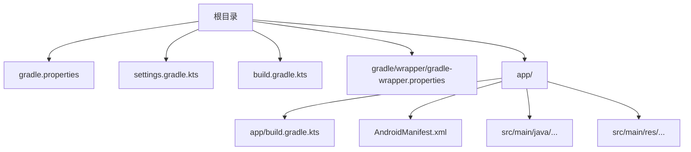
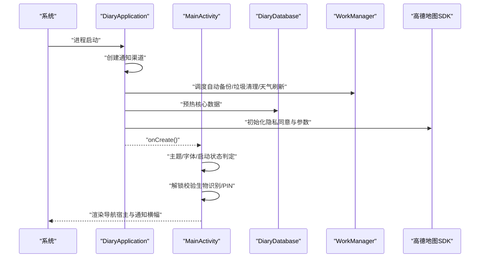
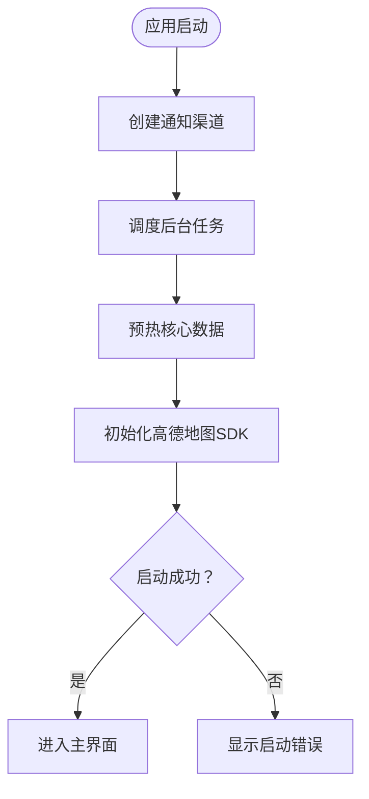
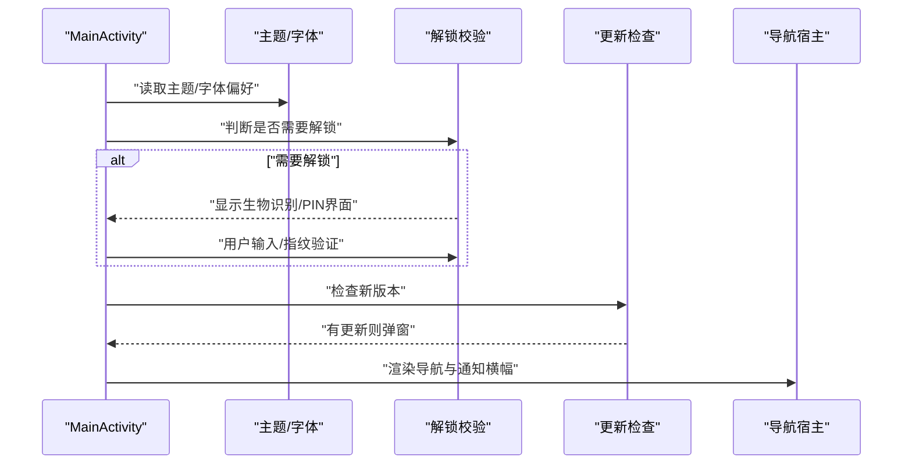
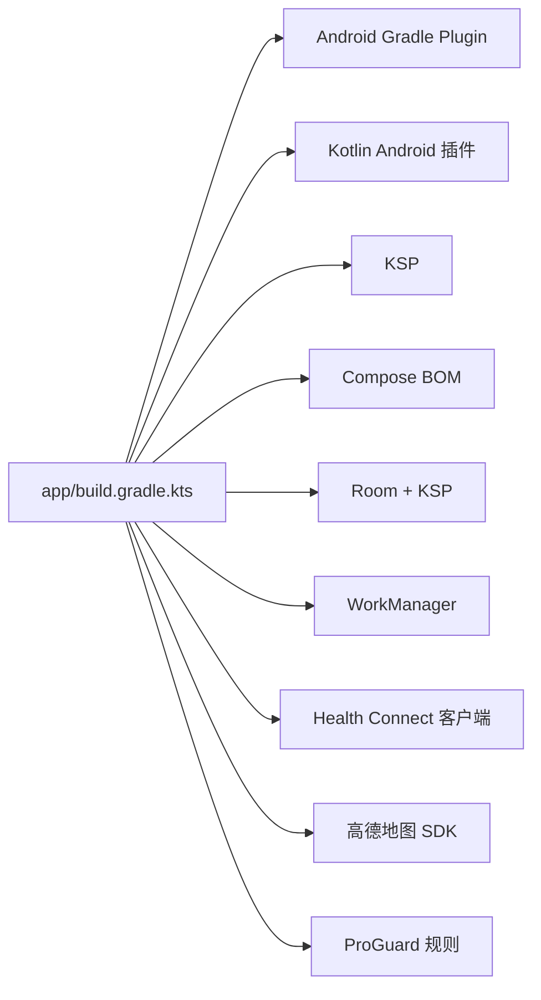

# 开发环境

<cite>
**本文引用的文件**
- [build.gradle.kts](file://build.gradle.kts)
- [app/build.gradle.kts](file://app/build.gradle.kts)
- [gradle.properties](file://gradle.properties)
- [settings.gradle.kts](file://settings.gradle.kts)
- [gradle-wrapper.properties](file://gradle/wrapper/gradle-wrapper.properties)
- [AndroidManifest.xml](file://app/src/main/AndroidManifest.xml)
- [DiaryApplication.kt](file://app/src/main/java/com/diary/app/DiaryApplication.kt)
- [MainActivity.kt](file://app/src/main/java/com/diary/app/MainActivity.kt)
- [build-notes.md](file://docs/build-notes.md)
- [README.md](file://docs/README.md)
- [proguard-rules.pro](file://app/proguard-rules.pro)
</cite>

## 目录
1. [简介](#简介)
2. [项目结构](#项目结构)
3. [核心组件](#核心组件)
4. [架构总览](#架构总览)
5. [详细组件分析](#详细组件分析)
6. [依赖分析](#依赖分析)
7. [性能考虑](#性能考虑)
8. [故障排查指南](#故障排查指南)
9. [结论](#结论)
10. [附录](#附录)

## 简介
本指南面向首次参与 DiaryApp 的开发者，目标是帮助你在本地快速完成开发环境搭建与首次运行，涵盖以下内容：
- 软件环境要求：Android Studio 版本、JDK 版本、Android SDK 版本与 Gradle 版本
- 项目克隆、依赖安装与首次运行步骤
- 调试配置、模拟器与真机调试方法
- 常用开发工具与插件推荐（代码格式化、静态分析等）
- 常见问题与最佳实践
- 项目结构说明与关键配置文件作用解析

## 项目结构
DiaryApp 采用标准 Android Gradle 项目结构，根目录包含 Gradle 配置与仓库级构建脚本，模块 app 下为应用实现与资源文件。

图表来源
- [settings.gradle.kts:1-18](file://settings.gradle.kts#L1-L18)
- [build.gradle.kts:1-6](file://build.gradle.kts#L1-L6)
- [gradle-wrapper.properties:1-6](file://gradle/wrapper/gradle-wrapper.properties#L1-L6)
- [app/build.gradle.kts:1-145](file://app/build.gradle.kts#L1-L145)
- [AndroidManifest.xml:1-158](file://app/src/main/AndroidManifest.xml#L1-L158)

章节来源
- [settings.gradle.kts:1-18](file://settings.gradle.kts#L1-L18)
- [build.gradle.kts:1-6](file://build.gradle.kts#L1-L6)
- [gradle-wrapper.properties:1-6](file://gradle/wrapper/gradle-wrapper.properties#L1-L6)
- [app/build.gradle.kts:1-145](file://app/build.gradle.kts#L1-L145)
- [AndroidManifest.xml:1-158](file://app/src/main/AndroidManifest.xml#L1-L158)

## 核心组件
- 应用入口与生命周期
  - 应用程序类负责初始化数据库、通知渠道、定时任务与第三方 SDK（如地图 SDK），并在启动阶段进行核心数据预热与错误上报。
  - 主界面 Activity 负责主题切换、启动状态管理、生物识别/PIN 解锁、更新检查与导航宿主渲染。
- 构建与打包
  - 根级构建脚本声明插件版本；模块构建脚本定义编译与目标 SDK、Compose 支持、Room/KSP、WorkManager、健康连接、地图 SDK 等依赖。
  - ProGuard 规则用于保留必要的类以适配 Gson、备份实体与高德地图 SDK。
- 配置与权限
  - 清单文件声明网络、存储、定位、广播接收器、桌面小部件、健康连接相关权限，并注入高德地图 API Key。
  - Gradle 属性启用 AndroidX、Kotlin 官方风格、非传递 R 类等。

章节来源
- [DiaryApplication.kt:30-157](file://app/src/main/java/com/diary/app/DiaryApplication.kt#L30-L157)
- [MainActivity.kt:79-435](file://app/src/main/java/com/diary/app/MainActivity.kt#L79-L435)
- [app/build.gradle.kts:14-87](file://app/build.gradle.kts#L14-L87)
- [proguard-rules.pro:1-31](file://app/proguard-rules.pro#L1-L31)
- [AndroidManifest.xml:5-158](file://app/src/main/AndroidManifest.xml#L5-L158)

## 架构总览
下图展示应用启动到进入主界面的关键流程，以及与系统服务（通知、后台任务）和第三方 SDK 的交互。

图表来源
- [DiaryApplication.kt:46-105](file://app/src/main/java/com/diary/app/DiaryApplication.kt#L46-L105)
- [MainActivity.kt:83-422](file://app/src/main/java/com/diary/app/MainActivity.kt#L83-L422)

## 详细组件分析

### 组件一：应用启动与初始化
- 初始化职责
  - 创建通知渠道与提醒通道
  - 预热数据库与成就系统
  - 启动周期性任务（自动备份、垃圾清理、天气刷新）
  - 初始化高德地图 SDK 并处理异常
- 关键点
  - 启动阶段失败会通过状态流上报错误，避免崩溃
  - 主题与实验特性状态来自偏好存储，支持运行时切换

图表来源
- [DiaryApplication.kt:46-105](file://app/src/main/java/com/diary/app/DiaryApplication.kt#L46-L105)

章节来源
- [DiaryApplication.kt:30-157](file://app/src/main/java/com/diary/app/DiaryApplication.kt#L30-L157)

### 组件二：主界面与解锁流程
- 功能要点
  - 根据主题模式与字体缩放渲染界面
  - 监听启动状态，未就绪时显示加载页，错误时提示
  - 提供生物识别与 PIN 双重解锁路径，支持在两者间切换
  - 启动后检查更新并弹出下载安装流程
- 用户体验
  - 解锁界面包含呼吸动画与渐进式入场效果
  - 通知横幅与成就通知联动

图表来源
- [MainActivity.kt:83-422](file://app/src/main/java/com/diary/app/MainActivity.kt#L83-L422)

章节来源
- [MainActivity.kt:79-435](file://app/src/main/java/com/diary/app/MainActivity.kt#L79-L435)

### 组件三：清单与权限
- 权限概览
  - 网络访问、外部存储读写（兼容旧版）、媒体读取、定位、开机广播、精确闹钟、通知发布
  - 健康连接读取步数、睡眠、心率、总热量消耗、距离、运动等
- 其他
  - 注入高德地图 API Key
  - 文件提供者、桌面小部件与相关服务注册
  - 健康连接权限引导别名

章节来源
- [AndroidManifest.xml:5-158](file://app/src/main/AndroidManifest.xml#L5-L158)

## 依赖分析
- 插件与工具链
  - Android Gradle Plugin、Kotlin Android 插件、KSP（Kotlin Symbol Processing）
- 运行时依赖（核心）
  - Jetpack Compose（BOM 管理）、Navigation、ViewModel、Lifecycle、Room（含 KSP 编译器）
  - 协程、WorkManager、Gson、Coil、WebKit（WebViewAssetLoader）、生物识别、健康连接客户端、高德地图 SDK
- ProGuard 规则
  - 保留 Gson、更新与备份相关类、高德 SDK 类，屏蔽部分告警

图表来源
- [app/build.gradle.kts:3-144](file://app/build.gradle.kts#L3-L144)
- [proguard-rules.pro:1-31](file://app/proguard-rules.pro#L1-L31)

章节来源
- [app/build.gradle.kts:89-144](file://app/build.gradle.kts#L89-L144)
- [proguard-rules.pro:1-31](file://app/proguard-rules.pro#L1-L31)

## 性能考虑
- JVM 内存与编码
  - Gradle 使用 UTF-8 与最大堆内存参数，建议保持默认以避免构建异常
- 编译与运行
  - 使用官方推荐的 JDK 与 Gradle 版本组合，避免测试工作进程不稳定
- 资源与混淆
  - Release 包启用代码压缩与资源收缩，确保 ProGuard 规则覆盖必要类

章节来源
- [gradle.properties:1-6](file://gradle.properties#L1-L6)
- [build-notes.md:3-27](file://docs/build-notes.md#L3-L27)
- [app/build.gradle.kts:42-52](file://app/build.gradle.kts#L42-L52)

## 故障排查指南
- 测试工作进程异常（Windows）
  - 现象：使用 Java 21 启动 Gradle 时，特定单元测试可能因工作进程类缺失而失败
  - 处理：切换 Gradle 运行时至 JDK 17
- 启动失败
  - 现象：应用启动阶段出现错误提示
  - 排查：查看应用启动错误状态流，确认数据库初始化、备份与成就系统是否正常
- 地图 SDK 初始化失败
  - 现象：地图隐私同意或初始化抛出异常
  - 处理：检查 API Key 注入与网络环境，确认异常已被捕获与记录

章节来源
- [build-notes.md:11-16](file://docs/build-notes.md#L11-L16)
- [DiaryApplication.kt:63-69](file://app/src/main/java/com/diary/app/DiaryApplication.kt#L63-L69)
- [MainActivity.kt:415-419](file://app/src/main/java/com/diary/app/MainActivity.kt#L415-L419)

## 结论
按照本指南完成环境准备与首次运行后，你将具备：
- 符合项目要求的 JDK、Gradle、Android SDK 版本
- 正确的项目克隆、依赖安装与构建流程
- 模拟器与真机调试方法
- 常用开发工具与插件的配置建议
- 常见问题的定位与解决思路

## 附录

### A. 软件环境要求
- Android Studio
  - 使用与 Android Gradle Plugin 对应的稳定版 Android Studio
- JDK
  - 推荐使用 JDK 17 运行 Gradle；避免使用 Java 21 运行 Gradle 以减少测试工作进程不稳定风险
- Android SDK
  - Compile SDK：35
  - Target SDK：34
  - Min SDK：26
- Gradle
  - Gradle Wrapper：8.2
  - Android Gradle Plugin：8.2.0

章节来源
- [build-notes.md:3-9](file://docs/build-notes.md#L3-L9)
- [gradle-wrapper.properties:3](file://gradle/wrapper/gradle-wrapper.properties#L3)
- [app/build.gradle.kts:16-21](file://app/build.gradle.kts#L16-L21)

### B. 项目克隆、依赖安装与首次运行
- 克隆仓库后，确保本地存在 local.properties（用于注入 GitHub Token 与高德地图 API Key）
- 执行以下命令完成清理与构建：
  - 清理：gradlew.bat clean
  - 编译实验版 Kotlin：gradlew.bat :app:compileExperimentalDebugKotlin
  - 构建实验版 Release：gradlew.bat :app:assembleExperimentalRelease
- 如需调试，选择合适的构建变体（stable/experimental）与产品风味

章节来源
- [app/build.gradle.kts:9-34](file://app/build.gradle.kts#L9-L34)
- [build-notes.md:17-22](file://docs/build-notes.md#L17-L22)

### C. 调试配置、模拟器与真机调试
- 模拟器
  - 建议使用 x86/x86_64 镜像，开启硬件加速
  - 设置目标 SDK 与最小 SDK 与项目一致
- 真机调试
  - 开启开发者选项与 USB 调试
  - 若涉及健康连接与地图功能，确保设备系统版本满足权限要求
- 构建变体
  - stable：正式发布风味
  - experimental：实验风味，便于快速迭代与预览

章节来源
- [app/build.gradle.kts:60-73](file://app/build.gradle.kts#L60-L73)

### D. 常用开发工具与插件推荐
- 代码格式化
  - Kotlin 官方风格：已在 Gradle 属性中启用
- 静态分析
  - 建议引入 SpotBugs/Kotlin 编译器插桩或 Detekt（按团队规范集成）
- Compose 开发
  - 使用 Android Studio 的 Compose 预览与布局检查工具
- 第三方 SDK
  - 高德地图 SDK 需要正确注入 API Key；健康连接需遵循平台权限流程

章节来源
- [gradle.properties:3](file://gradle.properties#L3)
- [AndroidManifest.xml:38-41](file://app/src/main/AndroidManifest.xml#L38-L41)

### E. 关键配置文件说明
- gradle.properties
  - 启用 AndroidX、Kotlin 官方风格、非传递 R 类、覆盖路径检查
- settings.gradle.kts
  - 配置仓库源与模块包含关系
- build.gradle.kts（根）
  - 声明插件版本（AGP、Kotlin、KSP）
- app/build.gradle.kts
  - 定义 compile/target/min SDK、Compose、Room/KSP、WorkManager、健康连接、高德地图等依赖
- gradle-wrapper.properties
  - 指定 Gradle 分发版本
- AndroidManifest.xml
  - 声明权限、服务、广播接收器、桌面小部件与健康连接别名
- proguard-rules.pro
  - 保留 Gson、备份与高德 SDK 类，屏蔽告警

章节来源
- [gradle.properties:1-6](file://gradle.properties#L1-L6)
- [settings.gradle.kts:1-18](file://settings.gradle.kts#L1-L18)
- [build.gradle.kts:1-6](file://build.gradle.kts#L1-L6)
- [app/build.gradle.kts:14-87](file://app/build.gradle.kts#L14-L87)
- [gradle-wrapper.properties:1-6](file://gradle/wrapper/gradle-wrapper.properties#L1-L6)
- [AndroidManifest.xml:28-158](file://app/src/main/AndroidManifest.xml#L28-L158)
- [proguard-rules.pro:1-31](file://app/proguard-rules.pro#L1-L31)