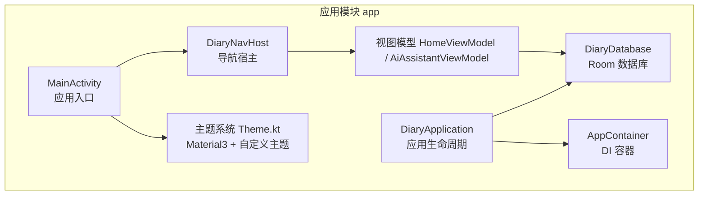
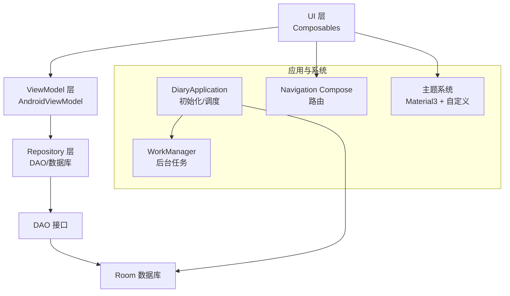
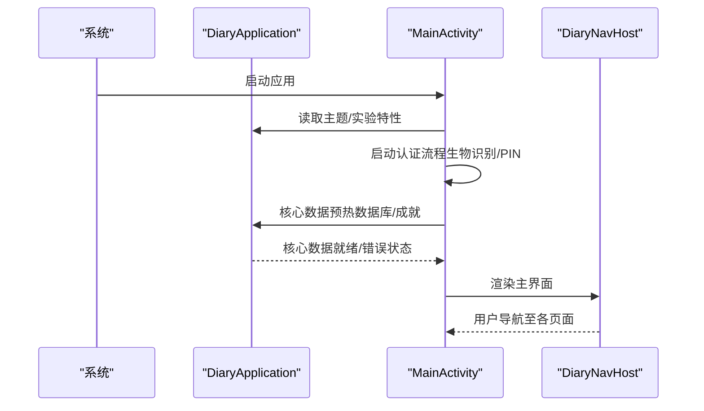
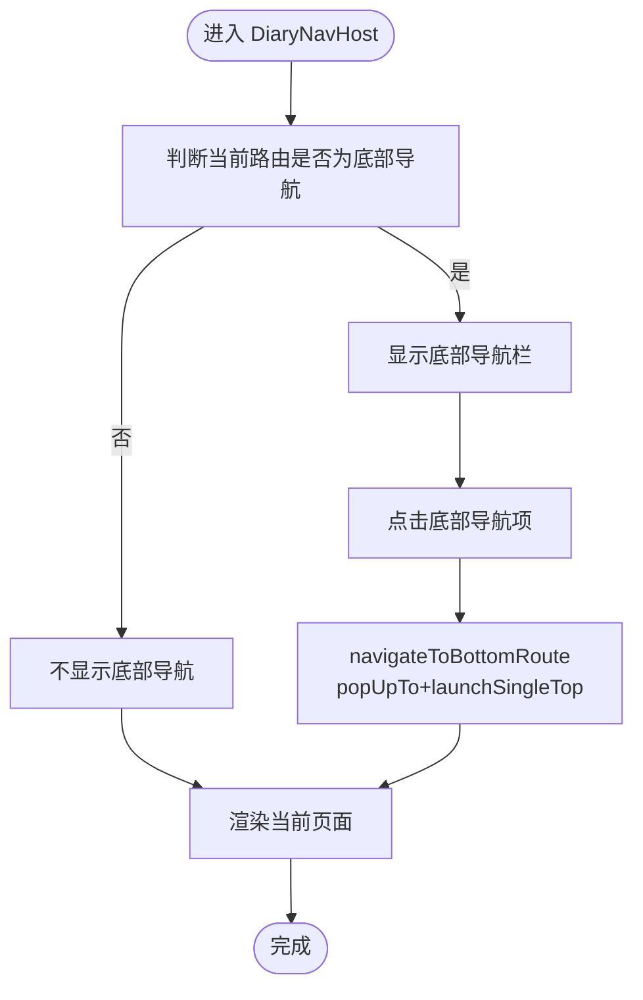
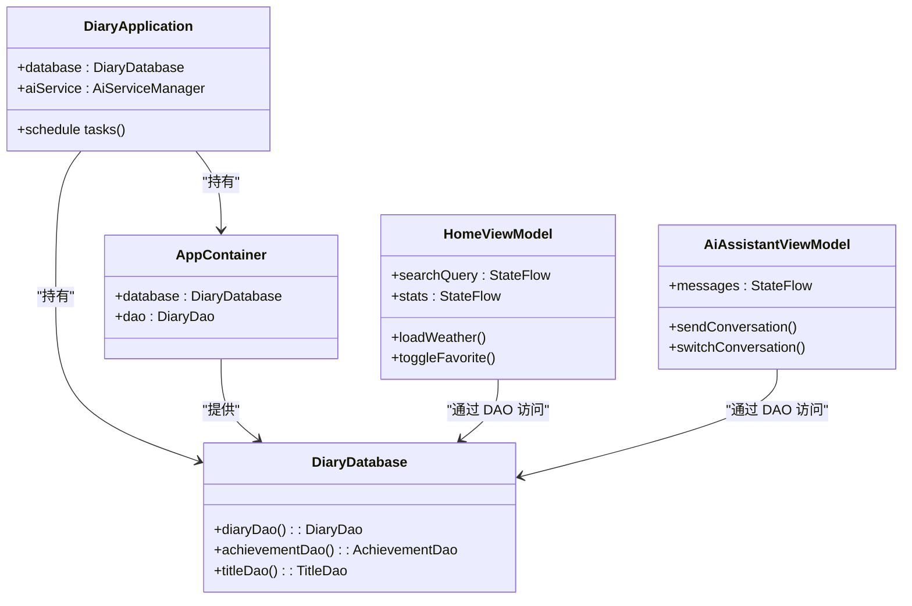
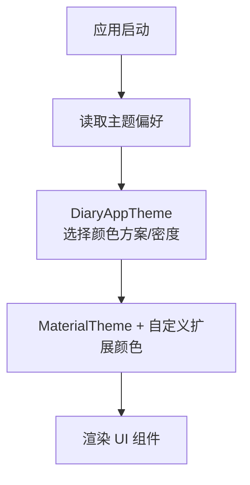
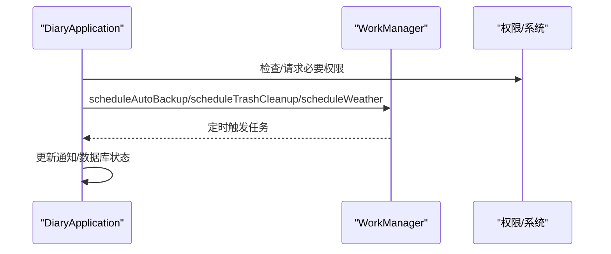
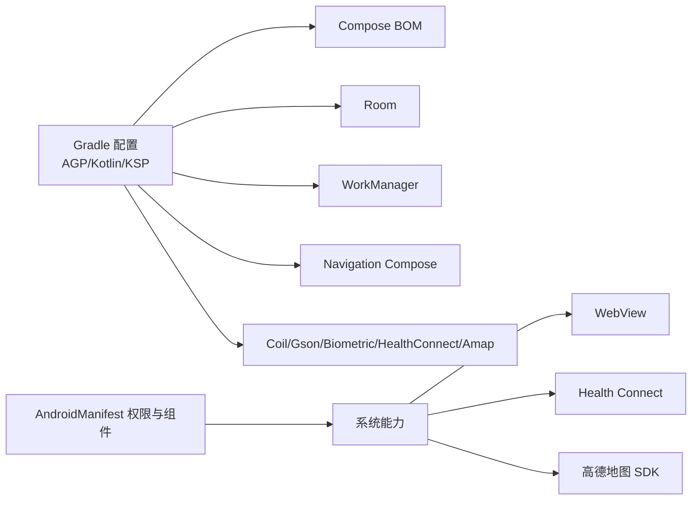

# 技术栈

<cite>
**本文档引用的文件**
- [app/build.gradle.kts](file://app/build.gradle.kts)
- [build.gradle.kts](file://build.gradle.kts)
- [settings.gradle.kts](file://settings.gradle.kts)
- [gradle.properties](file://gradle.properties)
- [app/src/main/AndroidManifest.xml](file://app/src/main/AndroidManifest.xml)
- [app/src/main/java/com/diary/app/DiaryApplication.kt](file://app/src/main/java/com/diary/app/DiaryApplication.kt)
- [app/src/main/java/com/diary/app/MainActivity.kt](file://app/src/main/java/com/diary/app/MainActivity.kt)
- [app/src/main/java/com/diary/app/ui/navigation/DiaryNavHost.kt](file://app/src/main/java/com/diary/app/ui/navigation/DiaryNavHost.kt)
- [app/src/main/java/com/diary/app/data/DiaryDatabase.kt](file://app/src/main/java/com/diary/app/data/DiaryDatabase.kt)
- [app/src/main/java/com/diary/app/di/AppContainer.kt](file://app/src/main/java/com/diary/app/di/AppContainer.kt)
- [app/src/main/java/com/diary/app/ui/theme/Theme.kt](file://app/src/main/java/com/diary/app/ui/theme/Theme.kt)
- [app/src/main/java/com/diary/app/ui/home/HomeViewModel.kt](file://app/src/main/java/com/diary/app/ui/home/HomeViewModel.kt)
- [app/src/main/java/com/diary/app/ai/AiAssistantViewModel.kt](file://app/src/main/java/com/diary/app/ai/AiAssistantViewModel.kt)
- [docs/README.md](file://docs/README.md)
- [docs/build-notes.md](file://docs/build-notes.md)
- [docs/pencil-compose-integration-guide.md](file://docs/pencil-compose-integration-guide.md)
</cite>

## 目录
1. [简介](#简介)
2. [项目结构](#项目结构)
3. [核心组件](#核心组件)
4. [架构总览](#架构总览)
5. [详细组件分析](#详细组件分析)
6. [依赖分析](#依赖分析)
7. [性能考虑](#性能考虑)
8. [故障排查指南](#故障排查指南)
9. [结论](#结论)
10. [附录](#附录)

## 简介
本技术栈文档面向 DiaryApp 项目，系统梳理其采用的核心技术与框架，包括 Android SDK、Kotlin 语言、Jetpack Compose 声明式 UI 框架；关键依赖库的选择原因，如 Room 数据库用于数据持久化、WorkManager 用于后台任务、Navigation Compose 用于导航管理、Material3 Design 用于设计系统；MVVM 架构模式的应用与优势；以及开发工具链（Android Studio、Gradle 构建系统、版本控制工具）与技术选型的考量因素（性能、可维护性、团队技能匹配）。文档同时提供代码级架构图与流程图，帮助读者快速理解系统设计。

## 项目结构
DiaryApp 采用标准 Android Gradle 项目结构，核心模块为 app，包含源码、资源与测试代码。项目使用 Kotlin DSL 的 Gradle 配置，并通过 Compose BOM 管理 Compose 生态依赖。应用入口为 MainActivity，通过 DiaryNavHost 进行路由与页面导航；数据层基于 Room，提供数据库、DAO、Repository 与 ViewModel 的 MVVM 分层。

**图表来源**
- [app/src/main/java/com/diary/app/MainActivity.kt:79-435](file://app/src/main/java/com/diary/app/MainActivity.kt#L79-L435)
- [app/src/main/java/com/diary/app/ui/navigation/DiaryNavHost.kt:200-776](file://app/src/main/java/com/diary/app/ui/navigation/DiaryNavHost.kt#L200-L776)
- [app/src/main/java/com/diary/app/DiaryApplication.kt:30-157](file://app/src/main/java/com/diary/app/DiaryApplication.kt#L30-L157)
- [app/src/main/java/com/diary/app/data/DiaryDatabase.kt:10-14](file://app/src/main/java/com/diary/app/data/DiaryDatabase.kt#L10-L14)
- [app/src/main/java/com/diary/app/di/AppContainer.kt:11-14](file://app/src/main/java/com/diary/app/di/AppContainer.kt#L11-L14)
- [app/src/main/java/com/diary/app/ui/theme/Theme.kt:500-576](file://app/src/main/java/com/diary/app/ui/theme/Theme.kt#L500-L576)

**章节来源**
- [app/build.gradle.kts:14-87](file://app/build.gradle.kts#L14-L87)
- [settings.gradle.kts:1-18](file://settings.gradle.kts#L1-L18)
- [gradle.properties:1-6](file://gradle.properties#L1-L6)

## 核心组件
- Android SDK 与运行时
  - compileSdk/targetSdk/minSdk：35/34/26，确保对最新系统能力的支持与向后兼容。
  - Java 8 语言特性与 Kotlin 1.9.x，配合 Gradle 8.2 插件链路。
- Kotlin 语言
  - 全面采用 Kotlin，结合协程与 Flow 实现响应式数据流与异步处理。
- Jetpack Compose
  - 通过 Compose BOM 管理版本，启用 compose buildFeatures，Material3 作为设计系统基座。
- 数据持久化：Room
  - 提供实体、DAO、数据库与迁移脚本，支持复杂查询与索引优化。
- 后台任务：WorkManager
  - 用于周期性自动备份、垃圾清理与天气刷新等任务调度。
- 导航：Navigation Compose
  - 基于 NavHost 的声明式导航，支持转场动画与参数传递。
- 设计系统：Material3
  - 自定义主题系统，支持多主题切换与密度适配。
- 其他关键依赖
  - ViewModel + Lifecycle：MVVM 生命周期感知。
  - Coroutines：并发与异步任务。
  - Coil：图片加载。
  - WebView：富文本渲染与资产加载。
  - Health Connect：健康数据访问。
  - 高德地图 SDK：位置与地图能力。

**章节来源**
- [app/build.gradle.kts:14-87](file://app/build.gradle.kts#L14-L87)
- [app/src/main/java/com/diary/app/data/DiaryDatabase.kt:10-14](file://app/src/main/java/com/diary/app/data/DiaryDatabase.kt#L10-L14)
- [app/src/main/java/com/diary/app/DiaryApplication.kt:52-61](file://app/src/main/java/com/diary/app/DiaryApplication.kt#L52-L61)

## 架构总览
DiaryApp 采用 MVVM 架构，数据流自上而下：UI 层（Composable）通过 ViewModel 订阅状态流，ViewModel 通过 Repository 访问 DAO，DAO 与 Room 数据库交互。应用通过 Navigation Compose 管理页面路由，DiaryApplication 负责应用级初始化与后台任务调度，主题系统贯穿 UI 层。

**图表来源**
- [app/src/main/java/com/diary/app/ui/home/HomeViewModel.kt:81-399](file://app/src/main/java/com/diary/app/ui/home/HomeViewModel.kt#L81-L399)
- [app/src/main/java/com/diary/app/ai/AiAssistantViewModel.kt:33-364](file://app/src/main/java/com/diary/app/ai/AiAssistantViewModel.kt#L33-L364)
- [app/src/main/java/com/diary/app/ui/navigation/DiaryNavHost.kt:247-279](file://app/src/main/java/com/diary/app/ui/navigation/DiaryNavHost.kt#L247-L279)
- [app/src/main/java/com/diary/app/DiaryApplication.kt:46-105](file://app/src/main/java/com/diary/app/DiaryApplication.kt#L46-L105)
- [app/src/main/java/com/diary/app/ui/theme/Theme.kt:500-576](file://app/src/main/java/com/diary/app/ui/theme/Theme.kt#L500-L576)

## 详细组件分析

### 应用入口与生命周期（MainActivity/DiaryApplication）
- MainActivity 负责应用启动页、认证（生物识别/PIN）、更新检查与主界面导航。
- DiaryApplication 负责数据库初始化、通知渠道创建、后台任务调度（自动备份、垃圾清理、天气刷新）与全局状态（主题、实验特性）。

**图表来源**
- [app/src/main/java/com/diary/app/MainActivity.kt:83-422](file://app/src/main/java/com/diary/app/MainActivity.kt#L83-L422)
- [app/src/main/java/com/diary/app/DiaryApplication.kt:46-105](file://app/src/main/java/com/diary/app/DiaryApplication.kt#L46-L105)

**章节来源**
- [app/src/main/java/com/diary/app/MainActivity.kt:79-435](file://app/src/main/java/com/diary/app/MainActivity.kt#L79-L435)
- [app/src/main/java/com/diary/app/DiaryApplication.kt:30-157](file://app/src/main/java/com/diary/app/DiaryApplication.kt#L30-L157)

### 导航与页面路由（Navigation Compose）
- DiaryNavHost 定义底部导航与页面路由，支持页面间转场动画与参数传递。
- 通过 rememberNavController 管理导航状态，支持手势导航与实验特性开关。

**图表来源**
- [app/src/main/java/com/diary/app/ui/navigation/DiaryNavHost.kt:200-246](file://app/src/main/java/com/diary/app/ui/navigation/DiaryNavHost.kt#L200-L246)
- [app/src/main/java/com/diary/app/ui/navigation/DiaryNavHost.kt:247-279](file://app/src/main/java/com/diary/app/ui/navigation/DiaryNavHost.kt#L247-L279)

**章节来源**
- [app/src/main/java/com/diary/app/ui/navigation/DiaryNavHost.kt:135-197](file://app/src/main/java/com/diary/app/ui/navigation/DiaryNavHost.kt#L135-L197)
- [app/src/main/java/com/diary/app/ui/navigation/DiaryNavHost.kt:200-776](file://app/src/main/java/com/diary/app/ui/navigation/DiaryNavHost.kt#L200-L776)

### 数据层与 MVVM（Room + ViewModel）
- DiaryDatabase 定义实体与迁移脚本，提供 DAO 访问接口。
- AppContainer 提供集中式的数据库与 DAO 访问。
- HomeViewModel/AiAssistantViewModel 通过协程与 Flow 管理状态，执行搜索、统计、天气与 AI 对话等业务逻辑。

**图表来源**
- [app/src/main/java/com/diary/app/DiaryApplication.kt:30-36](file://app/src/main/java/com/diary/app/DiaryApplication.kt#L30-L36)
- [app/src/main/java/com/diary/app/data/DiaryDatabase.kt:15-18](file://app/src/main/java/com/diary/app/data/DiaryDatabase.kt#L15-L18)
- [app/src/main/java/com/diary/app/di/AppContainer.kt:11-14](file://app/src/main/java/com/diary/app/di/AppContainer.kt#L11-L14)
- [app/src/main/java/com/diary/app/ui/home/HomeViewModel.kt:81-399](file://app/src/main/java/com/diary/app/ui/home/HomeViewModel.kt#L81-L399)
- [app/src/main/java/com/diary/app/ai/AiAssistantViewModel.kt:33-364](file://app/src/main/java/com/diary/app/ai/AiAssistantViewModel.kt#L33-L364)

**章节来源**
- [app/src/main/java/com/diary/app/data/DiaryDatabase.kt:10-14](file://app/src/main/java/com/diary/app/data/DiaryDatabase.kt#L10-L14)
- [app/src/main/java/com/diary/app/di/AppContainer.kt:11-14](file://app/src/main/java/com/diary/app/di/AppContainer.kt#L11-L14)
- [app/src/main/java/com/diary/app/ui/home/HomeViewModel.kt:81-399](file://app/src/main/java/com/diary/app/ui/home/HomeViewModel.kt#L81-L399)
- [app/src/main/java/com/diary/app/ai/AiAssistantViewModel.kt:33-364](file://app/src/main/java/com/diary/app/ai/AiAssistantViewModel.kt#L33-L364)

### 主题系统与设计规范（Material3 + 自定义）
- Theme.kt 提供多套主题（纯白/纯黑/苔藓绿/海洋/花瓣/沙砾/陶土/墨水），并暴露扩展颜色与密度缩放。
- 通过 CompositionLocal 提供主题模式、扩展颜色与字体缩放，贯穿 UI 层。

**图表来源**
- [app/src/main/java/com/diary/app/ui/theme/Theme.kt:500-576](file://app/src/main/java/com/diary/app/ui/theme/Theme.kt#L500-L576)

**章节来源**
- [app/src/main/java/com/diary/app/ui/theme/Theme.kt:108-124](file://app/src/main/java/com/diary/app/ui/theme/Theme.kt#L108-L124)
- [app/src/main/java/com/diary/app/ui/theme/Theme.kt:500-576](file://app/src/main/java/com/diary/app/ui/theme/Theme.kt#L500-L576)

### 后台任务与系统集成（WorkManager + Manifest）
- DiaryApplication 在启动时根据偏好调度 WorkManager 任务（自动备份、垃圾清理、天气刷新）。
- AndroidManifest.xml 声明权限、广播接收器与桌面小部件相关组件。

**图表来源**
- [app/src/main/java/com/diary/app/DiaryApplication.kt:52-61](file://app/src/main/java/com/diary/app/DiaryApplication.kt#L52-L61)
- [app/src/main/AndroidManifest.xml:5-27](file://app/src/main/AndroidManifest.xml#L5-L27)

**章节来源**
- [app/src/main/java/com/diary/app/DiaryApplication.kt:52-61](file://app/src/main/java/com/diary/app/DiaryApplication.kt#L52-L61)
- [app/src/main/AndroidManifest.xml:1-158](file://app/src/main/AndroidManifest.xml#L1-L158)

## 依赖分析
- Gradle 与 Android 配置
  - AGP 8.2.0 + Gradle 包装器 8.2，JDK 17 推荐用于稳定构建。
  - Compose BOM 管理 Compose 生态版本，Room、WorkManager、Navigation Compose 等依赖集中管理。
- 运行时权限与系统能力
  - INTERNET、位置、存储、健康数据、开机广播等权限在清单中声明。
  - WebView 与高德地图 SDK 用于内容渲染与地图能力。

**图表来源**
- [app/build.gradle.kts:90-144](file://app/build.gradle.kts#L90-L144)
- [app/src/main/AndroidManifest.xml:5-27](file://app/src/main/AndroidManifest.xml#L5-L27)

**章节来源**
- [app/build.gradle.kts:1-145](file://app/build.gradle.kts#L1-L145)
- [build.gradle.kts:1-6](file://build.gradle.kts#L1-L6)
- [gradle.properties:1-6](file://gradle.properties#L1-L6)
- [app/src/main/AndroidManifest.xml:1-158](file://app/src/main/AndroidManifest.xml#L1-L158)

## 性能考虑
- Compose 与 Material3
  - 声明式 UI 与状态提升减少不必要的重组；合理使用 remember 与 stateIn 控制流传播范围。
- 数据层
  - Room 索引与查询优化（如按日期范围查询、标签聚合），避免主线程数据库操作。
- 并发与异步
  - 协程与 Dispatchers.IO 处理耗时任务，避免阻塞 UI 线程。
- 构建稳定性
  - 使用 JDK 17 运行 Gradle，避免测试工作进程启动不稳定问题。

**章节来源**
- [docs/build-notes.md:3-28](file://docs/build-notes.md#L3-L28)
- [app/src/main/java/com/diary/app/ui/home/HomeViewModel.kt:156-158](file://app/src/main/java/com/diary/app/ui/home/HomeViewModel.kt#L156-L158)

## 故障排查指南
- 构建与测试
  - 若测试失败（如 Gradle Worker 启动异常），优先切换到 JDK 17 运行环境。
- 数据库启动失败
  - DiaryApplication 在数据库打开失败时会进行备份并抛出异常，检查迁移脚本与备份文件。
- 权限与系统能力
  - 未授予位置权限时，天气加载会降级；健康数据需通过系统权限页面授权。
- 更新与安装
  - MainActivity 支持在线更新检查与下载安装，注意网络超时与下载进度状态。

**章节来源**
- [docs/build-notes.md:11-28](file://docs/build-notes.md#L11-L28)
- [app/src/main/java/com/diary/app/DiaryApplication.kt:763-767](file://app/src/main/java/com/diary/app/DiaryApplication.kt#L763-L767)
- [app/src/main/java/com/diary/app/MainActivity.kt:314-373](file://app/src/main/java/com/diary/app/MainActivity.kt#L314-L373)

## 结论
DiaryApp 采用现代 Android 技术栈，以 Kotlin + Jetpack Compose 为核心 UI 技术，结合 Room、WorkManager、Navigation Compose 与 Material3 设计系统，形成清晰的 MVVM 分层架构。通过合理的依赖管理、主题系统与后台任务调度，项目在性能、可维护性与用户体验方面取得平衡。技术选型充分考虑团队技能与生态成熟度，为后续功能扩展与迭代提供了坚实基础。

## 附录
- 开发工具链
  - Android Studio：提供 Compose 预览、调试与性能分析工具。
  - Gradle：版本管理与构建自动化。
  - Git：版本控制与协作。
- 文档与研究
  - 项目内含多份技术研究与集成方案文档，指导 UI 设计与 AI 集成实践。

**章节来源**
- [docs/README.md:1-68](file://docs/README.md#L1-L68)
- [docs/pencil-compose-integration-guide.md:1-800](file://docs/pencil-compose-integration-guide.md#L1-L800)