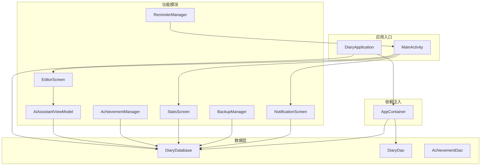
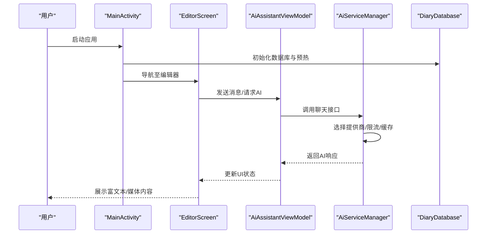
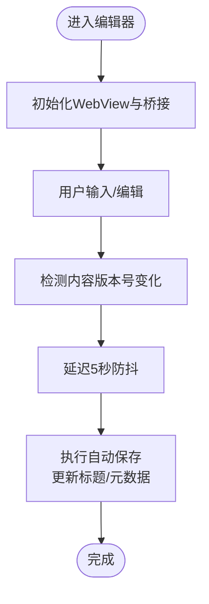
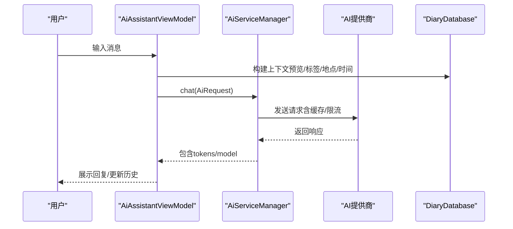
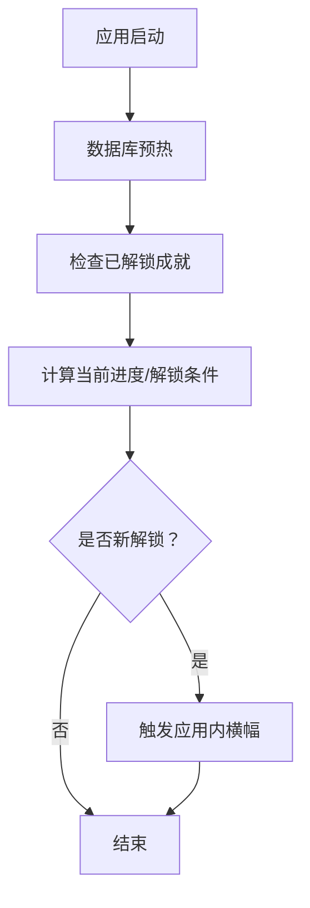
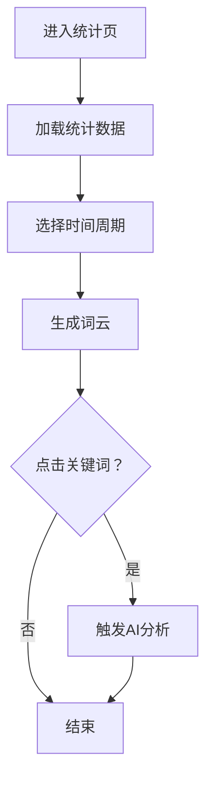
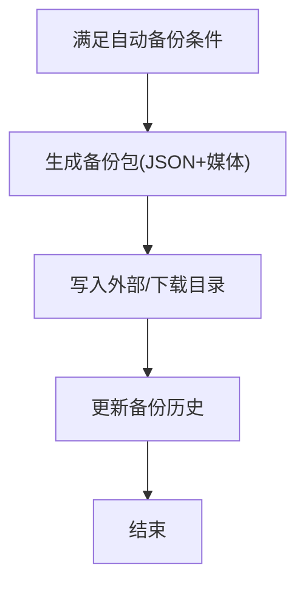
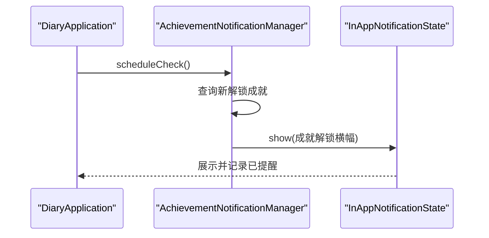
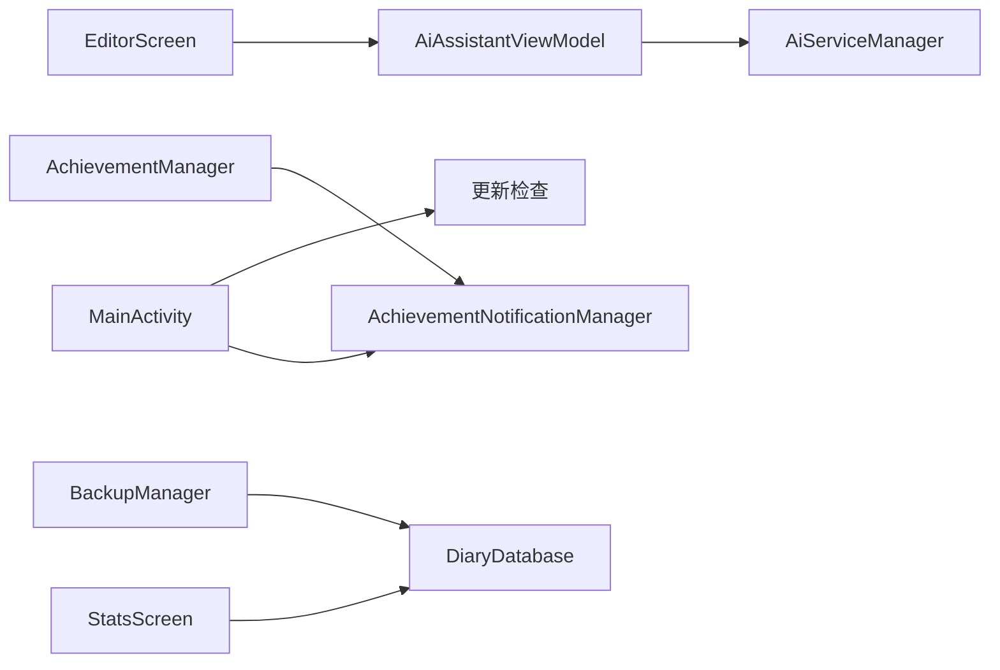

# 核心功能概览

<cite>
**本文档引用的文件**
- [DiaryApplication.kt](file://app/src/main/java/com/diary/app/DiaryApplication.kt)
- [MainActivity.kt](file://app/src/main/java/com/diary/app/MainActivity.kt)
- [AppContainer.kt](file://app/src/main/java/com/diary/app/di/AppContainer.kt)
- [AiAssistantViewModel.kt](file://app/src/main/java/com/diary/app/ai/AiAssistantViewModel.kt)
- [AiServiceManager.kt](file://app/src/main/java/com/diary/app/ai/AiServiceManager.kt)
- [AchievementManager.kt](file://app/src/main/java/com/diary/app/data/AchievementManager.kt)
- [BackupManager.kt](file://app/src/main/java/com/diary/app/data/BackupManager.kt)
- [ReminderManager.kt](file://app/src/main/java/com/diary/app/reminder/ReminderManager.kt)
- [AchievementNotificationManager.kt](file://app/src/main/java/com/diary/app/reminder/AchievementNotificationManager.kt)
- [EditorScreen.kt](file://app/src/main/java/com/diary/app/ui/editor/EditorScreen.kt)
- [StatsScreen.kt](file://app/src/main/java/com/diary/app/ui/stats/StatsScreen.kt)
- [AchievementScreen.kt](file://app/src/main/java/com/diary/app/ui/achievement/AchievementScreen.kt)
- [NotificationScreen.kt](file://app/src/main/java/com/diary/app/ui/notification/NotificationScreen.kt)
</cite>

## 目录
1. [简介](#简介)
2. [项目结构](#项目结构)
3. [核心功能模块](#核心功能模块)
4. [架构总览](#架构总览)
5. [详细组件分析](#详细组件分析)
6. [依赖关系分析](#依赖关系分析)
7. [性能考虑](#性能考虑)
8. [故障排除指南](#故障排除指南)
9. [结论](#结论)

## 简介
本文件面向DiaryApp的使用者与开发者，系统梳理应用的核心功能模块与其价值主张，帮助快速理解应用能力边界与特色功能。重点覆盖以下方面：
- 日记编辑器：富文本编辑与多媒体支持，提供沉浸式写作体验
- AI助手：多提供商智能写作辅助，构建“聊天伙伴”式的交互体验
- 成就系统：游戏化元素驱动持续记录，提升用户粘性与成就感
- 数据分析：可视化统计图表与报告，帮助用户洞察写作轨迹
- 备份恢复：自动与手动备份策略，保障数据安全与可迁移性
- 通知提醒：系统通知与应用内横幅，增强用户体验与参与度

## 项目结构
DiaryApp采用Android Jetpack Compose前端与Kotlin后端，模块化组织清晰，核心模块包括：
- 应用入口与生命周期：DiaryApplication、MainActivity
- 数据层与持久化：DiaryDatabase、DAO、Repository
- 功能模块：编辑器、AI助手、成就、统计、备份、通知、提醒
- 依赖注入：AppContainer集中管理数据库与DAO实例
- UI导航与主题：Compose导航与主题偏好

**图表来源**
- [DiaryApplication.kt:30-105](file://app/src/main/java/com/diary/app/DiaryApplication.kt#L30-L105)
- [MainActivity.kt:83-421](file://app/src/main/java/com/diary/app/MainActivity.kt#L83-L421)
- [AppContainer.kt:11-14](file://app/src/main/java/com/diary/app/di/AppContainer.kt#L11-L14)

**章节来源**
- [DiaryApplication.kt:30-105](file://app/src/main/java/com/diary/app/DiaryApplication.kt#L30-L105)
- [MainActivity.kt:83-421](file://app/src/main/java/com/diary/app/MainActivity.kt#L83-L421)
- [AppContainer.kt:11-14](file://app/src/main/java/com/diary/app/di/AppContainer.kt#L11-L14)

## 核心功能模块
本节概述各功能模块的价值与用户收益，并指出模块间的协作关系。

- 日记编辑器
  - 价值：提供富文本编辑与多媒体插入能力，支持图片、视频、音频等媒体资源，结合标题、心情、天气、位置、标签等元数据，形成完整的日记表达。
  - 用户收益：写作更自由、记录更丰富、内容可检索与回溯。
  - 协作关系：与AI助手联动（如“润色所选文本”）、与统计模块共享元数据（标签、天气、心情）。

- AI助手
  - 价值：基于多提供商模型（ModelScope、Agnes、DeepSeek），提供智能写作辅助、对话与洞察，构建“聊天伙伴”式体验。
  - 用户收益：获得写作灵感、语言润色、情绪分析与个性化建议。
  - 协作关系：与编辑器集成，与成就系统联动（里程碑提示）。

- 成就系统
  - 价值：通过游戏化设计（等级、稀有度、进度条）激励持续写作，涵盖写作数量、连续天数、标签与图片使用等维度。
  - 用户收益：获得成就感与目标感，提升长期留存。
  - 协作关系：与通知系统联动（解锁横幅）、与统计模块联动（里程碑触发）。

- 数据分析
  - 价值：提供热力图、趋势图、词云、心情分布、写作习惯等可视化分析，帮助用户发现模式与偏好。
  - 用户收益：自我洞察、目标追踪、内容主题识别。
  - 协作关系：与编辑器元数据强关联，与统计模块互补。

- 备份恢复
  - 价值：支持自动与手动备份，导出完整JSON与打包ZIP，兼容下载目录扫描与历史记录管理。
  - 用户收益：数据安全、跨设备迁移、离线可恢复。
  - 协作关系：与编辑器内容与元数据同步，与通知系统联动（备份完成提示）。

- 通知提醒
  - 价值：系统级提醒（每日写日记）、应用内横幅（成就解锁、里程碑、报告生成），以及回收站与分类管理。
  - 用户收益：减少遗忘、及时反馈、有序信息管理。
  - 协作关系：与成就系统、统计模块、提醒模块协同。

**章节来源**
- [EditorScreen.kt:122-714](file://app/src/main/java/com/diary/app/ui/editor/EditorScreen.kt#L122-L714)
- [AiAssistantViewModel.kt:33-226](file://app/src/main/java/com/diary/app/ai/AiAssistantViewModel.kt#L33-L226)
- [AchievementManager.kt:12-123](file://app/src/main/java/com/diary/app/data/AchievementManager.kt#L12-L123)
- [StatsScreen.kt:92-344](file://app/src/main/java/com/diary/app/ui/stats/StatsScreen.kt#L92-L344)
- [BackupManager.kt:63-104](file://app/src/main/java/com/diary/app/data/BackupManager.kt#L63-L104)
- [NotificationScreen.kt:80-172](file://app/src/main/java/com/diary/app/ui/notification/NotificationScreen.kt#L80-L172)

## 架构总览
DiaryApp采用分层架构与模块化设计：
- 表现层：Jetpack Compose UI，负责屏幕与交互
- 控制层：ViewModel与Manager，协调业务逻辑
- 数据层：Room数据库、DAO、Repository，持久化与查询
- 基础设施：依赖注入容器、工作调度（WorkManager）、通知通道

**图表来源**
- [MainActivity.kt:83-421](file://app/src/main/java/com/diary/app/MainActivity.kt#L83-L421)
- [EditorScreen.kt:122-714](file://app/src/main/java/com/diary/app/ui/editor/EditorScreen.kt#L122-L714)
- [AiAssistantViewModel.kt:128-226](file://app/src/main/java/com/diary/app/ai/AiAssistantViewModel.kt#L128-L226)
- [AiServiceManager.kt:43-61](file://app/src/main/java/com/diary/app/ai/AiServiceManager.kt#L43-L61)

## 详细组件分析

### 日记编辑器（EditorScreen）
- 功能要点
  - 富文本编辑：基于WebView承载Quill编辑器，支持格式化、链接插入、标题自动生成
  - 多媒体支持：图片、视频、音频导入与显示，统一转为WebView可访问URL
  - 元数据编辑：心情、天气、位置、标签、时间等
  - 自动保存与草稿：内容变更检测、后台自动保存、退出确认
  - AI集成：选中文本润色、标题建议、AI对话面板
- 用户价值
  - 写作体验流畅、内容表达丰富、操作便捷
- 关键流程（自动保存）

**图表来源**
- [EditorScreen.kt:510-550](file://app/src/main/java/com/diary/app/ui/editor/EditorScreen.kt#L510-L550)

**章节来源**
- [EditorScreen.kt:122-714](file://app/src/main/java/com/diary/app/ui/editor/EditorScreen.kt#L122-L714)

### AI助手（AiAssistantViewModel 与 AiServiceManager）
- 功能要点
  - 多提供商：ModelScope、Agnes、Deepseek，动态切换与配置
  - 对话上下文：基于近期日记构建上下文，包含连续写作天数、心情分布、标签、地点、写作时段等
  - 缓存与限流：请求哈希缓存（24h）、调用次数与速率控制
  - 历史管理：对话列表、消息分页、清理与迁移
- 用户价值
  - 个性化写作辅助、情绪洞察、高效创作
- 关键流程（发送消息）

**图表来源**
- [AiAssistantViewModel.kt:128-226](file://app/src/main/java/com/diary/app/ai/AiAssistantViewModel.kt#L128-L226)
- [AiServiceManager.kt:43-61](file://app/src/main/java/com/diary/app/ai/AiServiceManager.kt#L43-L61)

**章节来源**
- [AiAssistantViewModel.kt:33-226](file://app/src/main/java/com/diary/app/ai/AiAssistantViewModel.kt#L33-L226)
- [AiServiceManager.kt:10-61](file://app/src/main/java/com/diary/app/ai/AiServiceManager.kt#L10-L61)

### 成就系统（AchievementManager 与 AchievementNotificationManager）
- 功能要点
  - 成就定义：覆盖写作数量、连续天数、标签/图片使用、时间区间等维度
  - 进度计算：实时检查当前数据，更新进度或解锁
  - 通知联动：应用内横幅展示解锁成就，避免重复提醒
- 用户价值
  - 游戏化激励、目标达成感、长期留存
- 关键流程（启动时检查）

**图表来源**
- [DiaryApplication.kt:86-105](file://app/src/main/java/com/diary/app/DiaryApplication.kt#L86-L105)
- [AchievementManager.kt:66-123](file://app/src/main/java/com/diary/app/data/AchievementManager.kt#L66-L123)
- [AchievementNotificationManager.kt:44-61](file://app/src/main/java/com/diary/app/reminder/AchievementNotificationManager.kt#L44-L61)

**章节来源**
- [AchievementManager.kt:12-123](file://app/src/main/java/com/diary/app/data/AchievementManager.kt#L12-L123)
- [AchievementNotificationManager.kt:23-61](file://app/src/main/java/com/diary/app/reminder/AchievementNotificationManager.kt#L23-L61)

### 数据分析（StatsScreen）
- 功能要点
  - 热力图：近30/90/180/365天记录密度
  - 趋势图：月度趋势、心情变化对比
  - 词云：高频词提取与点击分析
  - 统计卡片：总篇数、累计字数、平均字数、本月篇数、当前连续天数
- 用户价值
  - 自我洞察、目标追踪、主题识别
- 关键流程（词云分析）

**图表来源**
- [StatsScreen.kt:676-739](file://app/src/main/java/com/diary/app/ui/stats/StatsScreen.kt#L676-L739)

**章节来源**
- [StatsScreen.kt:92-344](file://app/src/main/java/com/diary/app/ui/stats/StatsScreen.kt#L92-L344)

### 备份恢复（BackupManager）
- 功能要点
  - 自动备份：按日/3日/5日/周/双周/月配置周期
  - 手动备份：导出JSON与打包ZIP，包含日记、标签、待办、倒计时、胶囊、垃圾箱、习惯记录、通知、对话与消息
  - 历史管理：扫描下载目录与外部文档目录，重命名/删除/读取
  - 存储权限：兼容Android Q及以上存储访问
- 用户价值
  - 数据安全、可移植、可审计
- 关键流程（自动备份）

**图表来源**
- [BackupManager.kt:131-140](file://app/src/main/java/com/diary/app/data/BackupManager.kt#L131-L140)
- [BackupManager.kt:279-328](file://app/src/main/java/com/diary/app/data/BackupManager.kt#L279-L328)

**章节来源**
- [BackupManager.kt:63-104](file://app/src/main/java/com/diary/app/data/BackupManager.kt#L63-L104)
- [BackupManager.kt:131-140](file://app/src/main/java/com/diary/app/data/BackupManager.kt#L131-L140)
- [BackupManager.kt:279-328](file://app/src/main/java/com/diary/app/data/BackupManager.kt#L279-L328)

### 通知提醒（ReminderManager 与 NotificationScreen）
- 功能要点
  - 系统提醒：每日定时提醒写日记，支持自定义消息轮换
  - 应用内通知：成就解锁横幅、里程碑、报告生成、回收站管理
  - 分类与手势：左右滑动切换分类、长按菜单、滑动删除
- 用户价值
  - 减少遗忘、及时反馈、有序信息管理
- 关键流程（成就解锁通知）

**图表来源**
- [DiaryApplication.kt:96-99](file://app/src/main/java/com/diary/app/DiaryApplication.kt#L96-L99)
- [AchievementNotificationManager.kt:44-75](file://app/src/main/java/com/diary/app/reminder/AchievementNotificationManager.kt#L44-L75)

**章节来源**
- [ReminderManager.kt:11-119](file://app/src/main/java/com/diary/app/reminder/ReminderManager.kt#L11-L119)
- [NotificationScreen.kt:80-172](file://app/src/main/java/com/diary/app/ui/notification/NotificationScreen.kt#L80-L172)
- [AchievementNotificationManager.kt:23-75](file://app/src/main/java/com/diary/app/reminder/AchievementNotificationManager.kt#L23-L75)

## 依赖关系分析
- 组件耦合
  - EditorScreen与AiAssistantViewModel双向协作，编辑器触发AI请求，AI返回影响编辑器状态
  - AchievementManager与AchievementNotificationManager通过数据库DAO进行状态同步与通知触发
  - StatsScreen依赖DiaryDatabase查询统计，与EditorScreen元数据强关联
  - BackupManager与DiaryDao配合导出/导入，确保数据一致性
  - MainActivity作为入口，协调应用内通知横幅与更新检查
- 外部依赖
  - Room数据库、WorkManager（自动备份）、AlarmManager（提醒）
  - 第三方AI提供商SDK（由AiServiceManager封装）

**图表来源**
- [EditorScreen.kt:122-164](file://app/src/main/java/com/diary/app/ui/editor/EditorScreen.kt#L122-L164)
- [AiAssistantViewModel.kt:33-58](file://app/src/main/java/com/diary/app/ai/AiAssistantViewModel.kt#L33-L58)
- [AiServiceManager.kt:10-37](file://app/src/main/java/com/diary/app/ai/AiServiceManager.kt#L10-L37)
- [AchievementManager.kt:41-64](file://app/src/main/java/com/diary/app/data/AchievementManager.kt#L41-L64)
- [AchievementNotificationManager.kt:23-38](file://app/src/main/java/com/diary/app/reminder/AchievementNotificationManager.kt#L23-L38)
- [StatsScreen.kt:92-98](file://app/src/main/java/com/diary/app/ui/stats/StatsScreen.kt#L92-L98)
- [BackupManager.kt:63-104](file://app/src/main/java/com/diary/app/data/BackupManager.kt#L63-L104)
- [MainActivity.kt:375-399](file://app/src/main/java/com/diary/app/MainActivity.kt#L375-L399)

**章节来源**
- [MainActivity.kt:83-421](file://app/src/main/java/com/diary/app/MainActivity.kt#L83-L421)
- [AppContainer.kt:11-14](file://app/src/main/java/com/diary/app/di/AppContainer.kt#L11-L14)

## 性能考虑
- 编辑器
  - WebView内容注入采用Base64与延迟策略，避免内存峰值与卡顿
  - 自动保存防抖与后台保存，降低频繁IO
- AI助手
  - 请求缓存（24h）与限流，减少无效调用
  - 上下文构建限制最近条目数量，平衡性能与效果
- 备份
  - 大媒体文件打包流式写入，避免OOM
  - 历史记录上限与定期清理，控制存储占用
- 统计
  - 分批查询与懒加载，避免主线程阻塞
- 通知
  - 应用内横幅轻量提示，避免系统通知风暴

## 故障排除指南
- 启动失败
  - 现象：启动页显示错误信息
  - 排查：检查数据库预热与自动备份异常日志
  - 参考
    - [DiaryApplication.kt:86-105](file://app/src/main/java/com/diary/app/DiaryApplication.kt#L86-L105)
- AI请求失败
  - 现象：网络超时或未知错误提示
  - 排查：检查提供商配置、缓存命中、限流状态
  - 参考
    - [AiAssistantViewModel.kt:201-213](file://app/src/main/java/com/diary/app/ai/AiAssistantViewModel.kt#L201-L213)
    - [AiServiceManager.kt:57-61](file://app/src/main/java/com/diary/app/ai/AiServiceManager.kt#L57-L61)
- 备份失败
  - 现象：备份历史为空或文件缺失
  - 排查：确认存储权限、扫描路径、ZIP写入
  - 参考
    - [BackupManager.kt:279-328](file://app/src/main/java/com/diary/app/data/BackupManager.kt#L279-L328)
    - [BackupManager.kt:645-696](file://app/src/main/java/com/diary/app/data/BackupManager.kt#L645-L696)
- 通知未显示
  - 现象：成就解锁无横幅
  - 排查：确认通知偏好、静默时段、状态引用
  - 参考
    - [AchievementNotificationManager.kt:34-38](file://app/src/main/java/com/diary/app/reminder/AchievementNotificationManager.kt#L34-L38)
    - [MainActivity.kt:375-399](file://app/src/main/java/com/diary/app/MainActivity.kt#L375-L399)

**章节来源**
- [DiaryApplication.kt:86-105](file://app/src/main/java/com/diary/app/DiaryApplication.kt#L86-L105)
- [AiAssistantViewModel.kt:201-213](file://app/src/main/java/com/diary/app/ai/AiAssistantViewModel.kt#L201-L213)
- [AiServiceManager.kt:57-61](file://app/src/main/java/com/diary/app/ai/AiServiceManager.kt#L57-L61)
- [BackupManager.kt:279-328](file://app/src/main/java/com/diary/app/data/BackupManager.kt#L279-L328)
- [AchievementNotificationManager.kt:34-38](file://app/src/main/java/com/diary/app/reminder/AchievementNotificationManager.kt#L34-L38)
- [MainActivity.kt:375-399](file://app/src/main/java/com/diary/app/MainActivity.kt#L375-L399)

## 结论
DiaryApp围绕“记录—洞察—激励—安全”的闭环构建核心能力：
- 编辑器提供沉浸式写作体验，辅以AI助手与多媒体，使记录更丰富
- 成就系统与通知体系形成正向反馈，提升用户粘性
- 统计与报告帮助用户建立自我认知与目标感
- 备份恢复机制保障数据安全与可迁移性
这些模块协同工作，构成DiaryApp的差异化优势与长期价值。