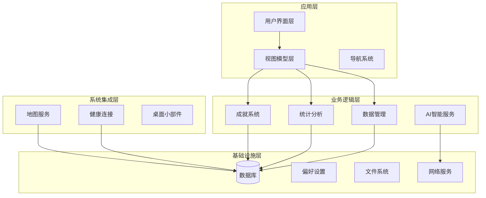
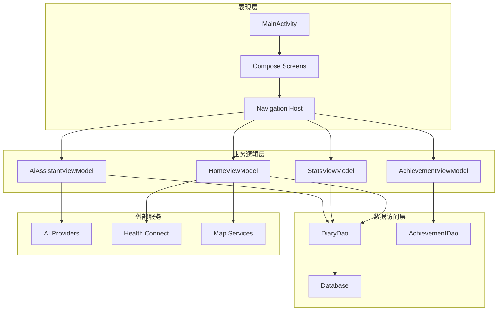
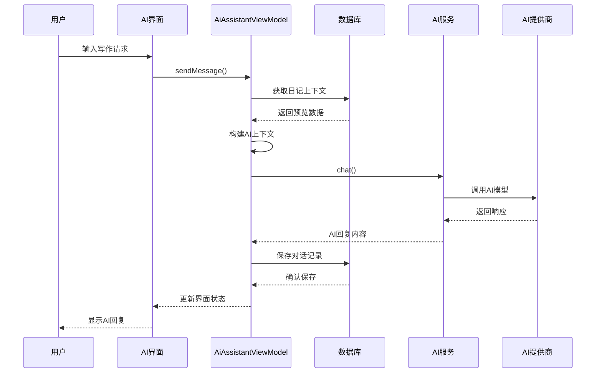
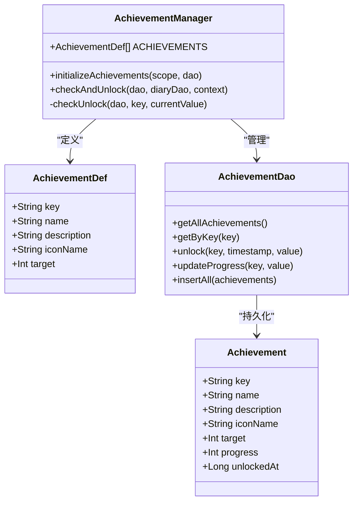
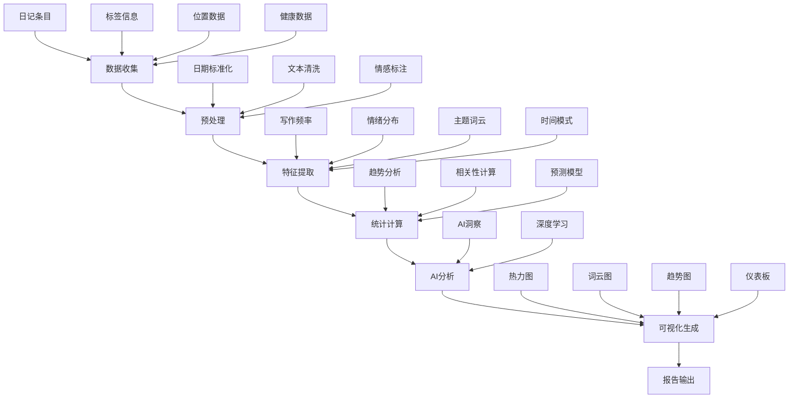
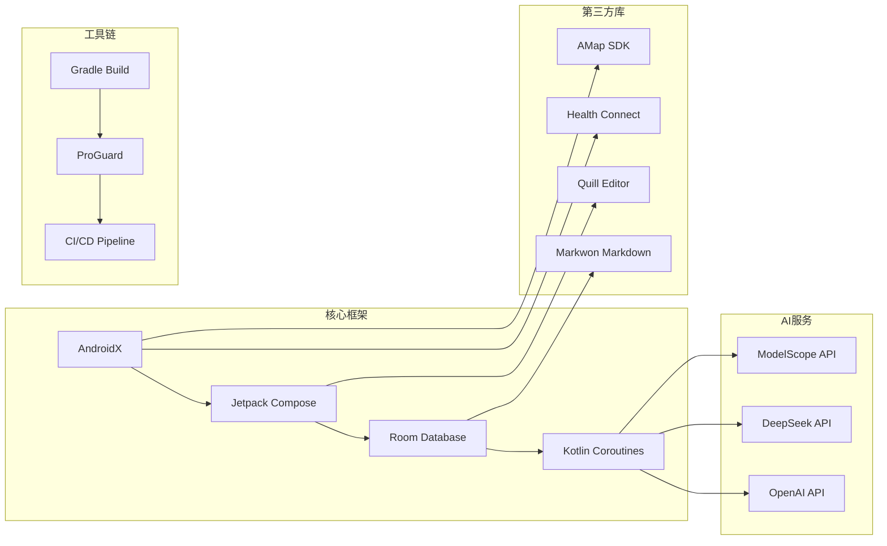

# 项目介绍

<cite>
**本文档引用的文件**
- [DiaryApplication.kt](file://app/src/main/java/com/diary/app/DiaryApplication.kt)
- [MainActivity.kt](file://app/src/main/java/com/diary/app/MainActivity.kt)
- [AndroidManifest.xml](file://app/src/main/AndroidManifest.xml)
- [AiAssistantViewModel.kt](file://app/src/main/java/com/diary/app/ai/AiAssistantViewModel.kt)
- [AchievementManager.kt](file://app/src/main/java/com/diary/app/data/AchievementManager.kt)
- [AchievementScreen.kt](file://app/src/main/java/com/diary/app/ui/achievement/AchievementScreen.kt)
- [StatsViewModel.kt](file://app/src/main/java/com/diary/app/ui/stats/StatsViewModel.kt)
- [StatsScreen.kt](file://app/src/main/java/com/diary/app/ui/stats/StatsScreen.kt)
- [TimeCapsuleScreen.kt](file://app/src/main/java/com/diary/app/ui/capsule/TimeCapsuleScreen.kt)
- [ReadCapsuleScreen.kt](file://app/src/main/java/com/diary/app/ui/capsule/ReadCapsuleScreen.kt)
- [Theme.kt](file://app/src/main/java/com/diary/app/ui/theme/Theme.kt)
- [AppContainer.kt](file://app/src/main/java/com/diary/app/di/AppContainer.kt)
- [BiometricHelper.kt](file://app/src/main/java/com/diary/app/biometric/BiometricHelper.kt)
- [README.md](file://docs/README.md)
</cite>

## 目录
1. [引言](#引言)
2. [项目结构](#项目结构)
3. [核心组件](#核心组件)
4. [架构概览](#架构概览)
5. [详细组件分析](#详细组件分析)
6. [依赖分析](#依赖分析)
7. [性能考虑](#性能考虑)
8. [故障排除指南](#故障排除指南)
9. [结论](#结论)

## 引言

DiaryApp是一个基于Android平台的现代化日记应用，致力于为用户提供优雅而富有情感的日记记录体验。该应用通过三大核心价值主张为用户创造独特的价值：

### 核心价值主张

**AI智能助手提升写作体验**
- 智能对话式AI助手，提供24/7的写作陪伴
- 基于用户日记内容的个性化情感分析和写作建议
- 智能写作辅助，帮助用户突破创作瓶颈

**成就系统激励持续记录**
- 全面的成就体系，涵盖写作数量、质量、习惯等多个维度
- 动态进度追踪，让写作成为一种有趣的游戏化体验
- 社交化的成就展示，激发用户的成就感和分享欲

**深度数据分析帮助回顾反思**
- 多维度的数据统计和可视化分析
- 情绪趋势、写作习惯、主题分布等深度洞察
- 年度回顾和月度报告，见证个人成长轨迹

### 目标用户群体

DiaryApp面向多元化的用户群体，满足不同人群的日记记录需求：

**忙碌的专业人士**
- 需要高效、简洁的记录方式
- 重视隐私保护和数据安全
- 希望获得专业级的写作辅助

**创意工作者**
- 寻求灵感激发和创作辅助
- 重视个性化表达和创意记录
- 需要灵活的内容组织和管理

**学生群体**
- 记录学习心得和成长轨迹
- 需要便捷的学习管理和反思工具
- 重视数据统计和学习效果分析

### 市场定位与竞争优势

在日记应用市场中，DiaryApp的独特定位体现在：

**技术领先性**
- 集成先进的AI技术，提供智能化写作体验
- 采用现代Android开发框架，确保应用性能和稳定性
- 支持多种健康数据集成，提供全方位的个人管理

**用户体验卓越性**
- 精美的Material Design设计语言
- 多种主题和个性化选项
- 流畅的交互体验和直观的操作界面

**功能完整性**
- 从基础记录到高级分析的全栈解决方案
- 完善的数据备份和安全管理
- 丰富的社交分享和导出功能

## 项目结构

DiaryApp采用模块化的项目结构，按照功能域进行清晰的层次划分：

**图表来源**
- [MainActivity.kt:79-435](file://app/src/main/java/com/diary/app/MainActivity.kt#L79-L435)
- [DiaryApplication.kt:30-105](file://app/src/main/java/com/diary/app/DiaryApplication.kt#L30-L105)

### 核心模块组织

**UI界面模块**
- 采用Jetpack Compose声明式UI框架
- 支持多主题切换和个性化定制
- 完整的屏幕导航和状态管理

**数据管理模块**
- Room数据库持久化存储
- 数据库迁移和版本管理
- 数据备份和恢复机制

**AI服务模块**
- 多供应商AI模型集成
- 智能写作辅助和内容生成
- 情感分析和洞察生成

**成就系统模块**
- 完整的成就定义和管理
- 实时进度追踪和解锁机制
- 成就展示和社交分享

**统计分析模块**
- 多维度数据统计
- 可视化图表和报告
- AI驱动的深度分析

**章节来源**
- [MainActivity.kt:79-435](file://app/src/main/java/com/diary/app/MainActivity.kt#L79-L435)
- [DiaryApplication.kt:30-105](file://app/src/main/java/com/diary/app/DiaryApplication.kt#L30-L105)

## 核心组件

### 应用入口与生命周期管理

DiaryApplication作为应用的全局入口点，负责初始化核心服务和管理应用状态：

**核心职责**
- 数据库实例化和依赖注入
- AI服务管理器初始化
- 主题模式和实验特性管理
- 后台任务调度和通知管理

**关键特性**
- 协程作用域管理异步操作
- 状态流提供响应式UI更新
- 权限检查和安全初始化
- 健康数据和地图服务集成

### 主界面与导航系统

MainActivity实现了完整的应用主界面，包含多重安全验证和智能导航：

**安全验证机制**
- 生物识别解锁和PIN码双重保护
- 锁定状态管理和错误处理
- 平滑的过渡动画和视觉反馈

**智能导航系统**
- 基于Intent的深度链接支持
- 快速启动和快捷方式集成
- 动态内容加载和错误恢复

**章节来源**
- [DiaryApplication.kt:30-157](file://app/src/main/java/com/diary/app/DiaryApplication.kt#L30-L157)
- [MainActivity.kt:79-435](file://app/src/main/java/com/diary/app/MainActivity.kt#L79-L435)

## 架构概览

DiaryApp采用现代Android架构模式，结合MVVM设计模式和响应式编程：

**图表来源**
- [MainActivity.kt:401-414](file://app/src/main/java/com/diary/app/MainActivity.kt#L401-L414)
- [AiAssistantViewModel.kt:33-58](file://app/src/main/java/com/diary/app/ai/AiAssistantViewModel.kt#L33-L58)
- [AchievementManager.kt:41-64](file://app/src/main/java/com/diary/app/data/AchievementManager.kt#L41-L64)

### 数据流架构

应用采用单向数据流架构，确保状态的一致性和可预测性：

**数据流向**
- 用户操作触发ViewModel状态变更
- ViewModel通过Repository层访问数据
- 数据库和外部服务提供数据源
- Compose UI自动响应状态变化

**状态管理模式**
- StateFlow提供响应式状态管理
- 懒加载和延迟初始化优化性能
- 错误边界和异常处理机制

## 详细组件分析

### AI智能助手系统

AI智能助手是DiaryApp的核心创新功能，提供全方位的写作辅助：

**图表来源**
- [AiAssistantViewModel.kt:128-226](file://app/src/main/java/com/diary/app/ai/AiAssistantViewModel.kt#L128-L226)

**核心功能特性**
- 智能上下文构建，基于用户历史日记内容
- 多轮对话管理和会话状态维护
- 实时进度追踪和令牌使用统计
- 智能搜索和相关条目推荐

**技术实现亮点**
- 基于Room数据库的实时数据查询
- 流式API调用和异步处理
- 智能缓存策略和错误恢复
- 多供应商AI模型抽象层

**章节来源**
- [AiAssistantViewModel.kt:19-364](file://app/src/main/java/com/diary/app/ai/AiAssistantViewModel.kt#L19-L364)

### 成就系统架构

成就系统通过多层次的挑战和奖励机制，激励用户持续记录：

**图表来源**
- [AchievementManager.kt:12-126](file://app/src/main/java/com/diary/app/data/AchievementManager.kt#L12-L126)

**成就分类体系**
- **写作成就**: 篇数统计、字数累积、连续写作
- **生活成就**: 情绪多样性、天气覆盖、时间规律
- **互动成就**: 收藏功能、标签管理、媒体内容
- **特殊成就**: 时间限定、隐藏成就、里程碑事件

**动态解锁机制**
- 实时进度计算和状态更新
- 智能提示和进度追踪
- 成就徽章的视觉反馈
- 排行榜和社交分享功能

**章节来源**
- [AchievementManager.kt:22-126](file://app/src/main/java/com/diary/app/data/AchievementManager.kt#L22-L126)
- [AchievementScreen.kt:64-183](file://app/src/main/java/com/diary/app/ui/achievement/AchievementScreen.kt#L64-L183)

### 统计分析与数据可视化

统计分析模块提供深度的数据洞察和可视化展示：

**图表来源**
- [StatsViewModel.kt:149-205](file://app/src/main/java/com/diary/app/ui/stats/StatsViewModel.kt#L149-L205)
- [StatsScreen.kt:715-763](file://app/src/main/java/com/diary/app/ui/stats/StatsScreen.kt#L715-L763)

**分析维度**
- **时间维度**: 日、周、月、年的写作趋势
- **内容维度**: 情绪分析、主题分布、关键词提取
- **行为维度**: 写作习惯、效率指标、模式识别
- **关联维度**: 外部因素影响、环境变量分析

**可视化特色**
- 交互式热力图展示写作活跃度
- 动态词云图反映主题变化
- 多维度仪表板提供综合概览
- AI驱动的洞察报告

**章节来源**
- [StatsViewModel.kt:128-254](file://app/src/main/java/com/diary/app/ui/stats/StatsViewModel.kt#L128-L254)
- [StatsScreen.kt:715-763](file://app/src/main/java/com/diary/app/ui/stats/StatsScreen.kt#L715-L763)

### 主题系统与个性化

DiaryApp提供丰富的主题系统，支持高度个性化的界面定制：

**主题类型**
- **纯净主题**: 经典的明暗双色方案
- **自然主题**: 森林绿、海洋蓝、花瓣粉等自然色调
- **材质主题**: 基于Material Design的颜色组合
- **自定义主题**: 支持RGB颜色和渐变配置

**个性化功能**
- 动态字体大小调整
- 深色/浅色模式自动切换
- 渐变背景和装饰元素
- 个性化图标和徽章样式

**章节来源**
- [Theme.kt:500-576](file://app/src/main/java/com/diary/app/ui/theme/Theme.kt#L500-L576)

### 安全与隐私保护

应用采用多层安全机制，确保用户数据的安全性和隐私性：

**生物识别安全**
- 支持指纹、面部识别、虹膜扫描
- 可选的PIN码双重验证
- 失败锁定和临时锁定机制
- 安全的密钥存储和管理

**数据保护措施**
- 端到端加密存储
- 安全的备份和恢复流程
- 访问权限控制和审计日志
- 隐私设置和数据共享控制

**章节来源**
- [BiometricHelper.kt:11-168](file://app/src/main/java/com/diary/app/biometric/BiometricHelper.kt#L11-L168)

## 依赖分析

### 外部依赖关系

DiaryApp采用现代化的依赖管理策略，平衡功能完整性与性能优化：

**图表来源**
- [AndroidManifest.xml:5-27](file://app/src/main/AndroidManifest.xml#L5-L27)

### 内部模块耦合

应用内部采用松耦合设计，通过接口和依赖注入降低模块间依赖：

**依赖注入架构**
- AppContainer提供统一的服务访问点
- DAO接口隔离数据访问层
- Repository模式封装业务逻辑
- ViewModel专注于UI状态管理

**模块边界设计**
- 清晰的职责分离和单一职责原则
- 接口优先的设计模式
- 异步处理和错误隔离
- 缓存策略和性能优化

**章节来源**
- [AppContainer.kt:11-15](file://app/src/main/java/com/diary/app/di/AppContainer.kt#L11-L15)

## 性能考虑

### 启动性能优化

应用采用多种策略确保快速启动和流畅体验：

**懒加载策略**
- 数据库连接延迟初始化
- AI服务按需加载
- 大型UI组件延迟渲染
- 资源文件按需加载

**内存管理**
- 对象池和重用机制
- 弱引用和软引用使用
- 内存泄漏检测和预防
- 大对象分页加载

**网络优化**
- 请求缓存和去重
- 连接池复用
- 增量更新和差分传输
- 离线模式支持

### 数据库性能

采用Room数据库的高性能特性：

**查询优化**
- 索引策略和查询计划
- 分页查询和游标使用
- 预编译语句和参数绑定
- 批量操作和事务处理

**存储优化**
- 数据压缩和归档
- 空间回收和碎片整理
- 内存映射文件使用
- SSD优化写入策略

## 故障排除指南

### 常见问题诊断

**启动失败问题**
- 检查数据库初始化状态
- 验证AI服务配置
- 确认权限授予情况
- 查看崩溃日志和异常堆栈

**性能问题排查**
- 监控内存使用和GC活动
- 分析CPU使用率和线程状态
- 检查磁盘I/O和网络延迟
- 识别内存泄漏和资源竞争

**功能异常处理**
- 验证API密钥和配额限制
- 检查网络连接和代理设置
- 确认用户授权和权限范围
- 排查第三方服务可用性

### 调试工具和技巧

**开发工具**
- Android Studio Profiler性能分析
- Logcat日志过滤和搜索
- 断点调试和变量监控
- 网络抓包和API测试

**生产环境监控**
- 异常报告和崩溃分析
- 性能指标和用户行为跟踪
- A/B测试和功能灰度发布
- 用户反馈收集和分析

**章节来源**
- [MainActivity.kt:415-472](file://app/src/main/java/com/diary/app/MainActivity.kt#L415-L472)

## 结论

DiaryApp作为一个现代化的Android日记应用，在技术创新、用户体验和功能完整性方面都达到了行业领先水平。通过AI智能助手、成就系统和深度分析功能的有机结合，应用为用户提供了前所未有的日记记录体验。

**核心优势总结**

**技术创新领先**
- AI驱动的智能写作辅助
- 多维度数据分析和洞察
- 现代化架构设计和性能优化

**用户体验卓越**
- 精美的界面设计和个性化定制
- 流畅的交互体验和响应速度
- 完善的安全保护和隐私保障

**功能生态完整**
- 从基础记录到高级分析的全栈功能
- 丰富的社交分享和导出能力
- 持续的功能迭代和优化升级

DiaryApp不仅是一个日记应用，更是用户个人成长和自我反思的智能伙伴。通过不断的技术创新和功能完善，应用致力于成为移动日记应用领域的标杆产品，为全球用户提供卓越的日记记录体验。