# 项目概述

<cite>
**本文档引用的文件**
- [DiaryApplication.kt](file://app/src/main/java/com/diary/app/DiaryApplication.kt)
- [MainActivity.kt](file://app/src/main/java/com/diary/app/MainActivity.kt)
- [DiaryDatabase.kt](file://app/src/main/java/com/diary/app/data/DiaryDatabase.kt)
- [AppContainer.kt](file://app/src/main/java/com/diary/app/di/AppContainer.kt)
- [AiAssistantViewModel.kt](file://app/src/main/java/com/diary/app/ai/AiAssistantViewModel.kt)
- [AchievementManager.kt](file://app/src/main/java/com/diary/app/data/AchievementManager.kt)
- [DiaryNavHost.kt](file://app/src/main/java/com/diary/app/ui/navigation/DiaryNavHost.kt)
- [Theme.kt](file://app/src/main/java/com/diary/app/ui/theme/Theme.kt)
- [AiServiceManager.kt](file://app/src/main/java/com/diary/app/ai/AiServiceManager.kt)
- [AiModels.kt](file://app/src/main/java/com/diary/app/ai/AiModels.kt)
- [BackupWorker.kt](file://app/src/main/java/com/diary/app/data/BackupWorker.kt)
- [TrashCleanupWorker.kt](file://app/src/main/java/com/diary/app/data/TrashCleanupWorker.kt)
- [WeatherWorker.kt](file://app/src/main/java/com/diary/app/weather/WeatherWorker.kt)
- [build.gradle.kts](file://app/build.gradle.kts)
</cite>

## 目录
1. [项目简介](#项目简介)
2. [项目结构](#项目结构)
3. [核心组件](#核心组件)
4. [架构概览](#架构概览)
5. [详细组件分析](#详细组件分析)
6. [依赖分析](#依赖分析)
7. [性能考虑](#性能考虑)
8. [故障排除指南](#故障排除指南)
9. [结论](#结论)

## 项目简介

DiaryApp是一个基于Android平台的现代化日记应用，采用Kotlin和Jetpack Compose构建。该项目旨在为用户提供一个功能丰富、设计精美的日记记录和管理平台，结合AI智能助手、成就系统、数据分析等功能，打造完整的个人成长记录生态系统。

### 项目目标

- **现代化日记体验**：提供直观易用的日记记录界面，支持富文本编辑、多媒体内容、地理位置标记等
- **智能化辅助功能**：集成AI助手，提供日记分析、情感识别、写作建议等智能服务
- **成就激励系统**：通过成就徽章和进度追踪，鼓励用户持续记录和成长
- **数据安全保障**：实现自动备份、数据加密、隐私保护等安全机制
- **个性化定制**：支持多种主题风格、字体大小、界面布局等个性化设置

### 核心功能模块

1. **日记记录管理**：完整的日记编辑、浏览、搜索、分类功能
2. **AI智能助手**：基于多模型提供商的对话式AI服务
3. **成就系统**：多层次的成就解锁和进度追踪
4. **数据分析**：可视化统计图表和趋势分析
5. **多媒体支持**：图片、音频、视频等多媒体内容管理
6. **健康数据集成**：与Android Health Connect API集成
7. **社交分享**：日记导出、分享、时间胶囊等功能

### 技术特点

- **现代UI框架**：完全采用Jetpack Compose声明式UI
- **响应式架构**：基于MVVM模式和状态管理
- **离线优先**：本地数据库存储，支持离线使用
- **云端同步**：可选的云端备份和同步功能
- **性能优化**：协程异步处理、内存优化、懒加载等

## 项目结构

DiaryApp采用模块化架构设计，按照功能域进行清晰的层次划分：

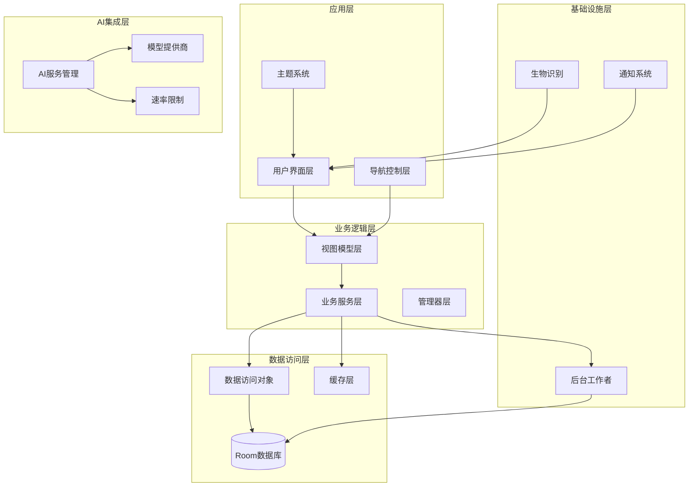

**图表来源**
- [DiaryApplication.kt:30-157](file://app/src/main/java/com/diary/app/DiaryApplication.kt#L30-L157)
- [MainActivity.kt:79-472](file://app/src/main/java/com/diary/app/MainActivity.kt#L79-L472)
- [DiaryDatabase.kt:10-829](file://app/src/main/java/com/diary/app/data/DiaryDatabase.kt#L10-L829)

### 主要目录结构

- **app/src/main/java/com/diary/app/**：主应用代码
  - **ai/**：AI相关功能模块
  - **data/**：数据访问和业务逻辑
  - **ui/**：用户界面组件
  - **di/**：依赖注入容器
  - **reminder/**：提醒和通知管理
  - **weather/**：天气服务集成
  - **widget/**：桌面小部件

- **app/src/main/res/**：资源文件
  - **drawable/**：图标和图形资源
  - **layout/**：布局文件
  - **values/**：字符串、颜色、样式定义

**章节来源**
- [build.gradle.kts:14-87](file://app/build.gradle.kts#L14-L87)

## 核心组件

### 应用入口与初始化

DiaryApplication作为应用的全局入口点，负责初始化各个核心组件：

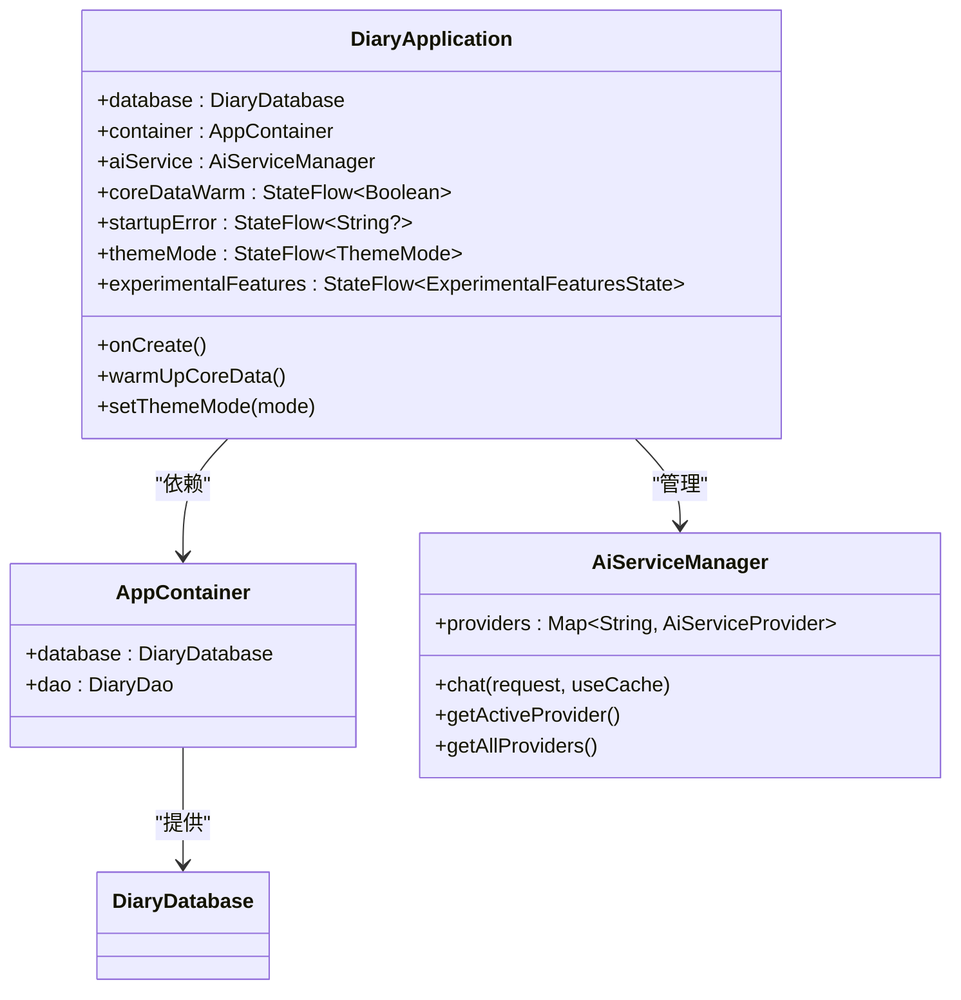

**图表来源**
- [DiaryApplication.kt:30-157](file://app/src/main/java/com/diary/app/DiaryApplication.kt#L30-L157)
- [AppContainer.kt:11-15](file://app/src/main/java/com/diary/app/di/AppContainer.kt#L11-L15)
- [AiServiceManager.kt:10-104](file://app/src/main/java/com/diary/app/ai/AiServiceManager.kt#L10-L104)

### 数据持久化架构

应用采用Room数据库作为数据持久化层，支持复杂的数据关系和迁移：

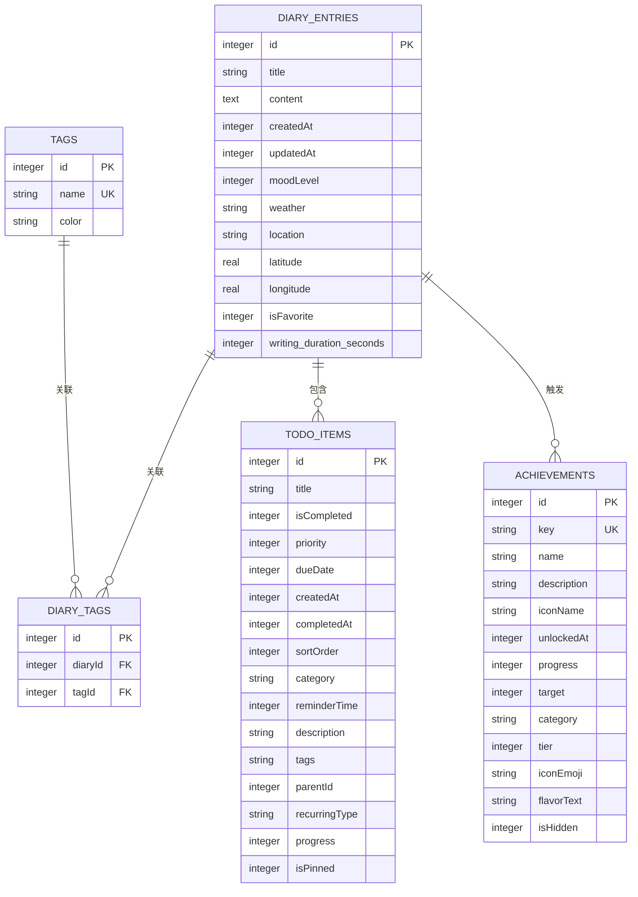

**图表来源**
- [DiaryDatabase.kt:10-14](file://app/src/main/java/com/diary/app/data/DiaryDatabase.kt#L10-L14)

### 导航与路由系统

应用采用声明式导航架构，支持复杂的页面跳转和参数传递：

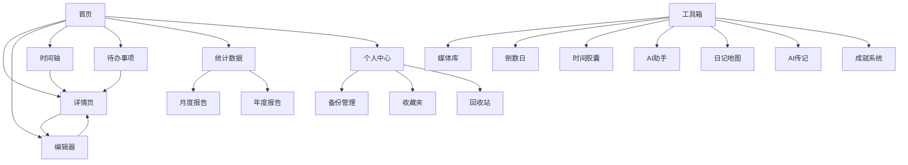

**图表来源**
- [DiaryNavHost.kt:135-183](file://app/src/main/java/com/diary/app/ui/navigation/DiaryNavHost.kt#L135-L183)

**章节来源**
- [DiaryApplication.kt:46-105](file://app/src/main/java/com/diary/app/DiaryApplication.kt#L46-L105)
- [DiaryDatabase.kt:15-32](file://app/src/main/java/com/diary/app/data/DiaryDatabase.kt#L15-L32)
- [DiaryNavHost.kt:191-197](file://app/src/main/java/com/diary/app/ui/navigation/DiaryNavHost.kt#L191-L197)

## 架构概览

DiaryApp采用分层架构设计，确保代码的可维护性和扩展性：

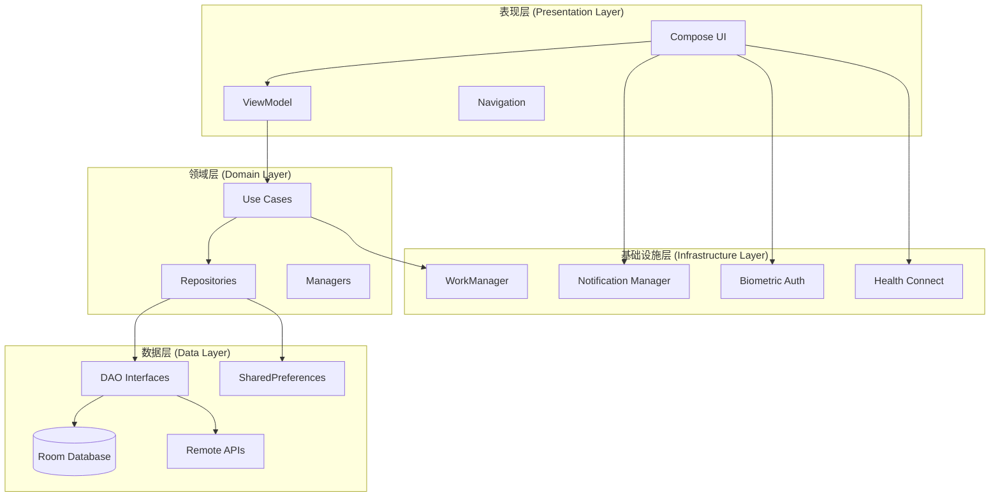

**图表来源**
- [MainActivity.kt:88-422](file://app/src/main/java/com/diary/app/MainActivity.kt#L88-L422)
- [AiAssistantViewModel.kt:33-58](file://app/src/main/java/com/diary/app/ai/AiAssistantViewModel.kt#L33-L58)

### 技术栈选择

#### MVVM架构模式
- **ViewModel**：管理UI状态和业务逻辑
- **LiveData/StateFlow**：响应式数据绑定
- **Repository模式**：数据访问抽象层
- **Use Case**：业务用例封装

#### Jetpack Compose
- **声明式UI**：提高开发效率和代码可读性
- **状态提升**：简化组件间通信
- **主题系统**：支持动态主题切换
- **动画支持**：流畅的用户体验

#### Room数据库
- **类型安全**：编译时SQL验证
- **迁移支持**：版本升级无缝迁移
- **查询优化**：自动生成SQL
- **离线优先**：本地数据持久化

#### WorkManager
- **后台任务**：定时备份、清理任务
- **约束感知**：网络、电量等条件满足时执行
- **可靠性保证**：任务重试和恢复

**章节来源**
- [build.gradle.kts:89-144](file://app/build.gradle.kts#L89-L144)

## 详细组件分析

### AI智能助手系统

AI助手是DiaryApp的核心特色功能，提供智能化的日记分析和交互能力：

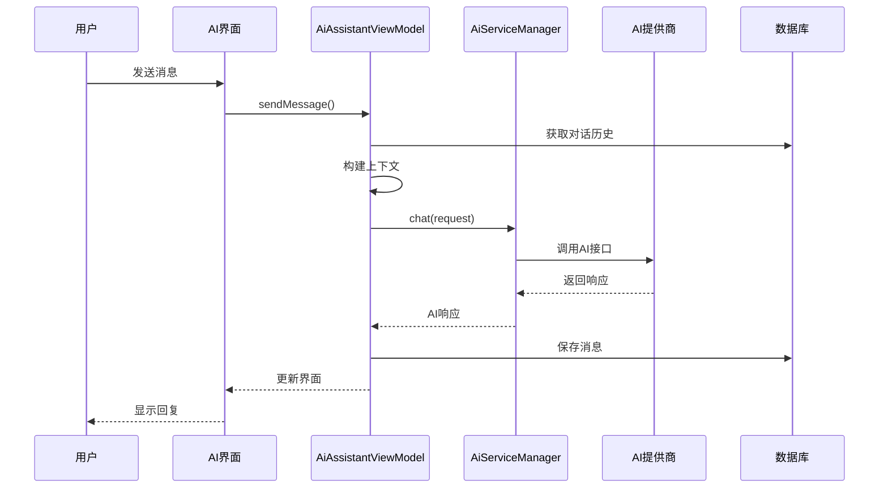

**图表来源**
- [AiAssistantViewModel.kt:128-226](file://app/src/main/java/com/diary/app/ai/AiAssistantViewModel.kt#L128-L226)
- [AiServiceManager.kt:43-61](file://app/src/main/java/com/diary/app/ai/AiServiceManager.kt#L43-L61)

#### 多模型提供商支持

系统支持多个AI模型提供商，包括ModelScope、Agnes、Deepseek等：

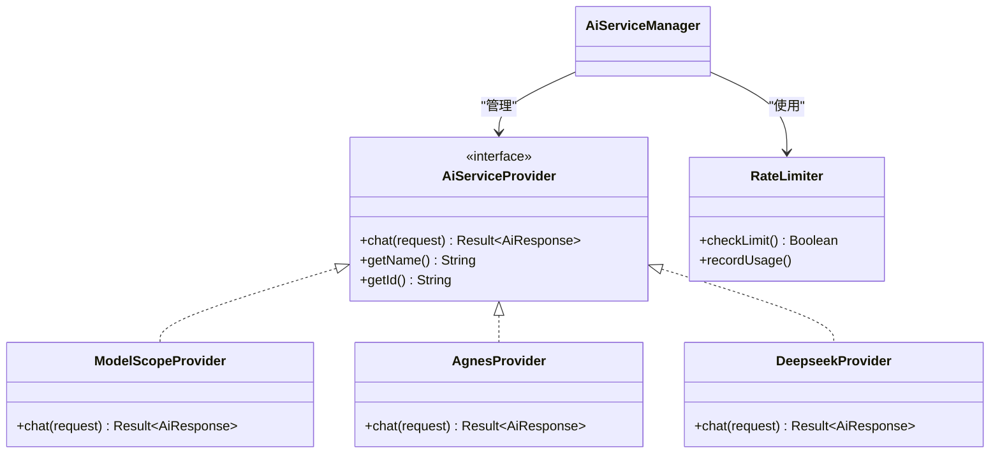

**图表来源**
- [AiServiceManager.kt:20-34](file://app/src/main/java/com/diary/app/ai/AiServiceManager.kt#L20-L34)
- [AiModels.kt:4-43](file://app/src/main/java/com/diary/app/ai/AiModels.kt#L4-L43)

#### 上下文构建算法

AI助手能够智能地从用户的日记数据中提取相关信息：

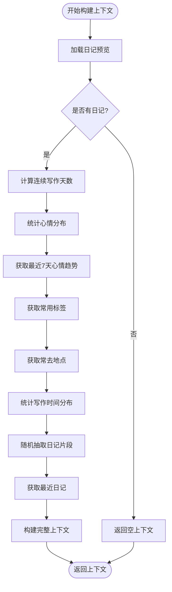

**图表来源**
- [AiAssistantViewModel.kt:228-330](file://app/src/main/java/com/diary/app/ai/AiAssistantViewModel.kt#L228-L330)

**章节来源**
- [AiAssistantViewModel.kt:33-364](file://app/src/main/java/com/diary/app/ai/AiAssistantViewModel.kt#L33-L364)
- [AiServiceManager.kt:10-104](file://app/src/main/java/com/diary/app/ai/AiServiceManager.kt#L10-L104)

### 成就系统

成就系统通过多层次的设计激励用户持续使用应用：

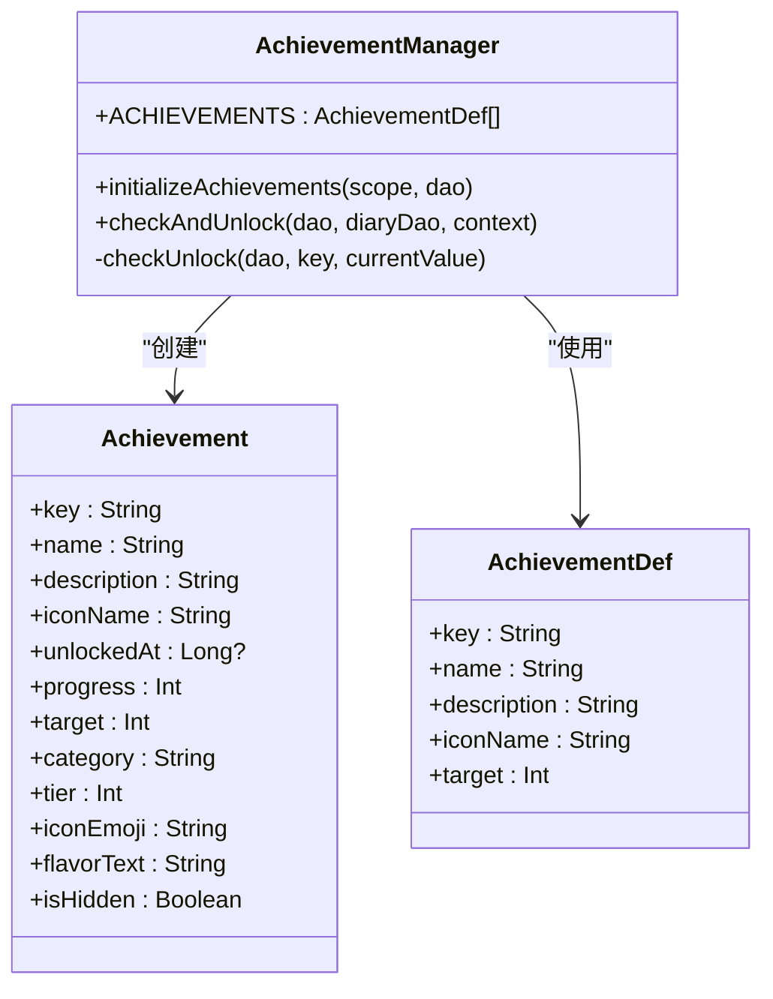

**图表来源**
- [AchievementManager.kt:12-126](file://app/src/main/java/com/diary/app/data/AchievementManager.kt#L12-L126)

#### 成就分类体系

成就系统分为多个类别，涵盖不同的使用场景：

| 类别 | 描述 | 示例成就 |
|------|------|----------|
| WRITING | 写作相关 | 首次记录、百篇里程碑、深度思考者 |
| HABIT | 习惯养成 | 连续7天、月度坚持、年度不间断 |
| TIME | 时间模式 | 深夜记录者、晨曦记录者、全周覆盖 |
| MOOD | 情绪表达 | 情绪丰富、乐观达人、深沉思考者 |
| WEATHER | 天气记录 | 风雨无阻、雨天收集者、风暴记录者 |
| EXPLORER | 探索发现 | 图文并茂、双子星、同日双记 |
| COLLECTOR | 收藏整理 | 收藏家、记忆守护者、标签达人 |
| LEGENDARY | 传奇成就 | 五百篇传说、百万字著、全能记录者 |

**章节来源**
- [AchievementManager.kt:22-39](file://app/src/main/java/com/diary/app/data/AchievementManager.kt#L22-L39)
- [DiaryDatabase.kt:624-682](file://app/src/main/java/com/diary/app/data/DiaryDatabase.kt#L624-L682)

### 后台任务管理

应用使用WorkManager进行可靠的后台任务调度：

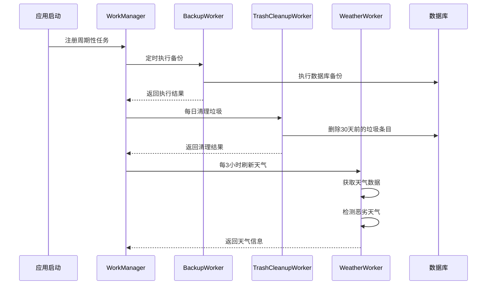

**图表来源**
- [DiaryApplication.kt:52-61](file://app/src/main/java/com/diary/app/DiaryApplication.kt#L52-L61)
- [BackupWorker.kt:13-25](file://app/src/main/java/com/diary/app/data/BackupWorker.kt#L13-L25)
- [TrashCleanupWorker.kt:17-28](file://app/src/main/java/com/diary/app/data/TrashCleanupWorker.kt#L17-L28)
- [WeatherWorker.kt:22-33](file://app/src/main/java/com/diary/app/weather/WeatherWorker.kt#L22-L33)

**章节来源**
- [BackupWorker.kt:8-27](file://app/src/main/java/com/diary/app/data/BackupWorker.kt#L8-L27)
- [TrashCleanupWorker.kt:12-44](file://app/src/main/java/com/diary/app/data/TrashCleanupWorker.kt#L12-L44)
- [WeatherWorker.kt:17-102](file://app/src/main/java/com/diary/app/weather/WeatherWorker.kt#L17-L102)

## 依赖分析

### 核心依赖关系

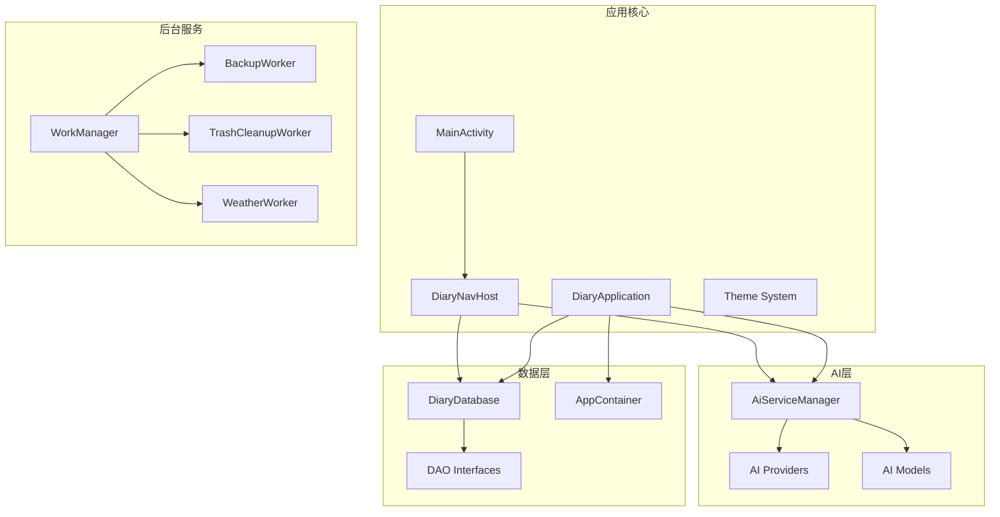

**图表来源**
- [DiaryApplication.kt:31-34](file://app/src/main/java/com/diary/app/DiaryApplication.kt#L31-L34)
- [MainActivity.kt:87-88](file://app/src/main/java/com/diary/app/MainActivity.kt#L87-L88)
- [AiServiceManager.kt:20-24](file://app/src/main/java/com/diary/app/ai/AiServiceManager.kt#L20-L24)

### 第三方库依赖

应用使用了丰富的第三方库来增强功能：

| 依赖库 | 版本 | 用途 |
|--------|------|------|
| AndroidX Compose BOM | 2023.10.01 | UI框架 |
| Room | 2.6.1 | 数据库ORM |
| WorkManager | 2.9.0 | 后台任务 |
| Kotlin Coroutines | 1.7.3 | 异步编程 |
| Gson | 2.10.1 | JSON序列化 |
| Coil | 2.5.0 | 图片加载 |
| WebView | 1.8.0 | 内置浏览器 |
| Biometric | 1.1.0 | 生物识别 |
| Health Connect | 1.1.0-alpha10 | 健康数据 |
| Amap 3D Map | 10.0.600 | 地图服务 |

**章节来源**
- [build.gradle.kts:89-144](file://app/build.gradle.kts#L89-L144)

## 性能考虑

### 内存管理优化

- **协程作用域管理**：使用适当的协程作用域避免内存泄漏
- **状态流生命周期**：正确管理StateFlow的订阅和取消
- **图片缓存策略**：使用Coil进行高效的图片加载和缓存
- **数据库连接池**：Room自动管理数据库连接

### 网络性能优化

- **请求缓存**：AI响应缓存减少重复请求
- **速率限制**：防止API滥用和超限
- **连接复用**：HTTP客户端连接池复用
- **错误重试**：智能的失败重试机制

### UI性能优化

- **组合优化**：避免不必要的重组
- **懒加载列表**：RecyclerView的懒加载实现
- **图片压缩**：合适的图片尺寸和质量
- **动画性能**：硬件加速的动画效果

## 故障排除指南

### 常见启动问题

**问题**：应用启动时显示"启动失败"
**原因**：数据库打开异常或核心数据初始化失败
**解决方案**：
1. 检查数据库文件权限
2. 查看Logcat中的具体错误信息
3. 尝试清除应用数据重新启动

**问题**：AI功能无法使用
**原因**：API密钥未配置或网络连接问题
**解决方案**：
1. 在设置中配置AI提供商的API密钥
2. 检查网络连接状态
3. 查看速率限制是否达到上限

### 数据库问题

**问题**：日记数据丢失或损坏
**原因**：数据库迁移失败或意外关闭
**解决方案**：
1. 检查备份文件是否存在
2. 重新安装应用并导入备份
3. 联系技术支持获取帮助

**章节来源**
- [DiaryApplication.kt:63-105](file://app/src/main/java/com/diary/app/DiaryApplication.kt#L63-L105)
- [DiaryDatabase.kt:736-771](file://app/src/main/java/com/diary/app/data/DiaryDatabase.kt#L736-L771)

## 结论

DiaryApp是一个功能完整、架构清晰的现代化日记应用。通过采用最新的Android开发技术和最佳实践，应用提供了优秀的用户体验和强大的功能特性。

### 核心价值主张

1. **完整的日记生态**：从记录到分析的全流程服务
2. **智能化辅助**：AI驱动的写作助手和分析工具
3. **个性化体验**：丰富的主题和定制选项
4. **数据安全保障**：可靠的备份和隐私保护机制
5. **持续演进**：模块化的架构支持功能扩展

### 技术优势

- **现代化技术栈**：Kotlin + Jetpack Compose + MVVM
- **高性能架构**：协程异步 + Room数据库 + WorkManager
- **可扩展设计**：模块化架构支持功能迭代
- **用户体验**：流畅的动画和响应式界面

DiaryApp不仅是一个日记应用，更是用户个人成长的数字化伙伴，通过技术手段帮助用户更好地记录生活、反思过去、规划未来。